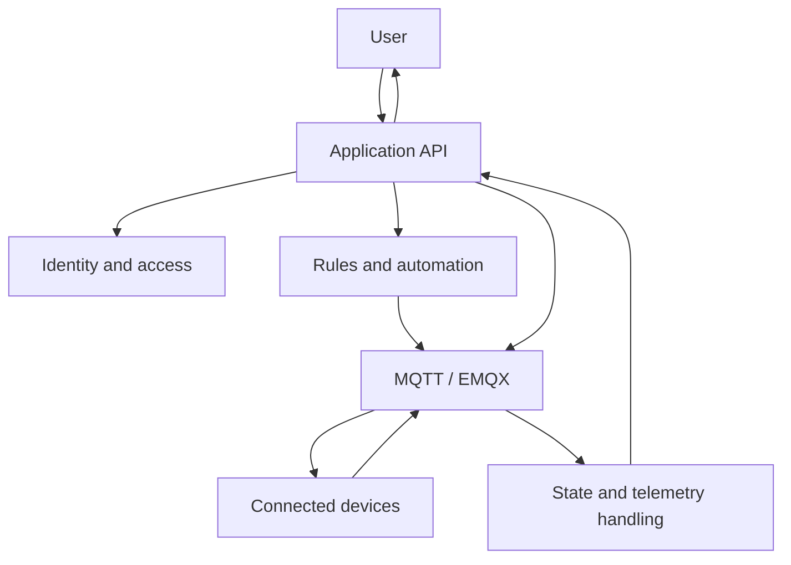

## The Problem Changed with Scale

A single connected device is mostly an integration problem. A fleet is an operations problem.

Once more users and devices share the same platform, the difficult questions move away from the protocol itself.

The system has to know who owns a device, who may control it, how current state is represented, and what should happen when hardware disappears from the network.

That shift is what shaped IoTNet.

## A Command Is Not a State Change

One of the most useful distinctions in the platform is between requesting an action and observing the result.

When a user clicks a control, the application can validate the request and publish a command. That only proves that the platform attempted the action. It does not prove that the physical device changed state.

The useful flow is closer to this:

```text
user intent
→ authorization
→ command publish
→ device execution
→ state or telemetry update
→ UI reflects observed state
```

That extra step matters in IoT because networks fail, devices restart, brokers reconnect, and hardware does not always behave like an in-memory object.

## Why HTTP and MQTT Have Different Jobs

I do not try to force user workflows and device communication through the same transport model.

HTTP works well for application actions such as signing in, loading resources, changing configuration, or asking the platform to perform an operation. MQTT is better suited to devices that publish state asynchronously and may disconnect without warning.

In IoTNet, the conceptual boundary is simple:

```text
human workflow → application API
device workflow → broker messaging
```

The backend sits between those two sides. It turns product-level requests into device-level messages and turns incoming device events back into application state.

## Identity Became Part of the Device Model

Device control stopped being only a messaging problem as soon as more than one user or organization shared the platform.

Before a command reaches a device, the backend needs enough context to answer questions such as:

- Which tenant or organization owns this device?
- Is this user allowed to operate it?
- Which target should receive the command?
- Should this user be able to see the returned state?

That is why I treat identity, ownership, and device messaging as connected parts of the same system rather than separate features added later.

## Automation Works Better as Small Building Blocks

The automation model is intentionally plain:

```text
event
→ condition
→ decision
→ action
```

The value comes from keeping those stages explicit.

A temperature update can become an event. Occupancy or a threshold can become a condition. The rule decides whether anything should happen, and only then does the platform dispatch an action.

This keeps the automation engine easier to inspect when a rule behaves unexpectedly. It also makes different use cases share the same model instead of growing a new feature path for every device type.

## The Platform Is a Coordination Layer

The architecture is easier to reason about when the platform owns product meaning and the broker owns message delivery.



That separation gives each layer a clearer responsibility. The application decides what an action means and whether it is allowed. The messaging layer moves commands and events. Device state is then folded back into the product model.

## What Became Harder Than Expected

The difficult parts were not the ones that look impressive in a demo.

Keeping state understandable after reconnects was harder than sending a command. Access boundaries mattered more as soon as multiple users shared the same environment. Automation needed enough flexibility to be useful without becoming impossible to predict.

Observability also became more important as the system grew. When a device, broker, API request, or background process can all be part of one user-visible failure, logs and traces are not optional debugging extras. They are how the failure path becomes visible.

## What I Would Keep If I Rebuilt It

I would keep the same high-level boundaries:

1. Keep user-facing API work separate from device messaging.
2. Treat authorization as part of every device action, not a frontend concern.
3. Distinguish a published command from an observed device state.
4. Keep automation rules explicit enough to inspect after the fact.
5. Add observability early, before the number of integrations makes failures difficult to trace.

The individual frameworks can change. Those boundaries are more durable than the stack around them.

## Current Stack

The current platform uses Nuxt and Vue on the frontend, a TypeScript backend with Hapi and Bun, PostgreSQL for application data, MQTT with EMQX for device messaging, and OpenTelemetry for operational visibility.

The project page has the broader product and system overview: [IoTNet](/projects/iotnet).

**Live product:** [i-ot.net](https://i-ot.net/)
