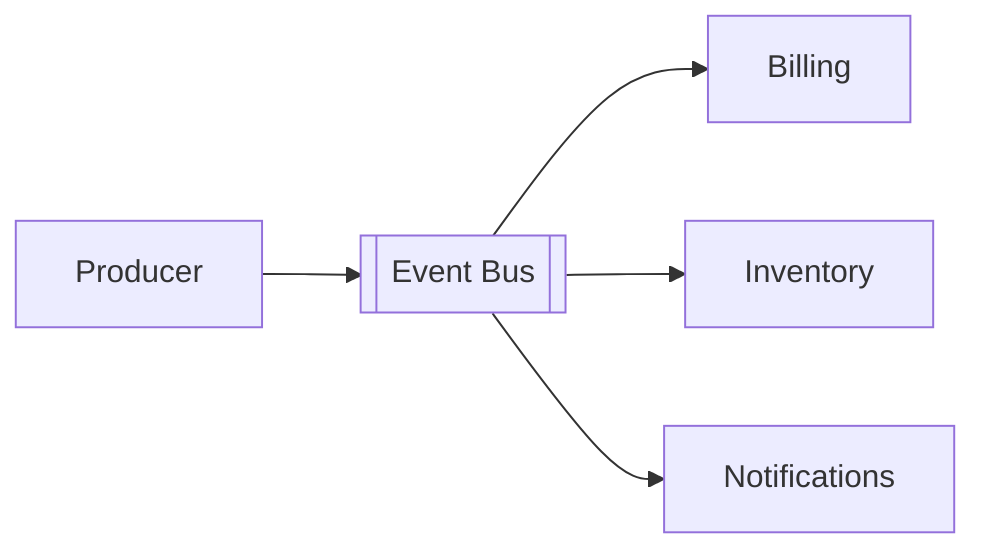

## Introduction

Event-driven systems help decouple services, absorb bursts, and model work as durable facts. They also introduce new failure modes around retries, ordering, duplicate delivery, and observability.

> Reliability comes from making failure behavior explicit, not from assuming the event bus will make it disappear.

## Event boundaries

Events should represent meaningful business occurrences instead of leaking internal implementation details.



## Delivery guarantees

At-least-once delivery is a practical default for many systems, but it means consumers must tolerate duplicates.

| Guarantee | Trade-off |
| --- | --- |
| At most once | Fast, but messages can disappear |
| At least once | Reliable delivery with possible duplicates |
| Exactly once | Strong semantics with higher complexity |

## Idempotency

A consumer should be able to receive the same event more than once without producing a second side effect.

```typescript
if (await alreadyProcessed(event.id)) return;
await processEvent(event);
await markProcessed(event.id);
```

## Retries and dead letters

Retries need bounded exponential backoff and visibility. Permanently failing work should move to a dead-letter flow that engineers actually monitor.

## Observability

Track queue age, processing latency, retry counts, failure rate, and correlation IDs across producer and consumer boundaries.

## Lessons learned

- design events around domain meaning
- make idempotency part of the consumer contract
- separate transient and permanent failure handling
- instrument the queue before incidents force you to
