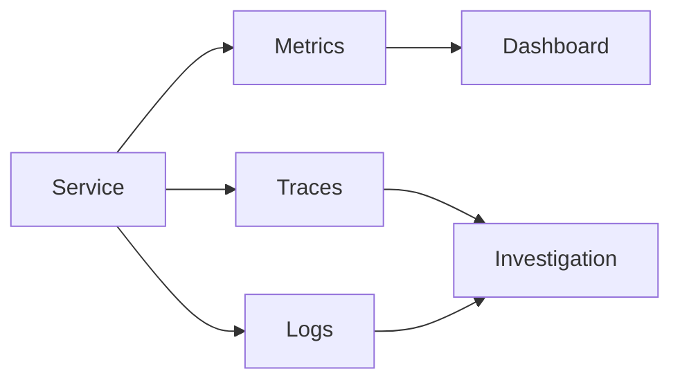

## Logs are one signal

Logs explain individual events, but they do not automatically explain system behavior.

## Correlated signals

## Metrics

Metrics are best for trends, saturation, error rates, and service-level indicators.

## Tracing

Distributed traces expose latency and dependency boundaries across services.

## Structured context

Correlation IDs, tenant scope, operation names, and job identifiers make every signal more useful.
