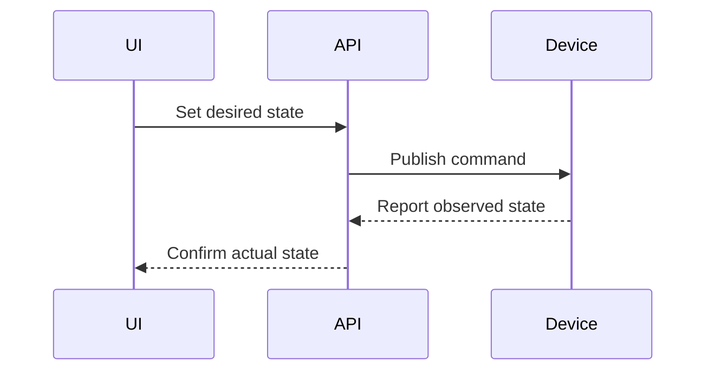

## Devices are distributed systems

Every device can disconnect, reboot, lag, or report state later than expected.

## Desired and observed state

## Reconnect behavior

Reconnect storms are a capacity problem. Backoff and jitter matter as much as the happy-path protocol.

## Local resilience

Critical local behavior should continue during short cloud outages whenever the product allows it.

## Lesson

Never model a device command as complete until the device has reported the resulting state.
