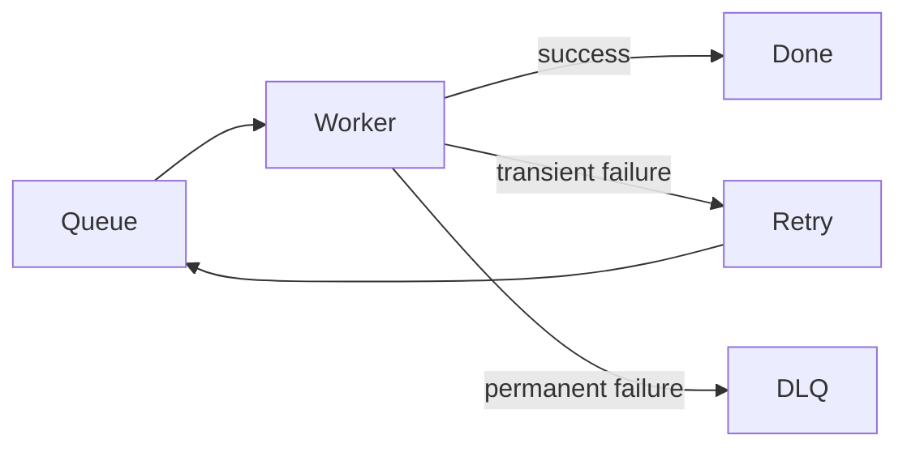

## The hidden request path

Moving work to a queue does not make it reliable. It only moves the reliability problem somewhere else.

## Failure model

Jobs can be duplicated, delayed, retried, partially completed, or permanently poisoned.

## Retry design

## Idempotency

The job handler needs a stable identity and durable checkpoints when the work has multiple side effects.

## Operations

Queue age is often more useful than queue length because it tells you whether user-visible work is becoming stale.
