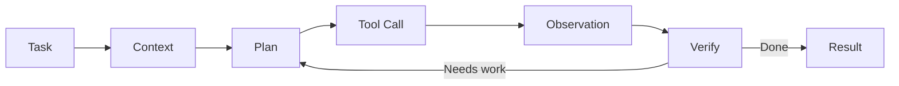

## Project overview

The workspace treats an agent as a tool-using software process rather than a chat box. Repository context, plans, tool results, and verification are represented explicitly.

## Agent loop

A task moves through planning, execution, observation, and verification. The runtime owns permissions and tool execution.

## Context management

Durable task state stays outside model context. Repository summaries and recent tool outputs are selected deliberately so long sessions do not grow without bound.

## Safety and isolation

Execution happens inside constrained environments with explicit tool capabilities. Network, filesystem, and command execution are separate permissions.

## Outcome and learnings

The useful abstraction turned out to be a stateful workflow with an LLM inside it, not an LLM with a pile of tools attached.
