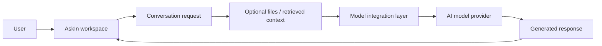

## When chat becomes an application

Using a language model is straightforward when the task is only sending a prompt and reading a response.

The experience becomes more complicated when the application also needs to work with different model providers, uploaded files, retrieved knowledge, tools, chat history, and user access.
At that point, the problem is no longer just calling an AI API. The application needs a consistent layer that turns several AI capabilities into one understandable workflow.

**AskIn** was the project I used during Ruangguru Academy to explore that problem.

Rather than treating the model itself as the product, the project focused on the application around it: how a user chooses a model, starts a conversation, brings external context into that conversation, and receives a response without needing to understand how each underlying service works.

## Keeping the user flow simple

From the user's perspective, the core flow stays intentionally simple.

A user enters a workspace, chooses an available model, sends a question, and can optionally add files or other context. The application prepares that request, routes it through the appropriate model integration, and returns the result as a continuing conversation.

The important part is that model access, retrieval, and supporting tools remain implementation details behind the interface. A user should be able to think about the question and the available context rather than the plumbing needed to connect each service.

## Interface composition and product presentation

The current AskIn repository also includes interface and showcase work where the visual decisions are explicit rather than accidental.

I kept the visual language tied to the application's real light-theme palette and treated the new-chat screen as the primary point of attention. Supporting views for code conversations, prompt workspaces, model selection, and settings are composed as secondary panels so the product can be understood without turning the showcase into a wall of screenshots.

The composition uses a consistent grid, spacing, corner radius, and restrained borders and shadows. Crops emphasize real product details without changing the underlying UI, and model selection is surfaced as a focused detail instead of competing with the main conversation flow.

That work reflects the kind of visual judgement I apply when presenting a web product: establish hierarchy first, keep navigation and supporting controls from overpowering the main task, and make multiple screens feel like one coherent interface rather than unrelated pages.

## The backend as a coordination layer

AskIn was built as a customized AI web application with a Svelte-based frontend and a Python/FastAPI backend.

The backend acts as the coordination layer between the web application and model services. It exposes the application APIs, manages authenticated user requests, discovers available models, and routes chat completions through integrations such as Ollama-compatible and OpenAI-compatible endpoints.

The same application also contains a retrieval layer for adding external knowledge to a conversation. Instead of sending every question directly to a model with no context, the system can prepare relevant document or file context and include it in the generation flow.

This separation made the project useful as a learning exercise because the visible chat experience depended on several backend concerns working together: identity, model discovery, request preparation, retrieval, streaming responses, and persistence.

## Model and knowledge integration

The project supports more than one model path rather than coupling the interface to a single provider.

Its backend contains integrations for **Ollama-compatible models** and **OpenAI-compatible APIs**, while the application layer keeps a common chat-completion flow above those provider-specific details. This allows the user-facing experience to stay largely the same even when the model behind it changes.

AskIn also includes a **retrieval-augmented generation** path. Files or knowledge sources can be processed as supporting context, then relevant information can be attached to a conversation before the generation request is sent to the model.

The value of this structure is not that every question needs retrieval. It is that the application has a place to introduce trusted context when a plain model prompt is not enough.

## Where the AI boundary ends

One of the useful lessons from AskIn was understanding where an AI feature ends and normal application engineering begins.

The model is only one dependency. The product still needs user sessions, configuration, API boundaries, stored conversations, files, model metadata, error handling, and a frontend capable of presenting incremental responses.

The backend therefore acts less like a thin proxy and more like an application boundary that coordinates those concerns before and after inference.

Docker-based packaging was also part of the repository so the frontend and backend could be distributed as one runnable application instead of requiring each service to be assembled manually by the user.

## What I worked on

My work on AskIn was centered on the **backend and integration side** of the project during Ruangguru Academy.

The project gave me a practical environment to understand how an AI-oriented application is connected end to end: from the web interface, through backend request handling and model routing, to retrieval and deployment concerns.

The current repository and showcase also document the interface-composition decisions described above. I treat those as product-presentation and visual-hierarchy work on the customized application, not as a claim that I originated the entire inherited interface system.

I describe the complete application here because those pieces are necessary to explain how AskIn works as a product.
It should not be read as a claim that every subsystem originated from me. The repository is a customized application built on top of the Open WebUI codebase, and my focus was learning from and adapting that system for the project context.

That distinction is important to me. The useful outcome was not presenting an existing foundation as something created from zero, but understanding its architecture well enough to adapt, run, and reason about the boundaries between the application and the AI services behind it.

## Source

The project source is available at [farismnrr/askin](https://github.com/farismnrr/askin).
