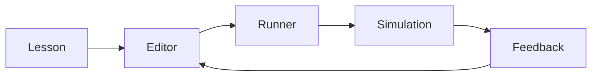

## Project overview

Learning Worlds turns programming exercises into environments where a learner can manipulate systems and immediately see the consequences.

## Learning model

Lessons are expressed as goals and constraints. A simulation engine evaluates the learner code and emits observable world state.

## Multiplayer sessions

WebRTC supports small collaborative rooms while server-side state keeps progress and assessment authoritative.

## Content authoring

Lesson definitions are data-driven, allowing educators to change objectives, hints, and world parameters without touching the core application.

## Outcome and learnings

Fast feedback mattered more than elaborate graphics. The strongest loops made cause and effect obvious within seconds.
