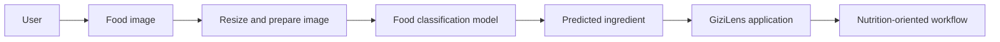
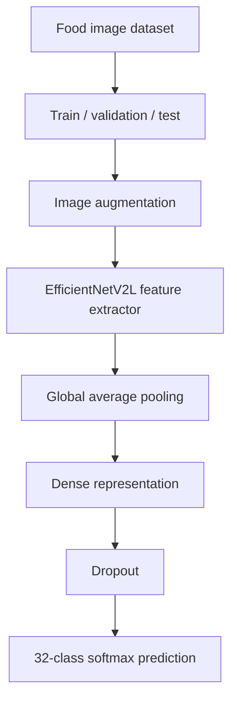
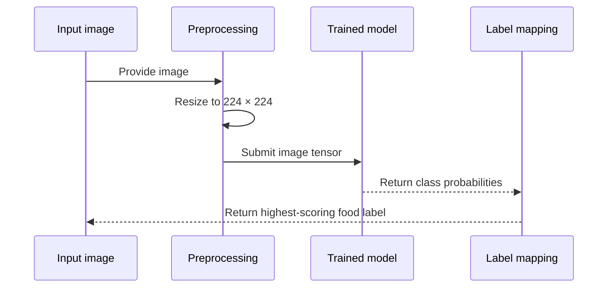
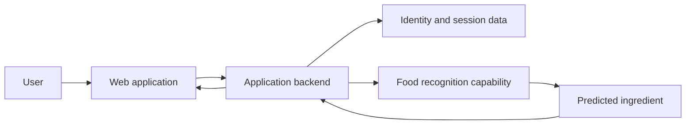

## The Problem

Nutrition tools often assume the user already knows exactly what food or ingredient they are looking at.

That is not always how people encounter food in practice. Sometimes the starting point is simply an image: an apple on a table, a vegetable in a kitchen, or an ingredient whose name is not immediately known. Before any nutrition information can be useful, the application first needs a reasonable way to identify what is visible.

**GiziLens** was our DBS Foundation capstone project built around that first step.

The idea was to use image classification to recognize common food ingredients, then place that prediction inside a larger web application where it could eventually support nutrition-related workflows. The machine-learning model was therefore not treated as the whole product. It was one component responsible for translating an image into a food label that the rest of the system could understand.

## Product Approach

The core interaction can be reduced to a simple flow: a user provides an image, the model prepares the image in the format it was trained on, predicts one of the supported food classes, and returns a label that can be used by the application.

Keeping that boundary explicit was important. The model answers a narrow question — *what ingredient does this image most closely resemble among the supported classes?* — while the application is responsible for everything around that prediction, such as user accounts, presentation, persistence, and the wider product experience.

## Building the Classifier

The machine-learning repository contains the training workflow for a 32-class food ingredient classifier.

The dataset was separated into training, validation, and test sets. Images were normalized to a consistent `224 × 224` input size, while augmentation introduced variations such as horizontal flips, rotation, zoom, contrast, and brightness. This helped the training process see more realistic visual variation instead of learning only the exact appearance of the original images.

The model used **EfficientNetV2L** with ImageNet weights as a feature extractor. Rather than training a large visual network entirely from scratch, the pretrained backbone was frozen and followed by a smaller classification head that mapped the extracted image features into the 32 supported ingredient classes.

This is a practical transfer-learning setup: reuse a model that already understands general visual features, then train the final layers for the narrower food-recognition problem.

## From Training to Prediction

Training and inference were kept as separate concerns.

During training, the model learned from batches of labeled images and was evaluated against validation data after each epoch. Early stopping monitored validation accuracy so the process could retain the strongest weights rather than simply continuing for a fixed number of epochs regardless of improvement.

For inference, the repository also contains a small prediction script. It loads the saved Keras model, resizes a supplied image to `224 × 224`, converts it into a model-ready array, runs prediction, and maps the highest-scoring output back to the corresponding ingredient label.

That small inference boundary is what makes the trained model useful outside the notebook: another service can treat it as a classifier instead of needing to know how the model was trained.

## The Application Around the Model

The capstone organization also contains a separate **Web-App** repository for GiziLens.

That repository shows the surrounding product concerns: a Nuxt-based frontend, backend APIs, registration and authentication flows, session handling, PostgreSQL persistence, Redis integration, and Docker-based runtime configuration. In other words, the project was structured as more than a notebook demonstration.

From a system-design perspective, the two repositories represent different responsibilities:

The web application provides the product boundary. The machine-learning work provides the visual recognition capability. Keeping those responsibilities separate makes it easier to improve the classifier without coupling model-training code to account management or user-interface concerns.

## My Role

My focus in the DBS Foundation capstone was the **machine-learning side of GiziLens**.

That meant working with the image-classification workflow: preparing image datasets, using augmentation, applying transfer learning with TensorFlow, evaluating the model against held-out data, and turning the trained model into a prediction flow that could be consumed beyond the training notebook.

The broader GiziLens system was a team project. The separate Web-App repository represents the application work surrounding the model, so I treat it here as system context rather than claiming every part of that application as my individual implementation.

## What I Took From It

The most useful lesson from GiziLens was that model accuracy is only one part of making machine learning useful.

A model still needs a clear input contract, stable preprocessing, understandable output labels, and a clean boundary with the application that consumes it. The project made that distinction tangible: training created the recognition capability, while product integration determined whether that capability could become part of an actual user workflow.

That separation — **model responsibility versus application responsibility** — is the part of the project that continued to matter beyond the capstone itself.
