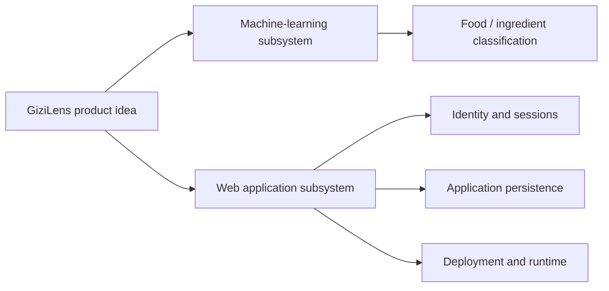
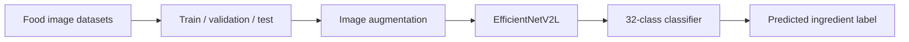
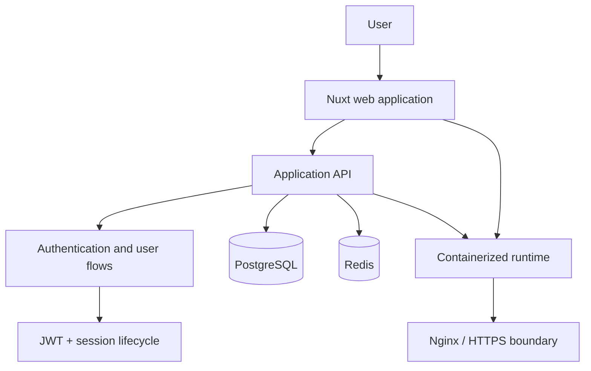
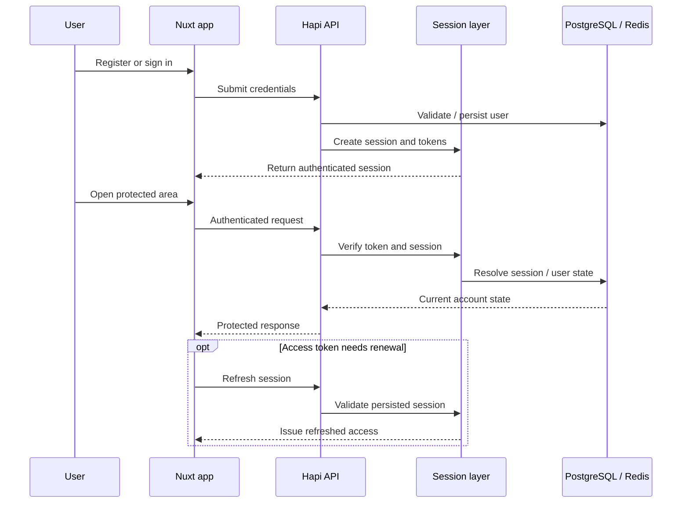
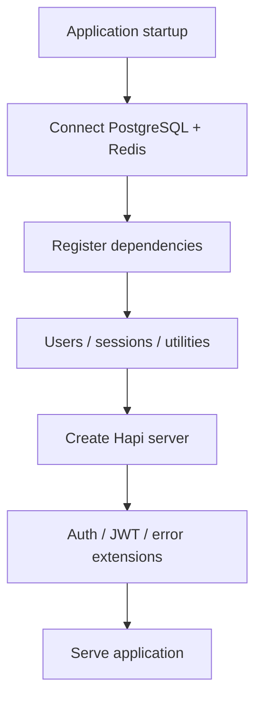
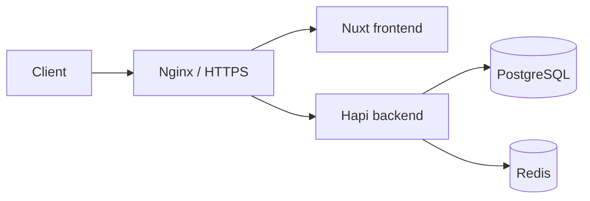

## The Idea

**GiziLens** was a team capstone from the DBS Foundation program built around a simple idea: a nutrition-oriented application could begin with something users already have — a photo of food or an ingredient.

The project explored that idea through two different technical responsibilities.

One side of the team worked on **food-image recognition**, turning an image into one of the supported ingredient labels. The other side worked on the **application around that capability**: how a user enters the system, how identity and sessions are managed, where application data lives, and how the web stack can be run as a deployable service.

Those responsibilities lived in separate repositories, and they were not fully integrated into a single end-to-end production flow in the repository state preserved today. I think that distinction is important: GiziLens was a team system in progress, not a finished product where every subsystem had already been connected.

## The Machine-Learning Subsystem

The team's machine-learning repository contains a **32-class food and ingredient image classifier** built with TensorFlow and EfficientNetV2L.

Its dataset combined several public image sources and grouped the supported labels into fruits, vegetables, nuts, and seasonings. Training used `224 × 224` images, augmentation, an ImageNet-pretrained EfficientNetV2L backbone, and a classification head for the 32 output classes.

A separate prediction script shows the inference boundary clearly: load the trained Keras model, prepare an input image, run the model, and map the highest-scoring output to an ingredient label.

This subsystem is part of the GiziLens team project, but I do **not** present its model training as my individual implementation. The repository history attributes that machine-learning work to another team member.

## The Application Subsystem

My implementation work is much more visible in the separate **Web-App** repository.

Rather than starting from the classifier, I worked on the foundation needed for GiziLens to behave like an actual web application: users need accounts, authenticated requests need a session model, the backend needs persistence and caching, and the whole stack needs a predictable way to run outside a developer's editor.

The application repository is split into a Nuxt frontend and a Bun/TypeScript backend built with Hapi.

The current frontend is primarily an identity and account shell: registration, login, authenticated user information, token refresh, logout, and a dashboard. It does not currently expose a complete image-upload-to-classification user journey, so I avoid describing that intended integration as if it were already implemented.

## Identity and Session Flow

A large part of the application work was making authentication more than a single login endpoint.

The backend exposes user registration for different roles, login, authenticated user retrieval and update, logout, account deletion/restore, and token refresh. JWT authentication protects authenticated routes, while persisted sessions give the application a server-side lifecycle for validating and revoking access.

The frontend mirrors that lifecycle with auth composables, API proxy handlers, session-aware middleware, and client-side authentication state. That makes login, refresh, logout, and protected requests part of one flow rather than unrelated API calls.

## Persistence and Application Boundaries

PostgreSQL is used as the durable application store for users and sessions, while Redis provides a separate fast-access infrastructure boundary. The backend keeps these concerns behind repository and dependency layers instead of letting HTTP handlers talk directly to storage everywhere.

The server startup sequence reflects that separation: establish PostgreSQL and Redis connections, register the application's dependencies, build the Hapi server, register its plugins and authentication extensions, then start serving requests.

This structure was useful to me because it kept application rules, HTTP transport, and infrastructure from collapsing into one layer as the project grew.

## Running GiziLens as a Service

The repository also includes the operational side of the application.

Frontend and backend have their own container build paths. The runtime configuration brings those services together with PostgreSQL, Redis, and Nginx on a shared Docker network. Nginx configuration covers reverse-proxy concerns and HTTPS certificate setup, while the deployment scripts provide a repeatable way to build, update, and restart the GiziLens services.

This was the part of the capstone where the project stopped feeling like a collection of local files and started behaving like a small deployed system with clear service boundaries.

## My Contribution

My contribution to GiziLens centered on the **Web-App and its runtime foundation**.

I worked on the registration and authentication flow, JWT and persisted-session handling, user lifecycle APIs, PostgreSQL and Redis integration, the Nuxt-side authentication flow, and the containerized application setup around the frontend and backend. The repository also includes the Nginx, domain/HTTPS, build, and update configuration used to run those services together.

The machine-learning classifier remained an important team subsystem because it defined the product idea GiziLens was trying to support. But the part I can directly attribute to my own repository history is the application and infrastructure around that idea, so that is the part I describe as my individual implementation here.

## What I Took From It

GiziLens ended up teaching me more about **system boundaries** than about any single framework.

A model can solve the recognition problem. A backend can solve identity and persistence. A frontend can give people somewhere to interact with the system. Deployment can make those pieces reachable. None of those pieces becomes the whole product by itself.

The capstone made that separation concrete for me: understand what each subsystem is responsible for, be explicit about what has actually been integrated, and avoid treating a team project's combined output as one person's work.
