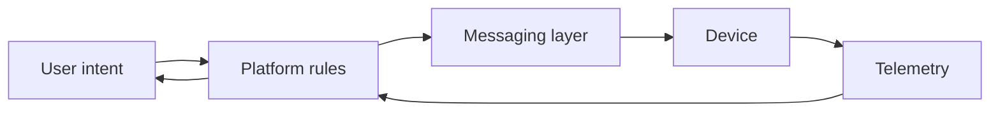
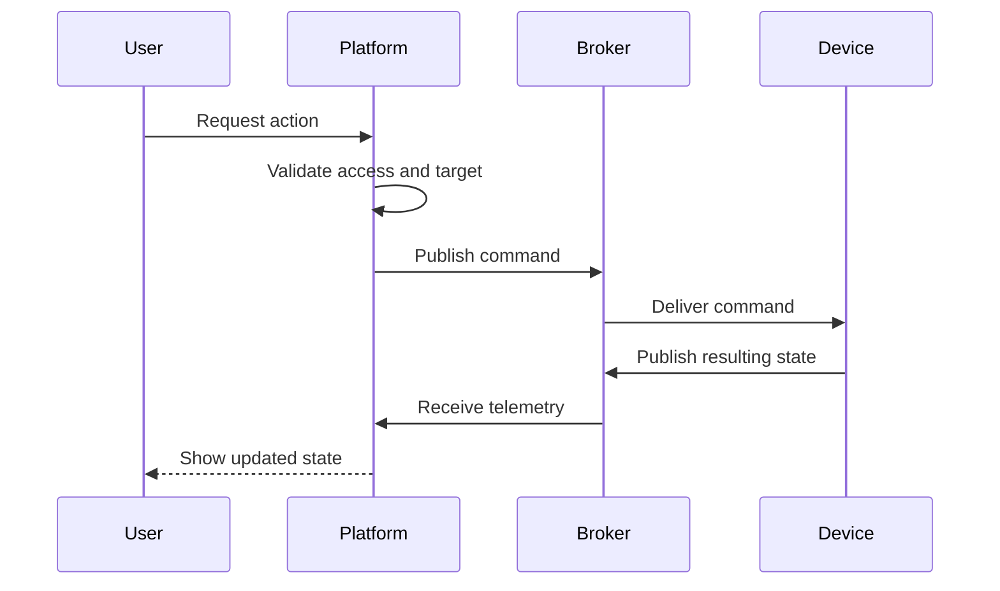
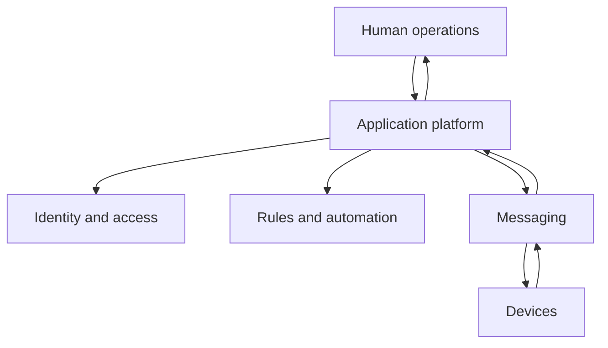

## What It Is

**IoTNet** is an IoT operations platform.

Its purpose is to give people one place to manage connected devices, automation, telemetry, user access, and operational state.

It is not just a dashboard. The concept is closer to a control plane for an IoT environment.

## Problem It Solves

IoT deployments often become fragmented.

A typical setup may have:

- devices;
- MQTT topics;
- broker credentials;
- users;
- automation rules;
- dashboards;
- telemetry;
- billing or account logic;
- embedded firmware.

When these pieces are managed separately, the system becomes hard to operate.

IoTNet tries to unify them into one model.

## Who It Is For

The platform is useful for:

- IoT operators;
- developers;
- integrators;
- organizations managing fleets of devices;
- teams building connected products.

## Core Concept

The system sits between human intent and device behavior.



The platform translates business-level actions into device-level communication, then converts device state back into human-readable information.

## General Device Flow



## General Automation Algorithm

An automation is conceptually:

```text
event
→ condition
→ decision
→ action
```

Example:

```text
temperature rises
→ room is occupied
→ threshold exceeded
→ turn cooling on
```

This simple pattern can support many IoT use cases.

## General System Design



### Human operations

Dashboards and user workflows.

### Application platform

Owns product rules and persistent state.

### Messaging

Provides asynchronous communication with devices.

### Devices

Produce telemetry and respond to actions.

## Why Identity Matters in IoT

Device control is not only a technical problem.

The platform must also answer:

- who owns this device?
- who can control it?
- which tenant does it belong to?
- which operations are allowed?

That is why identity and device management are part of the same platform concept.

## Important Product Decisions

### HTTP and MQTT have different jobs

HTTP is good for application workflows. MQTT is good for device messaging.

### Devices should not define business rules

Product-level permissions and automation belong in the application layer.

### Telemetry should close the loop

The system should verify resulting state instead of assuming a command succeeded.

## Tradeoffs

- **real-time behavior vs system complexity**;
- **centralized control vs device independence**;
- **rich automation vs understandable rules**;
- **multi-tenant flexibility vs stricter access logic**.

## Implementation Notes

The current platform uses a Nuxt frontend, a TypeScript backend, PostgreSQL, MQTT/EMQX, and supporting device and broker integrations.

## Stack

Nuxt, Vue, TypeScript, Hapi, PostgreSQL, MQTT, EMQX, Go plugins, and OpenTelemetry.
