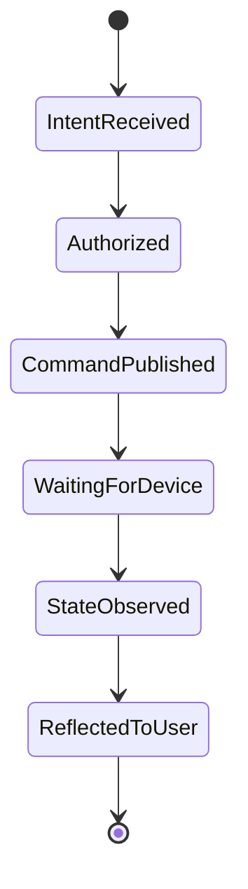
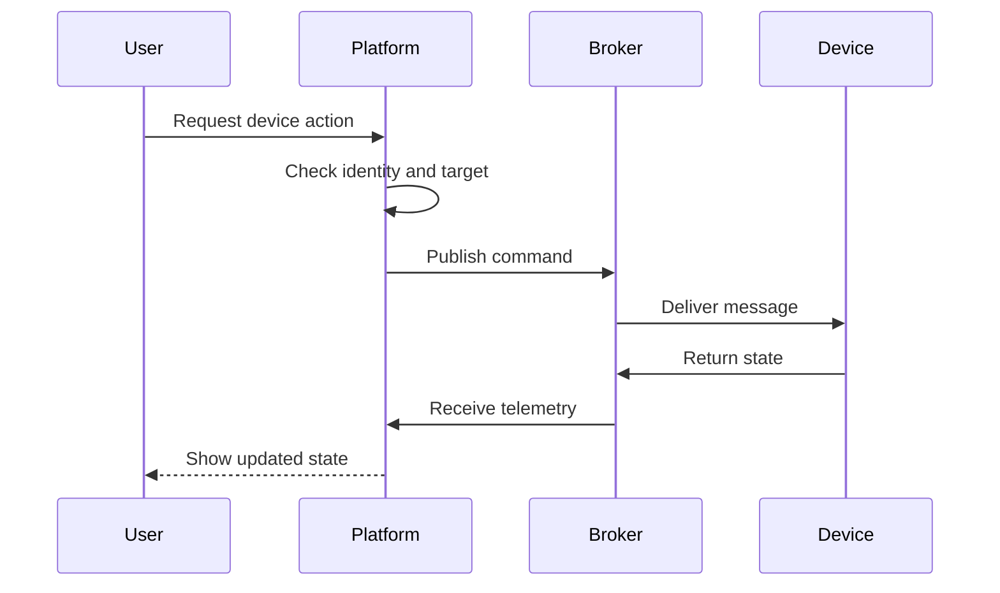
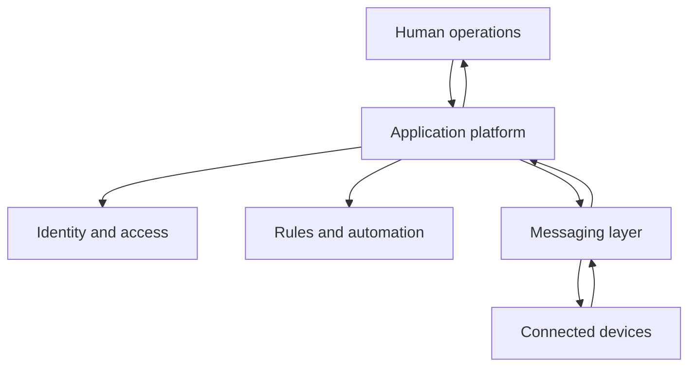

## The Problem

Building one connected device is mostly an integration task. Operating a fleet introduces a different set of problems.

The platform has to know who owns each device, who may control it, what state the hardware is actually in, how automation rules are evaluated, and what to do when a device disappears from the network.

**IoTNet** was built around that operational layer. It sits between people and connected hardware so users can work with product concepts instead of broker topics and raw protocol messages.

## The Core Model

A user asks for an outcome. The platform turns that request into a device action, applies the relevant access rules, and waits for state or telemetry to show what happened.



The distinction between **command published** and **state observed** is deliberate. In a physical system, sending a message is not the same thing as proving that a device changed state.

## Device Control Flow

A control request passes through application context before it reaches the broker.

The backend identifies the user, resolves the device and its owner, checks whether the action is allowed, publishes the command, and then consumes the returned state or telemetry.



That flow keeps device behavior grounded in what the system observes instead of assuming every command succeeds.

## Automation

Automation uses a small set of reusable stages:

```text
event
→ condition
→ decision
→ action
```

A temperature reading can be the event, occupancy and thresholds can become conditions, and the matching rule decides whether an action should be dispatched.

The same model can describe security alerts, environmental control, scheduling, and other IoT behavior without creating a separate automation concept for each device type.

## Identity and Ownership

Access control is part of the device model because hardware always belongs to some scope: a tenant, organization, site, project, or user group.

Every control path therefore has to answer two things:

```text
what can this device do?
who is allowed to ask it to do that?
```

Keeping ownership and messaging in the same product model makes those checks explicit before a command reaches physical hardware.

## System Design



The application platform owns the meaning of an action. The messaging layer handles delivery to and from devices.

That boundary is useful when devices reconnect, publish state independently, or fail in ways that do not map cleanly to a synchronous request.

## HTTP and MQTT

HTTP and MQTT stay separate because they solve different problems.

HTTP fits user-driven workflows such as loading resources, changing configuration, or requesting an operation. MQTT fits device communication where messages arrive asynchronously and connections can come and go.

```text
human workflow → application API
device workflow → messaging
```

The backend connects those two sides without forcing either one to behave like the other.

## Product Tradeoffs

**Real-time feedback vs operational complexity.** Faster feedback usually means more event-driven state and more failure paths to observe.

**Central control vs device independence.** Central orchestration makes policy easier to enforce, but devices still need to tolerate temporary disconnection.

**Flexible automation vs predictable behavior.** Rules become harder to understand as the automation model gains more expressive power.

Those tradeoffs matter more to the long-term platform than adding another device protocol.

## Implementation Notes

The current platform uses Nuxt and Vue on the frontend, a TypeScript backend with Hapi and Bun, PostgreSQL for application data, MQTT with EMQX for device messaging, and OpenTelemetry for operational visibility.

## Stack

Nuxt, Vue, TypeScript, Hapi, Bun, PostgreSQL, MQTT, EMQX, Go plugins, and OpenTelemetry.
