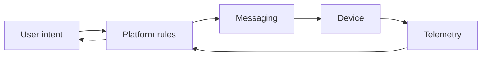
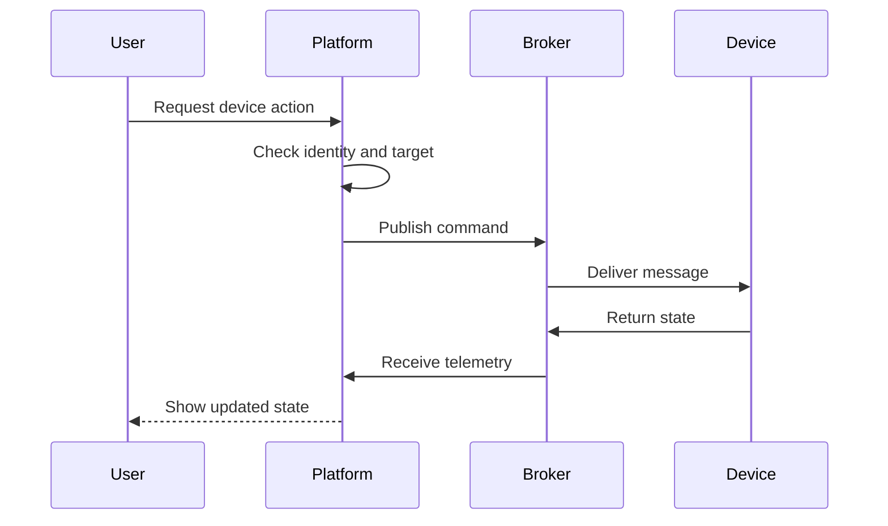
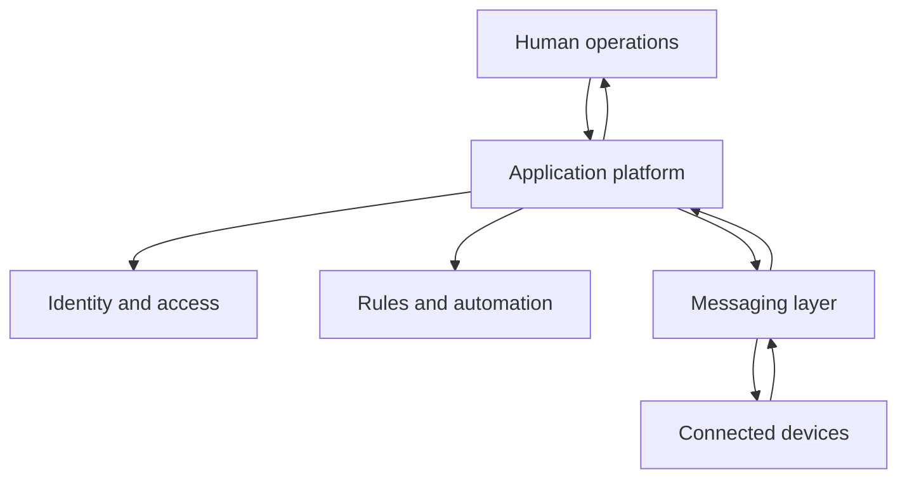

## The Story

Building one IoT device is relatively easy.

Operating hundreds of devices is a different problem.

The moment a project grows, new questions appear:

- Who owns this device?
- Who is allowed to control it?
- What happens when it goes offline?
- How do we know its current state?
- How do automation rules work?
- How do multiple users share the same environment?
- How do we keep all of this understandable?

**IoTNet** was built around that operational layer.

It is not only a dashboard for devices. It is a platform that sits between people and a fleet of connected hardware.

## The Core Idea

The platform translates **human intent** into **device behavior**.

A user thinks in product terms:

> “Turn this device on.”

The hardware understands protocol messages.

IoTNet is the layer in the middle that applies identity, rules, messaging, and state.



That translation is the heart of the system.

## The Device Control Story

Imagine a user clicking “turn on.”

The system should not immediately publish a raw command.

It first needs to understand the context.

Who is the user?

Which tenant owns the device?

Is this action allowed?

What target should receive the command?

Once the action is sent, the system should wait for state or telemetry to confirm what happened.



The system does not assume that “command sent” means “device changed.”

That distinction is important in the physical world.

## The Automation Model

Automation sounds complicated, but the core model is simple.

```text
event
→ condition
→ decision
→ action
```

For example:

```text
temperature rises
→ room is occupied
→ threshold exceeded
→ turn cooling on
```

or:

```text
door opens
→ outside office hours
→ security rule matches
→ send alert
```

This pattern is intentionally generic because many IoT use cases can be expressed with the same building blocks.

## Why Identity Is Part of an IoT Platform

It is tempting to think IoT is mostly about devices.

In practice, access control becomes just as important.

A device usually belongs to someone or something:

- a tenant;
- an organization;
- a site;
- a project;
- a user group.

The platform therefore has to answer both sides:

```text
what can this device do?
and
who is allowed to ask it to do that?
```

That is why identity, device ownership, and messaging belong in one larger system concept.

## General System Design



The platform becomes the coordination point.

It owns the product meaning of the action, while the messaging layer handles device communication.

## Why HTTP and MQTT Both Exist

These two protocols solve different problems.

HTTP is good for user-driven application workflows.

MQTT is good for asynchronous communication with devices that may connect, disconnect, or publish state independently.

The conceptual split is:

```text
human workflow → application API
device workflow → messaging
```

Trying to use one model for both makes the system harder to reason about.

## Product Tradeoffs

**Real-time behavior vs complexity.** Faster feedback usually means more event-driven state to manage.

**Central control vs device independence.** Central orchestration is easier to govern, but devices should still tolerate temporary disconnection.

**Powerful automation vs understandable rules.** The more expressive the automation engine becomes, the harder it is for users to predict behavior.

## Implementation Notes

The current platform uses a Nuxt frontend, a TypeScript backend, PostgreSQL, MQTT/EMQX, and supporting device and broker integrations.

## Stack

Nuxt, Vue, TypeScript, Hapi, PostgreSQL, MQTT, EMQX, Go plugins, and OpenTelemetry.
