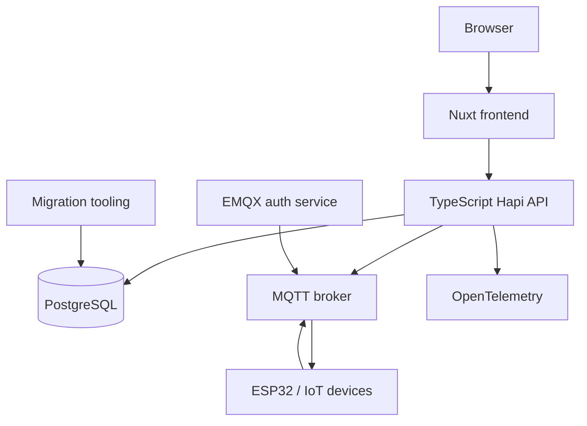
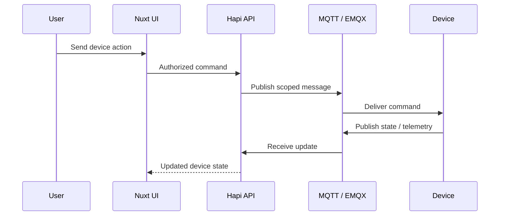

## Overview

**IoTNet** is an IoT operations platform for managing connected devices, users, telemetry, automation, and the infrastructure around them.

The current codebase is a multi-component system rather than a single Next.js dashboard. The main web frontend is built with Nuxt/Vue, the backend is a TypeScript/Hapi service running through Bun in development, device communication uses MQTT, and supporting plugins handle broker authentication, migrations, and embedded-device integration.

## Platform Architecture

The repository keeps frontend, backend, broker integrations, migration tools, and device-side libraries as separate components with explicit boundaries.

## Frontend

The current frontend is a Nuxt application using Vue, Pinia, Tailwind/UnoCSS utilities, MQTT browser integration, Chart.js, and PWA support.

It owns the operator-facing experiences for device management, monitoring, account flows, and platform administration while keeping durable state in backend services.

## Backend

The backend is a TypeScript service built on Hapi with explicit controller, service, and repository-style boundaries.

Its dependency rule is inward-facing: HTTP interfaces adapt requests, application services own use-case behavior, and persistence/integration details stay behind infrastructure boundaries.

The backend also integrates:

- PostgreSQL;
- MQTT;
- cloud object storage;
- email delivery;
- authentication and JWT handling;
- OpenTelemetry tracing and metrics.

## Device Communication

Broker access is not treated as a public message bus. EMQX authentication and authorization services participate in deciding who can connect and which topics they may use.

## Multi-Tenant and Identity Foundation

IoTNet integrates with a dedicated user-management service for tenant-scoped identity and access. This keeps device operations connected to explicit account and tenant boundaries rather than relying on frontend-only filtering.

The wider platform also includes billing/payment migrations and schema compatibility checks, so deployment fails early when required order/payment fields are missing instead of producing late runtime errors.

## Device Ecosystem

The project includes device-side and integration components beyond the web application:

- ESP32/Arduino libraries for device integration;
- broker authentication services;
- migration tooling;
- PWA/browser client;
- backend APIs;
- monitoring and observability support.

This makes IoTNet closer to an IoT platform than a standalone dashboard.

## Engineering Decisions

### Separate device transport from product API

MQTT handles device messaging while the HTTP API owns product behavior and authorization. The browser does not become the source of truth for device permissions.

### Explicit migration compatibility

Schema assumptions for features such as billing are checked at startup. Missing required columns fail fast.

### Component-specific validation

Frontend, backend, and Go-based plugins have separate validation commands so each subsystem can enforce its own language and architecture rules.

## Stack

Nuxt, Vue, TypeScript, Pinia, Hapi, Bun, PostgreSQL, MQTT, EMQX, Go plugins, ESP32/Arduino tooling, Docker, OpenTelemetry, Grafana/Jaeger/Prometheus-compatible observability, and GitHub Actions.

## Status

IoTNet is actively developed across the web application, backend APIs, broker/auth integration, device libraries, billing, and operational tooling.
