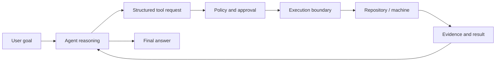
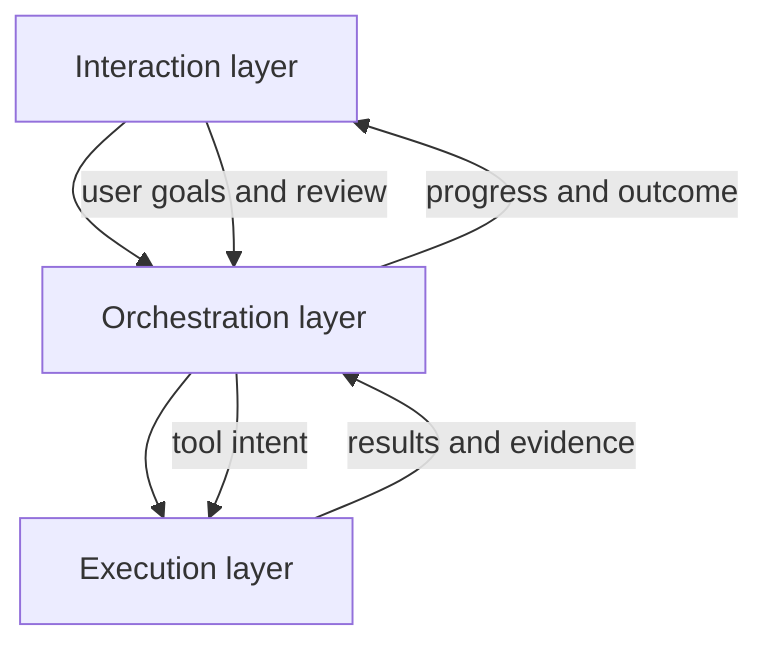
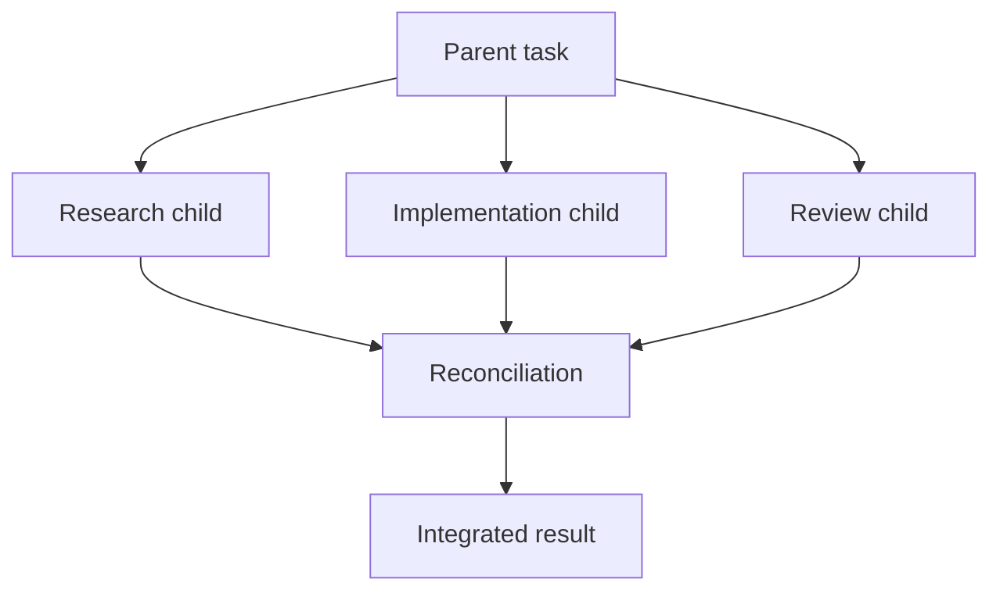

## What It Is

**Masih Awam AI Code** is an agentic coding workspace.

The idea is to move beyond “AI that explains code” toward “AI that can actually work inside a codebase.”

It can inspect repositories, search files, edit code, run commands, use tools, coordinate subagents, and return evidence of what changed.

## Problem It Solves

Normal coding assistants often stop at suggestions.

That creates a gap:

- the AI can describe a fix but cannot verify it;
- it can propose a refactor but cannot inspect the whole repository;
- it can write code but may not understand project-level rules;
- it may execute powerful actions without clear boundaries;
- users can struggle to tell what actually happened.

The product tries to solve this by combining **reasoning, tools, execution, and evidence** in one workflow.

## Who It Is For

The product is designed for developers who want AI to help with real engineering work:

- repository exploration;
- debugging;
- refactoring;
- testing;
- implementation;
- code review;
- repetitive maintenance;
- multi-step technical tasks.

## Core Concept

The system separates **thinking** from **authority**.

The model may decide what it wants to do, but a separate execution layer decides what it is actually allowed to do.



This is the central design principle.

## General Agent Loop

At a high level:

1. Understand the user goal.
2. Inspect the relevant repository state.
3. Decide the next useful action.
4. Select a structured tool.
5. Check whether that action is allowed.
6. Execute it.
7. Observe the result.
8. Continue until the goal is complete.

Conceptually:

```text
observe
→ decide
→ act
→ verify
→ repeat
```

## General System Design

The product has three conceptual layers.



### Interaction layer

Where the user communicates with the agent and reviews progress.

### Orchestration layer

Turns goals into tasks, tool calls, approvals, subagents, and execution plans.

### Execution layer

Performs filesystem, Git, process, and external-tool operations under explicit restrictions.

## Multi-Agent Concept

Some tasks can be decomposed into parallel work.



The parent should not accept child work blindly. It gathers evidence, resolves conflicts, and decides what becomes part of the final result.

## Evidence Model

A key principle is that the UI should show **what the system did**, not pretend hidden reasoning is proof.

Useful evidence includes:

- changed files;
- diffs;
- command results;
- test outcomes;
- Git state;
- tool activity;
- subagent outputs.

## Important Product Decisions

### AI does not directly own the machine

Execution authority stays in a separate runtime boundary.

### Structured tools are preferred

Known actions should use explicit capabilities rather than arbitrary shell commands.

### Verification is part of the loop

A code change is not considered complete just because it was written.

### Agent work should be inspectable

Users need to understand what changed and why.

## Tradeoffs

- **freedom vs safety** — more powerful tools make agents more useful but also harder to constrain;
- **automation vs user control** — full autonomy is convenient, but approvals matter for sensitive actions;
- **parallelism vs consistency** — subagents can speed work up, but their outputs must be reconciled carefully.

## Implementation Notes

The current system uses a web application for chat and orchestration, plus a native Rust execution relay for trusted machine operations.

## Stack

Nuxt, Vue, Rust, MCP, PostgreSQL, Bubblewrap, OAuth/OIDC, and OpenTelemetry.
