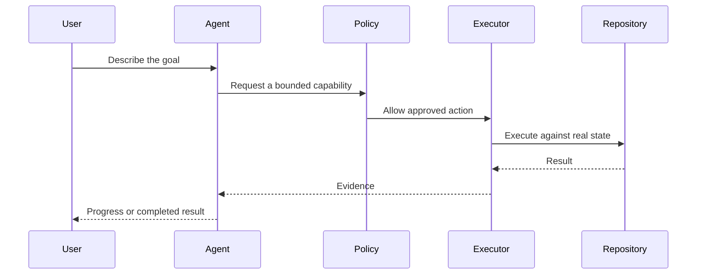
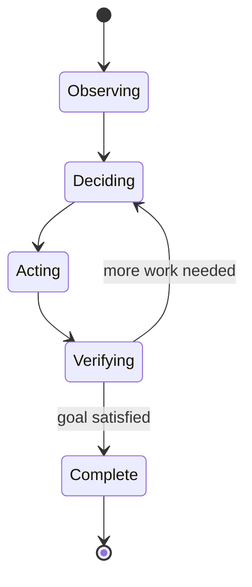
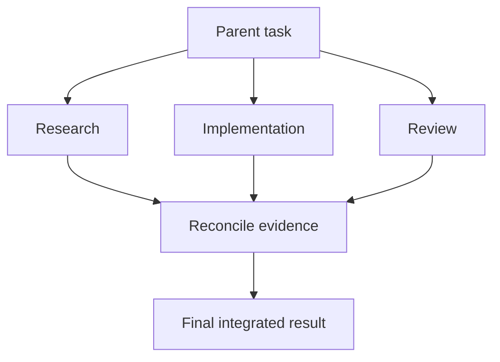
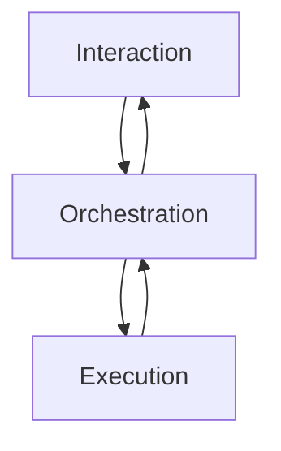

## The Story

Most AI coding tools are very good at telling you what code *should* look like.

The problem starts when the task stops being local.

A real engineering task is rarely just “write this function.” It is usually closer to:

- inspect the repository;
- understand existing rules;
- find the real source of the bug;
- edit several files;
- run checks;
- read the failures;
- fix them;
- verify Git state;
- then explain what changed.

At that point, a chat assistant that only generates code becomes limited.

**Masih Awam AI Code** was built around a different question:

> What would an AI coding assistant look like if it could actually work inside a real repository, but still had clear boundaries around what it is allowed to do?

## The Core Idea

The product separates **reasoning** from **authority**.

The AI can decide that a file should be edited or a command should be run, but it does not automatically own the machine.

Instead, every real action goes through a controlled execution path.



That split is the most important concept in the application.

It allows the agent to be useful without treating unrestricted shell access as the default trust model.

## What the User Experiences

The user gives the system a goal, not a sequence of commands.

For example:

> “Find why this build fails and fix it.”

The system then tries to work the way an engineer would.

It inspects the repository, forms a hypothesis, checks the relevant files, makes a change, runs validation, and keeps going until the evidence supports the result.

The user sees the progress as work, not as hidden magic.



## The General Agent Algorithm

At a high level, the agent loop is simple:

```text
observe
→ decide
→ act
→ verify
→ repeat
```

But each step matters.

**Observe** means reading actual repository state instead of guessing.

**Decide** means choosing the smallest useful next action.

**Act** means using a bounded capability.

**Verify** means checking whether the previous action actually improved the state.

Without verification, an agent is just an automated code generator.

## Why Structured Tools Matter

A terminal can do almost anything.

That is exactly why it is a poor default abstraction for every action.

If the system already knows the intent is “read a file,” “search the repository,” “edit a file,” or “inspect Git state,” then using a structured tool gives the system more context and creates better evidence.

The terminal remains useful for things that are genuinely command-oriented:

- builds;
- package managers;
- scripts;
- interpreters;
- project-specific tooling.

The philosophy is:

```text
use the narrowest capability that can solve the task
```

## Multi-Agent Work

Some tasks are easier to solve when they are decomposed.

One agent may research the problem while another prepares an implementation and another reviews the result.



The interesting part is not spawning multiple agents.

The interesting part is deciding how their work becomes one reliable result.

The parent must reconcile disagreements, reject weak evidence, and avoid merging competing changes blindly.

## General System Design

The product has three conceptual zones.



**Interaction** is where the user gives goals and reviews outcomes.

**Orchestration** decides how to break the task down and which tools to use.

**Execution** touches the real machine and therefore carries the strongest safety rules.

This separation keeps product logic away from native authority.

## Why Evidence Matters

An AI saying “I fixed it” is not enough.

The system should be able to show what supports that claim:

- which files changed;
- what the diff looks like;
- which checks ran;
- whether tests passed;
- what Git state remains;
- which child tasks completed;
- which actions required approval.

That makes the assistant easier to trust because the result is attached to observable work.

## Product Tradeoffs

**Freedom vs safety.** A more powerful agent can solve more tasks, but every new capability expands the risk surface.

**Automation vs control.** Too many approvals make the experience tedious, but no approvals can make powerful actions dangerous.

**Parallelism vs consistency.** Multiple agents can move faster, but coordinating them introduces merge and reasoning complexity.

The product is built around managing those tradeoffs explicitly instead of hiding them.

## Implementation Notes

The current system uses a web application for chat and orchestration, plus a native Rust execution relay for trusted machine operations.

## Stack

Nuxt, Vue, Rust, MCP, PostgreSQL, Bubblewrap, OAuth/OIDC, and OpenTelemetry.
