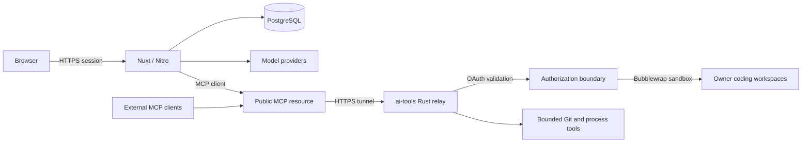
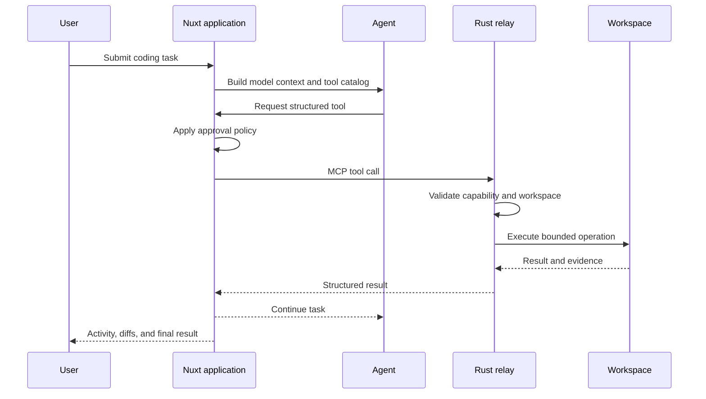

## Overview

**Masih Awam AI Code** is a self-hosted coding workspace designed around one idea: an AI assistant should be able to do real repository work without collapsing the boundary between model reasoning and trusted machine execution.

The product combines an authenticated Nuxt application with a native Rust relay. The web layer owns chat, workspaces, model providers, persistence, MCP configuration, orchestration, and activity views. The relay owns filesystem access, command execution, Git mutations, sandboxing, and the hard security boundary around the coding machine.

## Problem

A useful coding agent needs more than a chat box. It needs to inspect files, search code, execute commands, mutate repositories, call remote tools, and coordinate delegated work. Giving a web application unrestricted shell access would make that convenience the security model.

The architecture therefore separates **product orchestration** from **native authority**.

## Architecture

The split is deliberate:

- **Nuxt / Nitro** owns user sessions, conversations, workspaces, providers, MCP configuration, orchestration state, and telemetry.
- **Rust relay** owns the native execution surface and independently enforces workspace and tool authorization.
- **PostgreSQL + Drizzle** persist application state.
- **MCP** is the contract between the application, the native relay, and compatible external clients.

## Agent Execution Flow

A coding task moves through explicit boundaries rather than directly from a prompt to a shell.

Dedicated workspace and Git capabilities are preferred over opaque terminal commands. Terminal execution remains the fallback for builds, package managers, scripts, interpreters, and operations not covered by a structured capability.

## Native Security Boundary

The native relay is intentionally more restrictive than the UI:

- refuses root execution in production;
- binds the relay to loopback rather than a public interface;
- uses **Bubblewrap** for filesystem and process containment on Linux;
- protects credential-bearing paths such as SSH, cloud, Docker, Kubernetes, and package-manager configuration;
- keeps ordinary terminal networking disabled unless explicitly enabled;
- validates tool authorization server-side even when the UI has already shown an approval;
- bounds process lifetime, output retention, cancellation, and concurrency.

Remote MCP access uses OAuth resource-server validation with issuer, audience, signature, expiry, owner subject, and required scope checks.

## Multi-Agent Orchestration

Agent mode supports bounded dependency graphs for delegated work. Independent children can run concurrently, while writer tasks are isolated into worktrees so multiple agents do not mutate the same checkout blindly.

The parent owns reconciliation: evidence is deduplicated, reviewer disagreements are surfaced, high-severity blockers prevent delivery, and writer work is tracked through produced, reviewed, accepted, integrated, and delivered states.

The orchestration layer does **not** bypass Git delivery controls. Git and forge primitives remain the only path for branch integration and repository delivery.

## Activity and Evidence

Execution history is treated as product data rather than hidden reasoning. The relay can record workspace operations into an encrypted owner-local journal before execution, then export them asynchronously into the web application's PostgreSQL read model.

Structured file mutations can carry exact before/after evidence. Terminal, Git, and opaque process operations remain bounded summaries unless the relay can prove a more exact diff.

## Engineering Decisions

### Two trust zones instead of one full-stack shell

The web application can evolve quickly without becoming the authority over the host machine. Native security policy remains concentrated in one component.

### MCP as the execution contract

The same relay can serve the first-party application and compatible external MCP clients without creating separate execution implementations.

### Structured capabilities before terminal

Known operations get explicit schemas and policy. The terminal stays available, but it is not the default abstraction for every filesystem or Git action.

### Evidence over hidden reasoning

The UI surfaces tool calls, task state, child agents, approvals, activity, and supported diffs. It does not pretend hidden chain-of-thought is execution evidence.

## Stack

Nuxt 4, Vue, TypeScript, Nitro, PostgreSQL, Drizzle ORM, Rust, MCP Streamable HTTP, Bubblewrap, OAuth/OIDC, OpenTelemetry, and provider integrations.

## Status

The project is actively developed as a self-hosted coding environment and native execution platform. Its current architecture is centered on the Nuxt/Rust trust split, MCP-based tool access, bounded orchestration, and explicit execution evidence.
