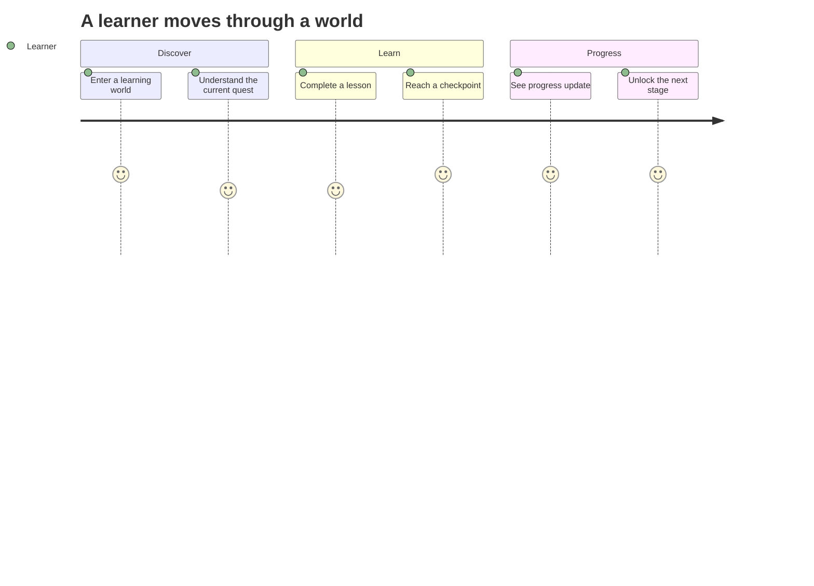
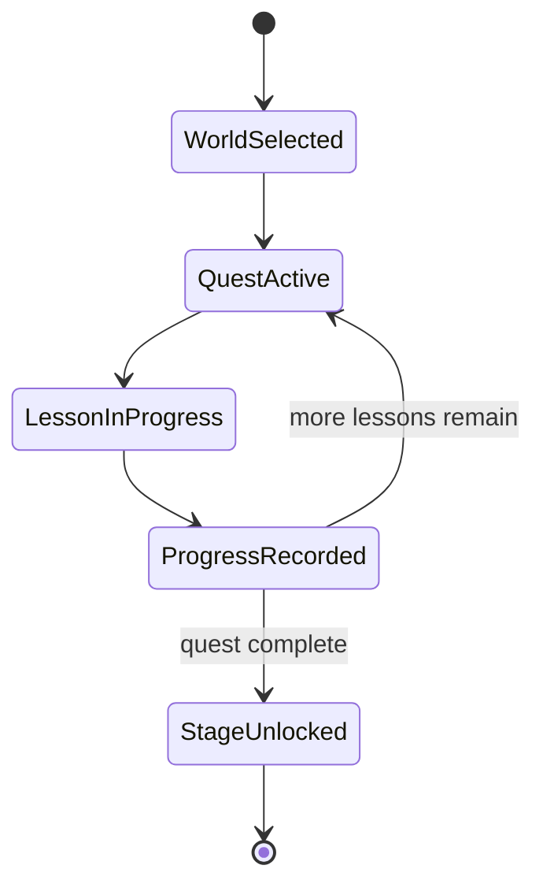
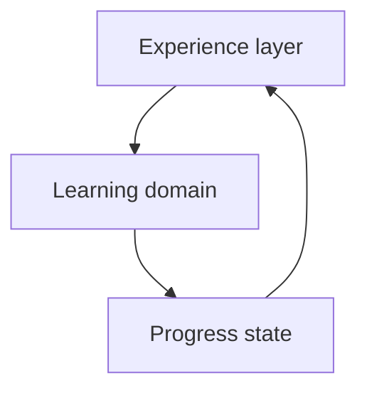
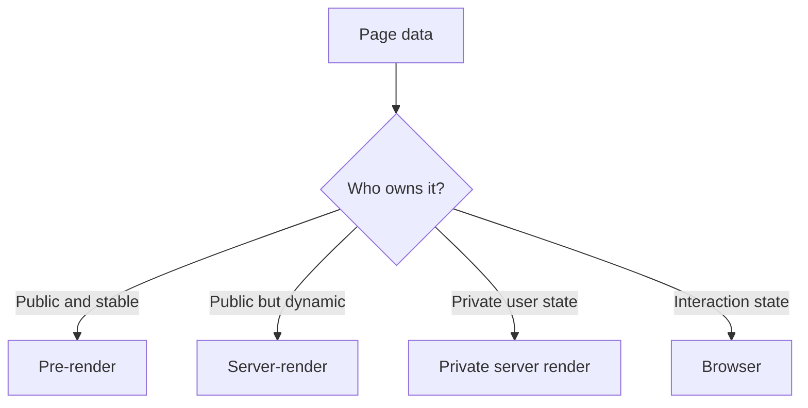

## The Story

Traditional LMS products are good at organizing content.

They are not always good at making people want to continue.

A learner logs in, sees a list of courses, opens one, finds another list of modules, then another list of lessons. Technically, everything is there. Emotionally, the experience can feel like navigating folders.

**Masih Awam LMS** started from a different question:

> What if learning felt less like browsing a catalog and more like progressing through a game?

## The Core Idea

The product turns learning into a journey.

Instead of only showing courses and completion percentages, the learner moves through:

- worlds;
- quests;
- lessons;
- checkpoints;
- progression.

The underlying learning material is still structured like a normal LMS, but the experience layer gives it direction and momentum.



The goal is not to make education look like a game.

The goal is to use game concepts to answer a very practical question:

> “What should I do next?”

## The Learner Experience

A good learning system should reduce decision fatigue.

The learner should not need to repeatedly figure out where they are, what they completed, and what comes next.



Progression becomes part of the product language.

Instead of “Module 3, Lesson 4,” the system can frame progress as “you are here in this journey.”

## The General Progress Model

The mathematics are intentionally simple.

```text
completed lessons
-----------------
total lessons
= progress
```

The interesting part is how that progress is interpreted.

A lesson completion contributes to a quest.

A quest contributes to a world.

A world contributes to the learner's broader progression.

```text
lesson
→ quest
→ world
→ overall journey
```

The algorithm remains predictable while the experience feels more meaningful.

## Why Storytelling Belongs in the Product

A beginner often struggles with more than the technical material.

They also struggle with uncertainty:

- Am I doing this in the right order?
- How much is left?
- Why does this topic matter?
- What should I learn after this?

Narrative and characters can act as guidance.

They give context to the next task and make transitions between lessons feel intentional instead of arbitrary.

The story is not the source of truth for progress. It is the layer that makes the structure easier to follow.

## General System Design

The product can be understood as three connected layers.



**Experience layer** contains the worlds, quests, visual-novel scenes, and presentation.

**Learning domain** contains courses, modules, lessons, and enrollment.

**Progress state** records what the learner has actually completed.

This separation is important because a story can change without corrupting learning progress, and the learning structure can evolve without rewriting the entire experience layer.

## Why Different Pages Behave Differently

Not every page in the LMS has the same type of information.

A public course page is different from a learner dashboard.

A course catalog can be shared by everyone. A dashboard contains private progress for one specific user.

So the product follows the data:



The idea is not “use many rendering techniques.” The idea is that different data deserves different handling.

## Product Tradeoffs

**Engagement vs distraction.** Game mechanics should motivate learning, not become the main activity.

**Guidance vs freedom.** Beginners benefit from a strong path, but advanced learners may want shortcuts.

**Story vs speed.** Some users enjoy narrative context; others want to move directly to the lesson.

The product has to make the experience richer without making it slower for users who already know where they want to go.

## Implementation Notes

The current product uses a Rust backend with PostgreSQL and a lightweight browser experience, plus observability for production behavior.

## Stack

Rust, Axum, PostgreSQL, HTML, SCSS, JavaScript, OpenTelemetry, Prometheus, Loki, Tempo, and Grafana.
