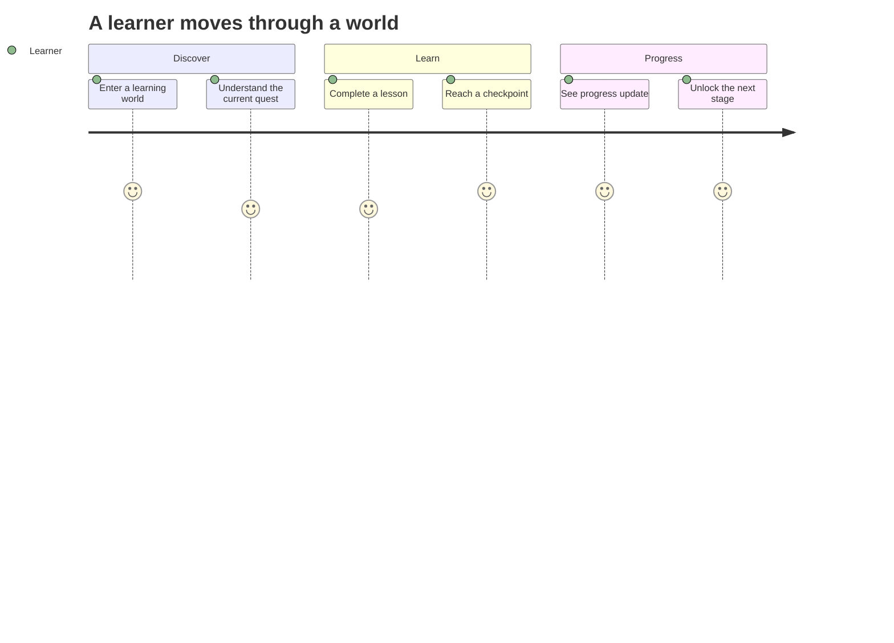
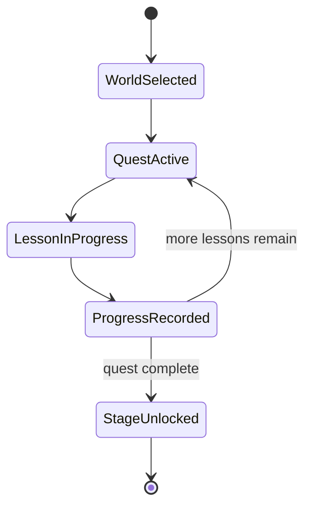
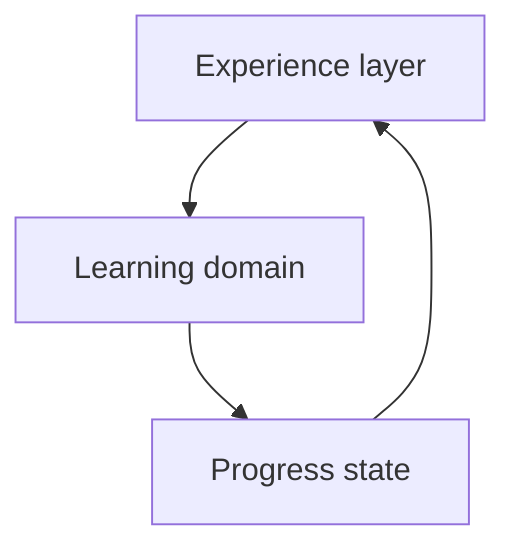
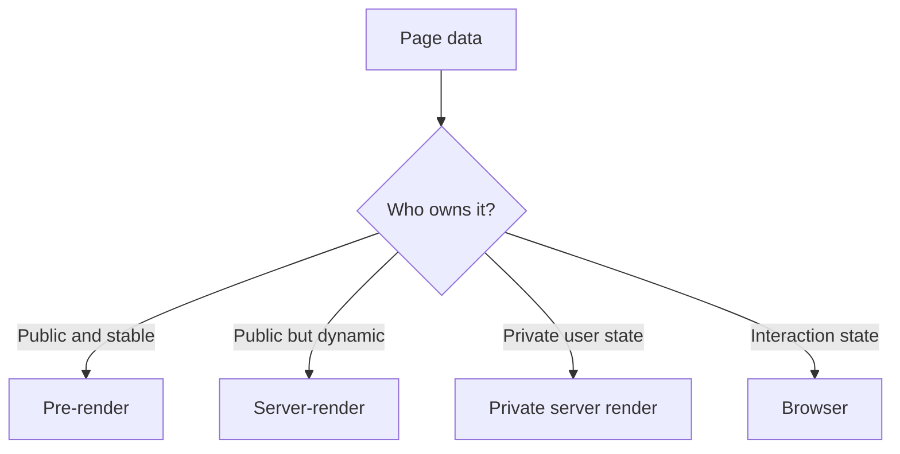

## The Problem

A conventional LMS is good at storing courses and tracking completion. It is not always good at helping a learner understand what to do next.

The usual pattern is a course list, then modules, then lessons. Everything can be technically organized while the experience still feels like navigating folders.

**Masih Awam LMS** explores a different presentation model. The underlying learning structure stays familiar, but the learner moves through worlds, quests, lessons, and checkpoints instead of browsing a flat catalog.

## The Core Idea

The product treats progression as part of the interface, not only as a percentage stored in the backend.



The game concepts are there to answer a practical question: **what should I do next?**

They are not meant to replace the learning material or turn every interaction into a reward mechanic.

## Learner Flow

The platform keeps the next action visible by carrying progress through a small hierarchy.



A lesson contributes to a quest. A quest contributes to a world. The interface can then show the learner where they are without asking them to reconstruct that context from several pages.

## Progress Model

The calculation itself stays simple:

```text
completed lessons
-----------------
total lessons
= progress
```

The product uses that simple state at more than one level:

```text
lesson
→ quest
→ world
→ overall journey
```

Keeping the calculation predictable matters because presentation can change without changing what completion means.

## Story as Navigation Context

Storytelling is useful only when it helps the learner understand the path.

A character, scene, or quest description can explain why the next lesson matters or connect one topic to the next. Progress still comes from completed learning work, not from narrative state.

That separation means the story layer can change without corrupting course completion.

## System Design

The product can be viewed as three connected layers.



**Experience layer** contains worlds, quests, visual-novel scenes, and presentation.

**Learning domain** contains courses, modules, lessons, and enrollment.

**Progress state** records what the learner has actually completed.

The boundary is useful because each layer changes for a different reason. Story and presentation evolve with the learning experience, while progress needs to remain stable and auditable.

## Rendering by Data Ownership

Not every page carries the same kind of data.

A public course page can be shared across users. A learner dashboard contains private progress. Interactive controls also have browser state that does not belong in a public prerendered document.



The rendering strategy follows the data instead of applying one technique to every page.

## Product Tradeoffs

**Engagement vs distraction.** Game mechanics should make the path clearer, not become the main activity.

**Guidance vs freedom.** Beginners may benefit from a strong sequence, while experienced learners may want direct access to a specific lesson.

**Story vs speed.** Narrative context can help some learners, but it should not block someone who already knows where they want to go.

Those tradeoffs shape the product more than adding another visual reward system.

## Implementation Notes

The current product uses a Rust backend with Axum and PostgreSQL, a lightweight browser interface, and observability through OpenTelemetry, Prometheus, Loki, Tempo, and Grafana.

## Stack

Rust, Axum, PostgreSQL, HTML, SCSS, JavaScript, OpenTelemetry, Prometheus, Loki, Tempo, and Grafana.
