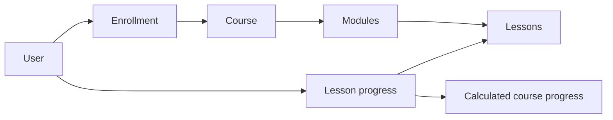
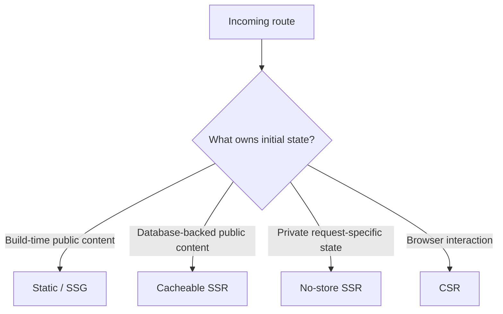
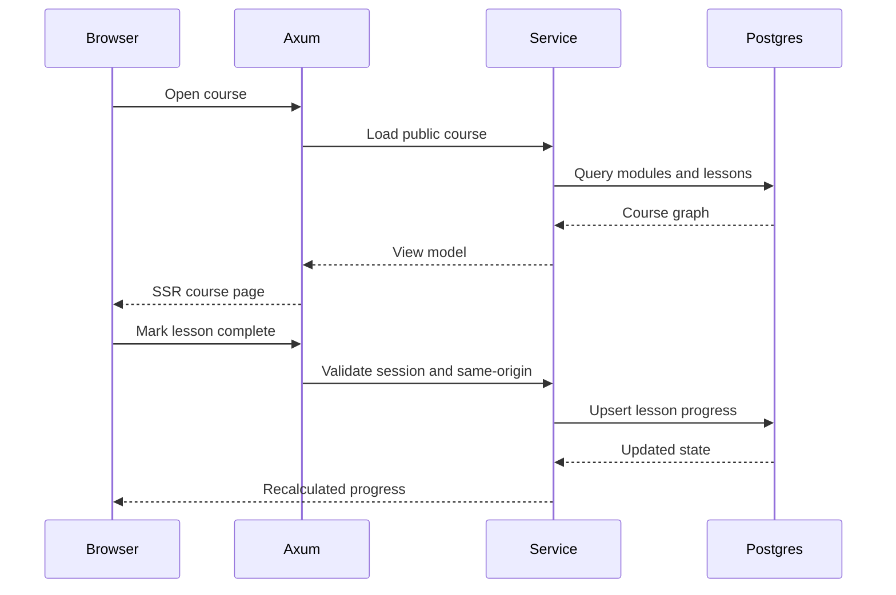
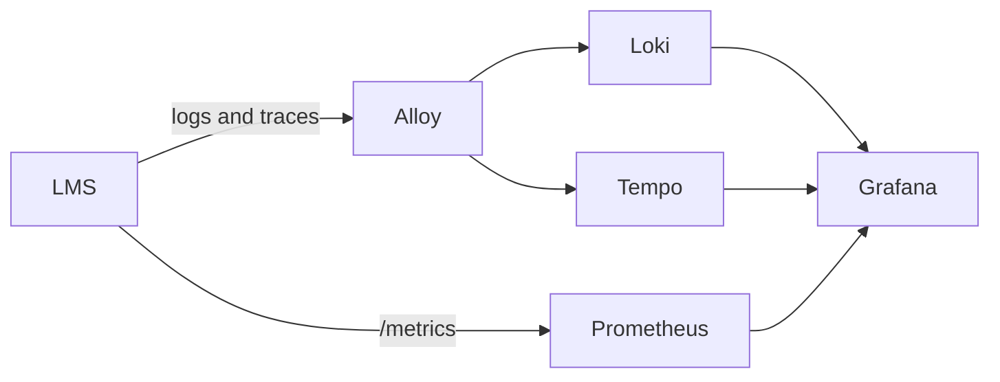

## Overview

**Masih Awam LMS** explores what an LMS looks like when progression, worlds, quests, and story are the primary interaction model instead of a conventional course catalog.

The browser remains intentionally lightweight: HTML, compiled SCSS, and vanilla JavaScript. The backend is a Rust/Axum application backed by PostgreSQL and responsible for authentication, course state, enrollments, progress, server rendering, and security-sensitive mutations.

## Product Direction

The learning experience is structured around:

- world-based course discovery;
- levels, quests, checkpoints, and XP;
- visual-novel scenes with characters, dialogue, and choices;
- authenticated learner progress;
- course modules and lessons backed by durable database state.

The goal is not to hide a traditional LMS behind game graphics. Progression is part of the product model itself.

## Domain Model

Course progress is calculated from completed lessons rather than stored as an independent percentage. Enrollment and lesson-completion mutations are idempotent.

## Rendering Architecture

The site uses different rendering strategies for different ownership boundaries.

This keeps public course content fast and indexable while preserving server authority for private dashboard state, sessions, enrollment, and progress.

The landing page is pre-rendered. Private dashboard views can receive server-rendered initial state so the browser does not immediately repeat the same session and progress requests after boot.

## Authentication and Security

The LMS includes a production-oriented account system rather than a demo login:

- Argon2id password hashing;
- session tokens stored as hashes in PostgreSQL;
- absolute and idle session expiry;
- session limits per account;
- fresh-auth requirements for sensitive actions;
- email verification and recovery;
- admin MFA using TOTP and single-use recovery codes;
- encrypted MFA secrets;
- breached-password screening through a k-anonymity range API;
- same-origin protections on browser mutations;
- persistent security-history events.

Admin sessions have stricter boundaries than normal learner sessions.

## Learning Request Flow

## Backend Structure

The Rust server follows one-way dependencies:

`repositories → services → handlers → routes → main`

The repository guard enforces those architectural directions, keeps integration tests outside production source, and applies source-size and folder-density constraints so the codebase does not silently collapse into oversized modules.

## Observability

Logs and traces are exported over OTLP through Alloy, while Prometheus scrapes application metrics.

The dashboard covers service health, request rate, error ratio, p95 latency, structured logs, and trace search.

## Stack

Rust, Axum, SQLx, PostgreSQL, HTML, SCSS, vanilla JavaScript, OpenTelemetry, Prometheus, Loki, Tempo, Grafana, and Playwright.

## Status

The LMS has working authentication, course/catalog data, enrollment, lesson progress, learner dashboard foundations, hybrid rendering, observability, and the visual-novel/game-based presentation system. AI-driven adaptive characters remain a future direction rather than a shipped capability.
