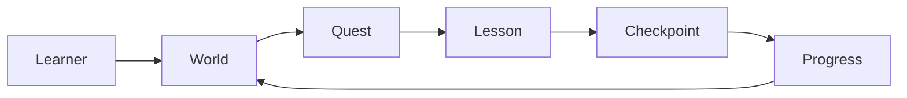
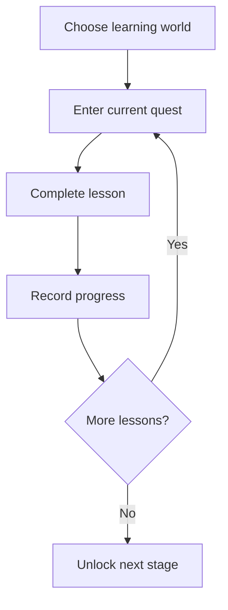
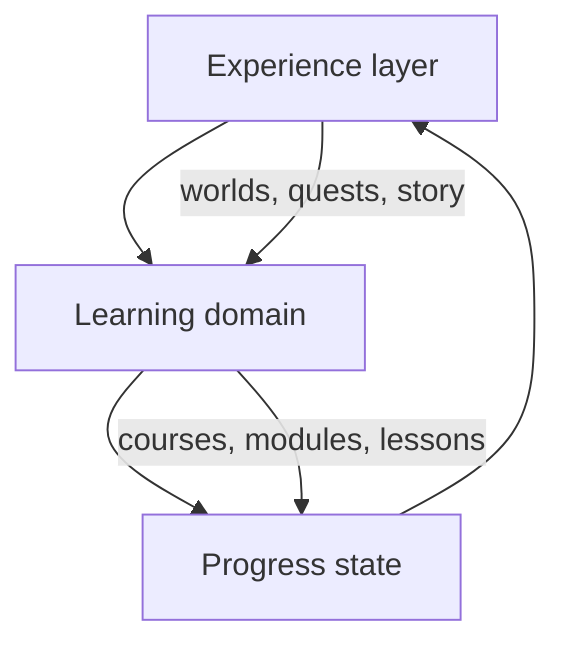

## What It Is

**Masih Awam LMS** is a game-based learning platform.

Instead of presenting learning as a list of courses and modules, the product frames it as a journey through worlds, quests, lessons, checkpoints, and progression.

The goal is to make the experience feel closer to playing through a guided adventure than navigating a traditional LMS dashboard.

## Problem It Solves

Traditional LMS products are often functionally correct but emotionally flat.

Common problems:

- learners do not know what to do next;
- progress feels abstract;
- courses feel like disconnected content pages;
- motivation drops between lessons;
- dashboards expose information but do not create momentum.

The product tries to solve this by giving learning a stronger sense of **direction, progression, and narrative**.

## Who It Is For

The concept is aimed at beginner learners who benefit from:

- clear next steps;
- visible progress;
- small achievable goals;
- story and character guidance;
- reduced cognitive load.

## Core Concept

The learning model is built around progression.



A course is not just content. It is a structured sequence of goals.

## General Learning Flow



The system should always make the learner's next meaningful action obvious.

## General Progress Algorithm

Course progress can be described very simply:

```text
completed lessons / total lessons = course progress
```

But the experience layer adds meaning on top:

```text
lesson completion
→ quest progress
→ world progress
→ learner progression
```

The product keeps the calculation simple while making the presentation richer.

## General System Design



### Experience layer

Owns the story, worlds, quests, characters, and presentation.

### Learning domain

Owns courses, modules, lessons, and enrollment.

### Progress state

Tracks what the learner has completed and what becomes available next.

## Why Hybrid Rendering Matters Conceptually

Not every page has the same type of data.

- public content can be prepared ahead of time;
- shared course pages can be rendered on request;
- private learner state depends on the current user;
- interactions such as dialogue choices belong in the browser.

The rendering strategy follows data ownership rather than forcing the whole product into one model.

## Important Product Decisions

### Progress should be obvious

The learner should always know where they are and what comes next.

### Game mechanics support learning

XP, quests, and worlds are useful only if they clarify progression rather than distract from content.

### Security remains server-owned

Authentication and progress rules should not depend on browser-side state.

## Tradeoffs

- **engagement vs distraction** — gamification can motivate, but too much can obscure learning;
- **structure vs flexibility** — guided paths help beginners but may feel restrictive for advanced users;
- **story vs speed** — narrative improves immersion but can slow users who want direct access.

## Implementation Notes

The current product uses a Rust backend with PostgreSQL and a lightweight browser experience, plus observability for production behavior.

## Stack

Rust, Axum, PostgreSQL, HTML, SCSS, JavaScript, OpenTelemetry, Prometheus, Loki, Tempo, and Grafana.
