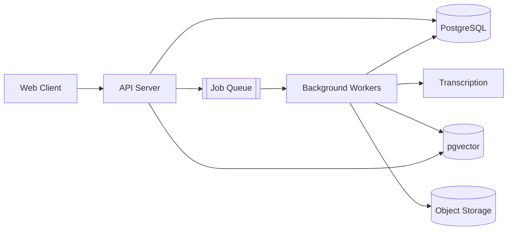
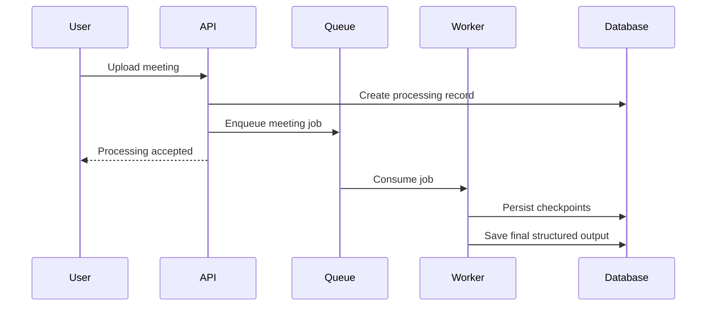
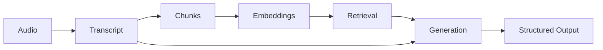

## Project overview

The product started from a simple observation: teams produce a huge amount of useful context in meetings, but most of it disappears into recordings, chat fragments, and personal notes.

Sensio Notes turns each meeting into a durable knowledge artifact. Audio is transcribed, normalized, enriched with speaker context, and converted into **summaries, decisions, action items, and searchable evidence**.

> The goal was not to make another meeting recorder. The goal was to make the conversation useful after the call ends.

### What the product needed to do

- keep the upload path fast even for large recordings
- process transcription and AI work asynchronously
- preserve source context for every generated answer
- make past meetings semantically searchable
- recover safely from partial failures

## The problem

Meeting content is naturally unstructured. Important decisions might appear in the middle of a forty-minute discussion, while action items are often implied rather than written down.

| Challenge | Product consequence |
| --- | --- |
| Long conversational input | Processing must happen away from request/response paths |
| Repeated context | Retrieval must rank the most relevant transcript chunks |
| AI uncertainty | Answers need citations back to meeting evidence |
| Large uploads | Upload and processing need independent recovery paths |

## System architecture

The architecture separates the interactive product path from long-running work. The API records durable state quickly, then workers consume jobs independently.



### Failure boundaries

Workers are designed around idempotent jobs. A retry can safely resume processing without creating duplicate meeting artifacts.



## AI and retrieval

The AI path is deliberately staged. Each stage produces an inspectable artifact rather than hiding everything behind one large prompt.

1. **Transcription** turns audio into timestamped speaker text.
2. **Chunking** groups the transcript into semantically coherent passages.
3. **Embeddings** make those passages searchable by meaning.
4. **Retrieval** selects evidence for the current question or generation task.
5. **Structured generation** emits typed summaries, decisions, and action items.



## Reliability and operations

The system assumes that uploads fail, workers restart, providers throttle, and individual AI calls occasionally produce unusable output.

```typescript
type ProcessingState =
  | 'uploaded'
  | 'transcribing'
  | 'indexing'
  | 'generating'
  | 'completed'
  | 'failed';
```

Operationally, the most useful signals are queue age, stage latency, retry counts, provider error rates, and end-to-end completion time.

## Outcome and learnings

- keep expensive work outside synchronous request paths
- make retries a design constraint, not an afterthought
- store enough intermediate state to explain failures
- treat AI output as a view over evidence, not the evidence itself
- build observability into the workflow state machine
