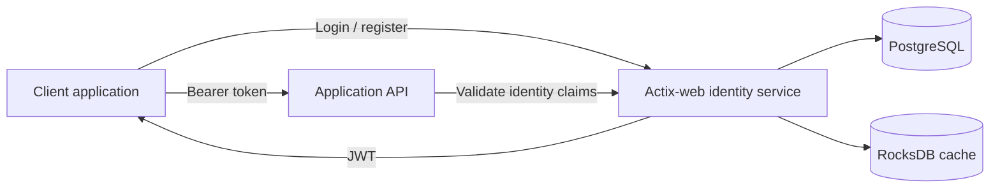
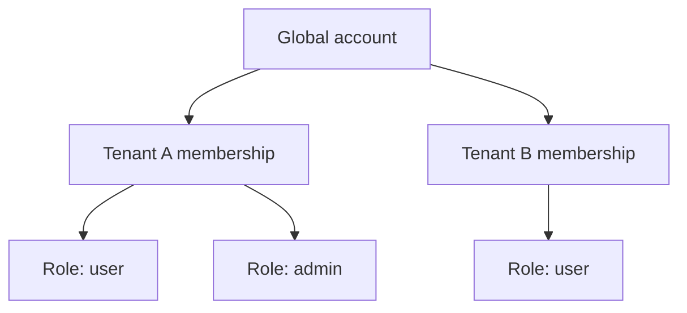
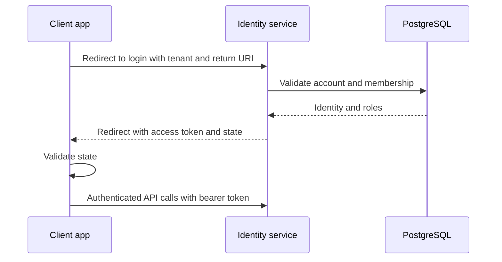

## Overview

The **Multi-Tenant User Management Service** is a standalone authentication and identity service designed to be reused across applications instead of rebuilding account management inside every product.

It provides tenant-scoped user and role management, JWT authentication, refresh sessions, SSO-style redirects, API-key protected bootstrap endpoints, and persistent caching.

## Why a Separate Service

Applications such as IoT platforms need identity rules that cut across multiple products:

- the same account may belong to multiple tenants;
- one account may have multiple roles inside a tenant;
- tenant data must remain isolated;
- authentication and token refresh must behave consistently across clients;
- frontend applications should not implement security policy themselves.

The service centralizes those rules behind HTTP contracts.

## Architecture

PostgreSQL owns durable identity and tenant state. RocksDB is a local persistent cache with TTL to reduce repeated database work for frequently accessed data.

## Authentication Boundaries

The HTTP surface is split into two scopes.

### API-key protected bootstrap scope

The `/api` endpoints handle operations such as login, registration, and token refresh. They require application-level API keys or a tenant secret depending on the operation.

### JWT protected scope

User, tenant, profile, logout, verification, and password-management operations require bearer tokens.

This split separates application bootstrap credentials from end-user session authority.

## Multi-Tenant Access Model

Accounts are global rather than duplicated per tenant. A user can reuse the same credentials across tenant memberships while roles remain scoped to the relevant tenant.

## SSO Flow

The integration documentation uses redirect state and nonce values to protect the login handoff and sends the access token through the URL fragment rather than a query parameter so it is less likely to appear in server access logs.

## Security

The service includes:

- Argon2 password hashing;
- access and refresh JWT/session flows;
- role-based access control;
- tenant-scoped authorization;
- API-key protection;
- rate limiting;
- soft deletes;
- structured logging;
- graceful shutdown;
- integration and end-to-end tests.

## Caching Strategy

RocksDB stores local cache entries with TTL. Expired data is removed lazily when accessed. The cache is an optimization layer; PostgreSQL remains the durable source of truth.

## Integration Surface

The repository includes documented examples for Next.js, React, Vue, and vanilla JavaScript clients plus API contracts for:

- authentication;
- tenant management;
- user management;
- profile operations;
- MQTT-related identity and ACL checks.

That documentation is part of the product because the main value of a standalone identity service is predictable integration.

## Stack

Rust, Actix-web, PostgreSQL, RocksDB, SQLx migrations, JWT, Argon2, Docker, Docker Compose, Playwright, and Rust integration tests.

## Status

The service has the authentication, tenant, user, SSO integration, cache, migration, and test foundations needed to serve as a reusable identity component for other projects.
