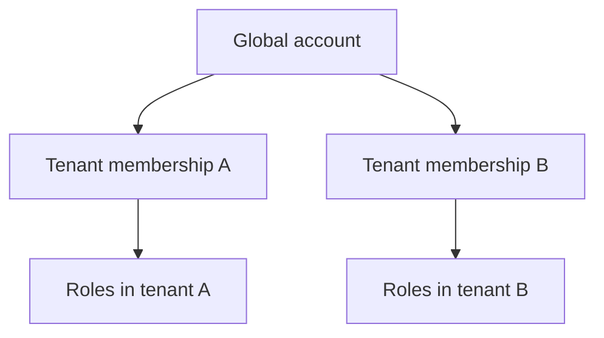
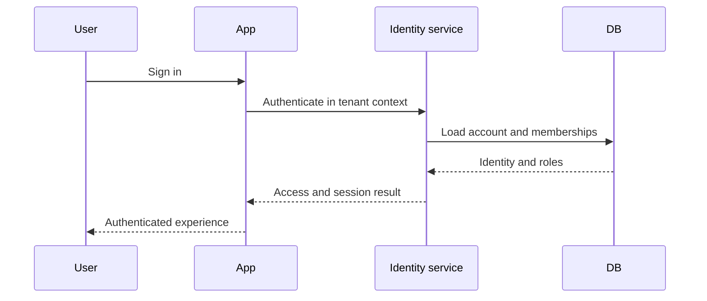
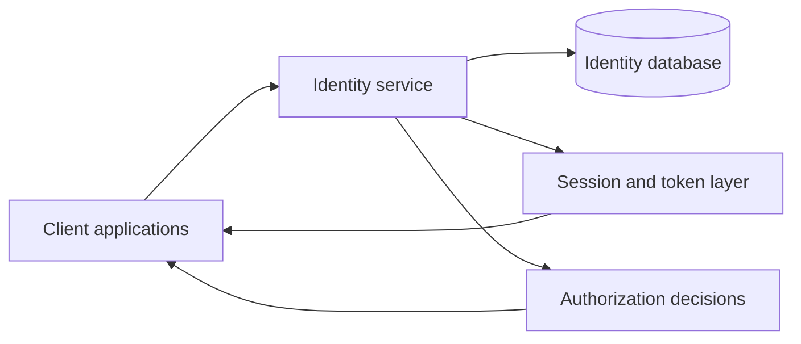

## What It Is

The **Multi-Tenant User Management Service** is a reusable identity platform.

Its job is to answer four questions consistently:

1. Who is this user?
2. Which tenant do they belong to?
3. Which roles do they have?
4. What are they allowed to do?

Instead of solving those questions separately inside every application, the service centralizes them.

## Problem It Solves

Multi-tenant products often duplicate authentication and authorization logic.

That leads to:

- inconsistent session behavior;
- duplicated user tables;
- different role models across products;
- harder security maintenance;
- repeated frontend integration work.

The service creates one shared identity model.

## Who It Is For

It is designed for applications that need:

- multiple tenants;
- shared accounts;
- tenant-scoped roles;
- centralized login;
- reusable authentication APIs.

## Core Concept

An account is global, while access is contextual.



The same person can participate in multiple products or organizations without creating unrelated credentials each time.

## General Authentication Flow



## General Authorization Algorithm

A permission decision can be reduced to:

```text
identity
→ tenant membership
→ role
→ requested action
→ allow or deny
```

That logic is the heart of the system.

## General System Design



Client applications consume identity as a service rather than implementing it independently.

## SSO Concept

Single sign-on allows the same account to move between applications while keeping tenant and role context explicit.

The goal is:

```text
authenticate once
→ preserve identity
→ apply application-specific tenant context
```

## Important Product Decisions

### Accounts are global

Identity belongs to the person, not to one tenant row.

### Roles are contextual

A user can have different roles in different tenants.

### Authentication and authorization are separate

Being logged in does not automatically mean every action is allowed.

### Integration is part of the product

A reusable identity service is only useful if applications can integrate it predictably.

## Tradeoffs

- **central consistency vs service dependency**;
- **global accounts vs tenant isolation**;
- **flexible role models vs more complex permission logic**.

## Implementation Notes

The current service uses Rust, PostgreSQL, JWT-based sessions, tenant-aware APIs, and a local cache for frequently accessed data.

## Stack

Rust, Actix-web, PostgreSQL, RocksDB, JWT, Argon2, and Docker.
