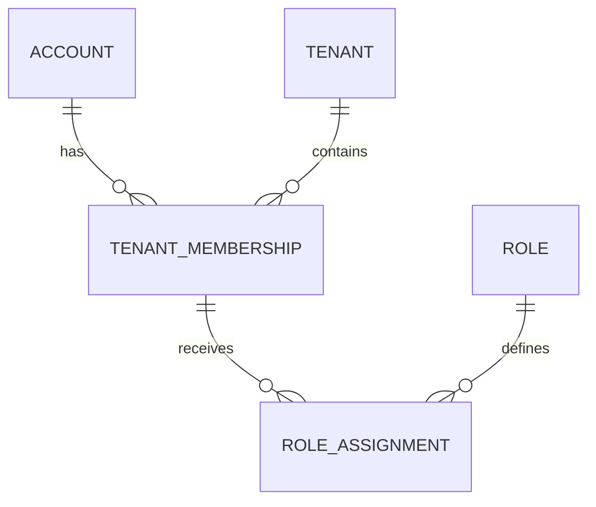
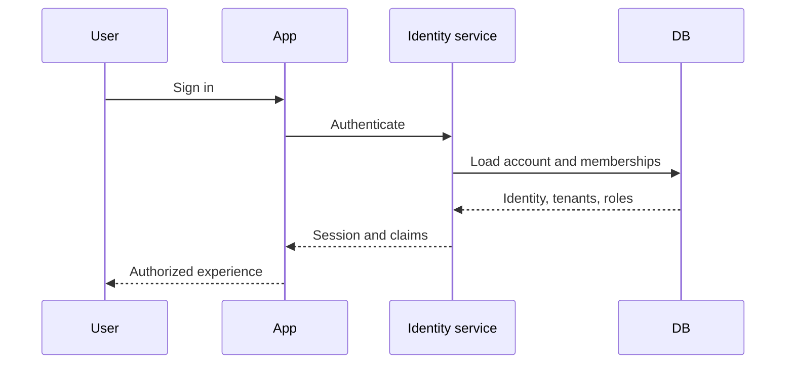
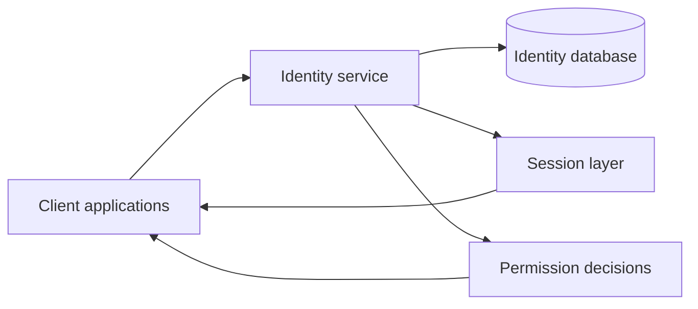

## One account can belong to more than one tenant

User management looks simple when an application is small.

You create a users table, add login, store a role, and move on.

Then the product grows. A second tenant appears. A user needs access to both tenants. The same person is an admin in one organization and a normal user in another. Another application needs the same login system.

Suddenly, “users” is no longer one table.

That is the problem this service was built to solve.

## Identity is global; permissions are contextual

The service separates **identity** from **context**.

A person has one global account. That account can participate in multiple tenants. Each tenant membership can carry its own roles.



That means the answer to “who are you?” stays stable, while the answer to “what can you do here?” depends on the tenant context.

Without this separation, applications often duplicate identity. The same person may end up with different user rows, different passwords, and different role logic across products.

That creates security drift. One application rotates sessions correctly while another does not. One product uses tenant-scoped roles while another stores one global role field.

Centralizing identity gives consuming applications one consistent model.

## Login stays ordinary even when authorization is not

From the user's point of view, login should still feel ordinary.

They enter credentials. The system identifies the account. Then the tenant context determines what that account is allowed to do.



The extra complexity exists so the user does not have to think about it.

## Authorization follows a fixed chain

Every protected action can be described with the same logic:

```text
identity
→ tenant
→ membership
→ role
→ permission
→ allow / deny
```

A successful login only proves identity. It does not prove permission.

A user may be valid but still have no access to a specific tenant, resource, or action. Treating authorization as a separate decision prevents the common mistake of equating “logged in” with “allowed to do everything.”

## One identity service, many applications



Applications do not need to reimplement the same account logic. They ask one identity system for consistent answers.

Once identity is centralized, multiple applications can share the same account while each consuming application still applies its own tenant context.

```text
one person
→ one identity
→ many tenant contexts
→ many applications
```

## Tradeoffs that shape the service

**Central consistency vs dependency.** A shared identity service reduces duplication, but consuming applications now depend on it being available.

**Global accounts vs strict isolation.** Reusing one identity is convenient, but tenant boundaries must remain explicit everywhere.

**Flexible roles vs simple permissions.** Rich role models support more cases, but become harder to reason about if they are not kept disciplined.

## Current implementation

The current service uses Rust with Actix-web, PostgreSQL for durable identity data, RocksDB for local caching, JWT-based sessions, Argon2 for password hashing, tenant-aware APIs, and Docker for packaging.
