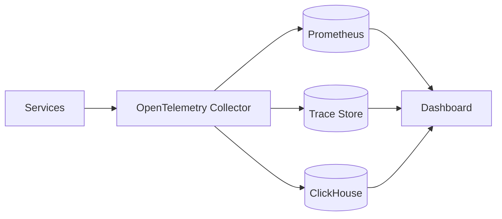

## Project overview

The stack gives engineers one path from a customer-visible symptom to the trace, metrics, and logs that explain it.

## Telemetry pipeline

OpenTelemetry collectors normalize application telemetry before routing each signal to the storage system suited for it.

## Correlation

Trace and request identifiers are propagated into structured logs, allowing engineers to pivot from a slow endpoint directly into the related event stream.

## Alerting

Alerts are based on user-impacting service-level signals before low-level infrastructure noise.

## Outcome and learnings

Observability is most useful when instrumentation conventions are treated as application architecture rather than an operations add-on.
