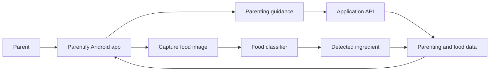
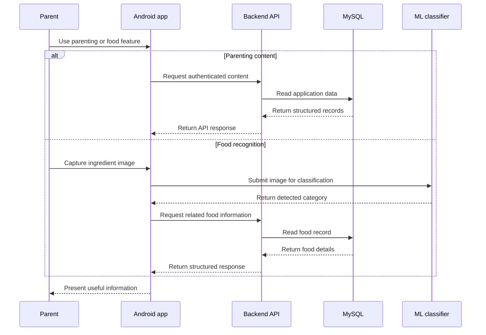

## The Problem

Parenting decisions often depend on information that is available, but fragmented.

A parent may need practical guidance about childcare and development, then need a different source to understand everyday food ingredients or determine what they are looking at. Moving between unrelated sources adds friction to tasks that should be simple and accessible from a phone.

**Parentify** was developed as our Bangkit Academy capstone to bring those needs into a single mobile experience. The product combined curated parenting information with a camera-based food recognition flow so users could move from a question or an observed ingredient to useful information without treating each feature as a separate product.

The project was less about adding as many features as possible and more about making several independently developed systems behave like one coherent application.

## Product Approach

From a user's perspective, Parentify was designed around two practical journeys.

The first was **parenting guidance**: users could authenticate, browse parenting articles, open detailed content, and keep relevant information available through the application experience.

The second was **food recognition**: users could capture an image through the Android application, classify the ingredient through the machine-learning flow, and receive structured food information associated with the detected category.



This separation mattered internally, but it was intentionally hidden from the user. Articles, authentication, camera capture, classification, and food data needed to feel like parts of the same application rather than individual Bangkit deliverables.

## How the System Worked

Parentify was developed across the three Bangkit learning paths and split into three repositories with clear responsibilities.

- **Mobile Development** owned the Android client and user-facing flows.
- **Cloud Computing** provided the application backend, authentication flow, domain data, and integration boundary used by the client.
- **Machine Learning** developed the image-classification workflow for recognizing food ingredients.

The Android application coordinated the user interaction. Network-backed features communicated with the application API, while the food-detection experience connected camera input with the classification workflow and then presented the resulting ingredient information to the user.



## Mobile Experience

The Android application was implemented in **Kotlin** and organized around Android architecture components rather than placing application behavior directly in screens.

**ViewModel** and **LiveData** supported UI state, **Navigation Component** managed movement between screens, and **Hilt** handled dependency injection. **Retrofit** and **OkHttp** provided the network boundary to remote services, while **Room** supported local persistence for application data such as saved article content. **CameraX** powered the camera-based detection flow, and **Firebase Authentication** was also included in the Android stack for identity-related functionality.

The result was an application with separate flows for authentication, parenting content, favorites, camera capture, food detection results, and supporting settings/detail screens.

These technologies were not the objective of the project by themselves. Their role was to keep UI, local data, network communication, and device capabilities separated enough that the mobile team could evolve each part without turning the Android client into one tightly coupled screen flow.

## Food Recognition

The Machine Learning track addressed the problem of turning a camera image into a food category the application could understand.

The repository contains a TensorFlow/Keras convolutional neural network trained to classify **36 food-ingredient categories**, including vegetables, fruits, grains, proteins, and other common ingredients. Training used 150×150 RGB images and a softmax output representing the supported classes.

The model was trained for 20 epochs. The recorded experiment reached a validation accuracy of approximately **93.7% at its best observed epoch**, although the final epoch was lower. I treat that number as an experimental training result rather than a production guarantee, because model performance in a notebook and performance on real user camera input are not necessarily the same thing.

The resulting artifacts were stored in both Keras `.h5` and **TensorFlow Lite** formats, making the model suitable for integration into a mobile-oriented inference workflow.

```text
camera image
→ resize / prepare input
→ CNN inference
→ one of 36 ingredient classes
→ resolve related food information
→ present result to the user
```

## Backend and Data Layer

My primary responsibility was the **Cloud Computing and backend integration** side of Parentify.

I worked on translating product requirements into backend capabilities that the Android client could consume consistently. The Node.js service used **Express** to expose APIs for authentication, parenting articles, and food information, with **MySQL** holding the structured application data.

Authentication used token-based access with **JSON Web Tokens**, password hashing through **bcrypt**, and request validation through **Joi**. Rather than requiring the Android application to understand database relationships, the backend provided a stable application-facing contract and returned domain data in a form the client could consume directly.

Conceptually, the service separated responsibilities into a small number of application domains:

```text
authentication
→ identify users and control access

parenting articles
→ provide guidance content to the application

food information
→ map recognized ingredients to structured records

API contract
→ keep mobile, data, and backend assumptions aligned
```

That integration boundary was important because each Bangkit learning path could make progress independently. The product only worked when those independently developed pieces agreed on inputs, outputs, naming, and data relationships.

## Cloud and Delivery

The backend was prepared to run on **Google Cloud infrastructure** using a Linux-based environment with Node.js and MySQL.

Deployment documentation covered provisioning the application dependencies, configuring database access, setting up service credentials, and running an update/deployment script on a scheduled job. The repository also included API documentation through Postman to make the backend contract easier to test during integration.

For this project, the cloud layer was therefore not only a place to host an API. It was the environment where the application contract, persistent data, authentication, and team integration came together.

## Technology Across the Product

The complete product used different technologies for different responsibilities:

| Area | Technology | Role in Parentify |
| --- | --- | --- |
| Android | Kotlin, Android SDK, ViewModel, LiveData, Navigation Component | User-facing application and screen/state flow |
| Mobile architecture | Hilt, Room, View/Data Binding | Dependency management, local persistence, and UI integration |
| Networking | Retrofit, OkHttp | Communication between the Android client and remote services |
| Device capability | CameraX | Camera capture for the food-recognition flow |
| Authentication | Firebase Auth, JWT, bcrypt | Identity and protected application access across the product stack |
| Backend | Node.js, Express, Joi | Application APIs, validation, and integration logic |
| Data | MySQL | Persistent user, article, food, and related application records |
| Machine learning | TensorFlow, Keras, CNN | Training the 36-class food ingredient classifier |
| Mobile inference artifact | TensorFlow Lite | Portable model format for application-oriented inference |
| Cloud | Google Cloud, Linux | Runtime environment for backend and application data services |
| API collaboration | Postman | Backend testing and API contract documentation |

## My Responsibility

My direct implementation responsibility was primarily in **Cloud Computing**, especially the backend and the integration surface connecting the application to its data and services.

That work included shaping API behavior around authentication, articles, and food information; working with the MySQL data model; and helping establish the contract the mobile application could integrate against.

I also worked around the wider project integration where the cloud, mobile, and machine-learning deliverables needed to meet. I describe the mobile and machine-learning architecture here because they are essential to understanding Parentify as a product, not to imply that I personally implemented every layer.

The main engineering lesson was that a mobile screen, backend endpoint, database table, and model can all work correctly in isolation while the overall product still fails if their assumptions differ. Parentify made integration, contracts, and ownership boundaries as important as the implementation of any individual component.

## Repositories

Parentify's implementation is available across the three original Bangkit project repositories:

- [Parentify — Cloud Computing](https://github.com/Parentify/Parentify-Cloud-Computing) — backend API, application data, cloud setup, and integration work.
- [Parentify — Mobile Development](https://github.com/Parentify/Parentify-Mobile-Development) — Kotlin Android application, parenting content experience, authentication, favorites, and camera/detection flows.
- [Parentify — Machine Learning](https://github.com/Parentify/Parentify-Machine-Learning) — dataset workflow, CNN training notebook, and exported model artifacts.

The repositories are also collected under the [Parentify GitHub organization](https://github.com/orgs/Parentify/repositories).
