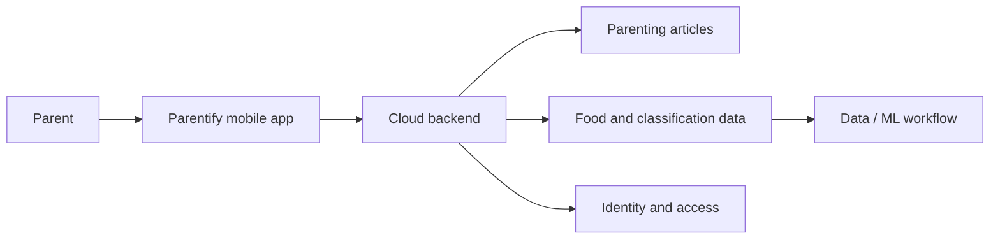
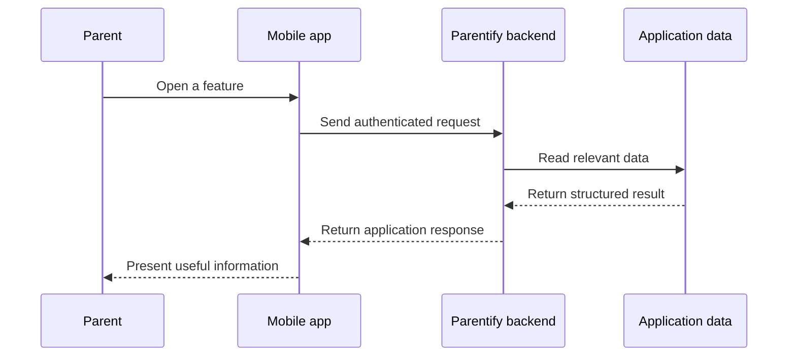

## The Story

Parenting information is everywhere, but that does not automatically make it easy to use.

A parent may need to understand a child’s daily needs, find a relevant article, or check whether a food fits a particular condition. Those questions usually live across different sources, use different language, and require the parent to connect the pieces themselves.

**Parentify** was our Bangkit Academy 2023 Batch 2 capstone attempt to make that journey more direct.

Instead of building a generic information portal, the team shaped the product around a simple idea: give parents one companion where practical parenting content and structured food information can be reached from the same mobile experience.

The capstone was split across the three Bangkit learning paths. Mobile Development owned the Android experience, Machine Learning worked on the data/model side, and Cloud Computing turned the product requirements into backend services that the application could actually consume.

My primary responsibility sat on that Cloud Computing boundary.

## The Product Idea

At a high level, Parentify connected three kinds of value:

- a mobile experience that parents could use directly;
- parenting articles that could be retrieved through the application;
- food information and classification data that could be surfaced in a structured way.

The important part was not any single endpoint or model. It was making the pieces behave like one product.



From the user’s perspective, those internal boundaries should disappear. They should simply open the application, authenticate, find information, and receive a useful response.

## My Role in the Capstone

I worked primarily on the cloud and backend side of the project.

That meant taking features discussed by the team and translating them into services that the Android application could call consistently. The backend exposed flows for authentication, articles, food records, and food-classification information, with MySQL holding the application data behind those flows.

I also helped connect work across repositories. The project was not one monolithic codebase: Mobile Development, Cloud Computing, and Machine Learning progressed separately, so integration required us to agree on what data moved between each part and what the mobile client could rely on.

That cross-team boundary was one of the most useful lessons from the project. A feature is not finished merely because one team’s component works in isolation.

## The General System Flow

The backend acted as the shared contract between the mobile experience and the underlying application data.



For food guidance, the application stored both the food record itself and associated classification information. The backend combined those pieces before returning them to the client, so the mobile layer did not have to reconstruct the relationship on its own.

Conceptually, the flow was:

```text
user intent
→ mobile request
→ authenticated backend boundary
→ domain data lookup
→ structured response
→ mobile presentation
```

## Designing for Integration

The capstone made one architectural constraint very clear: every learning path could move independently, but the product could only work if the contracts between them stayed understandable.

For Cloud Computing, that meant keeping backend responsibilities explicit:

```text
authentication
→ protect application access

articles
→ serve parenting content

food data
→ expose food details and related classification

application API
→ give the Android client one stable integration point
```

The backend therefore became less about “hosting some routes” and more about translating several project domains into a consistent interface for the client application.

## What I Learned

Parentify was one of my first experiences building a product where the engineering problem was genuinely cross-functional.

The technical work mattered, but the harder lesson was coordination: a mobile screen, database schema, backend response, and machine-learning artifact can each be correct on their own and still fail as a product if they do not agree with one another.

The capstone pushed me to think beyond deploying infrastructure. I had to think about contracts, ownership boundaries, integration order, and how backend decisions affect people working in completely different parts of the stack.

That perspective became much more valuable to me than any individual service used during the project.
