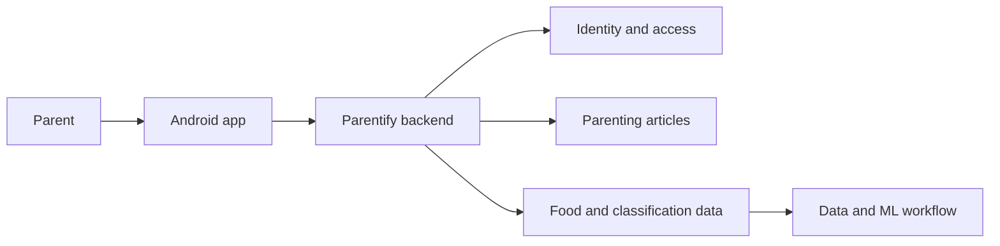
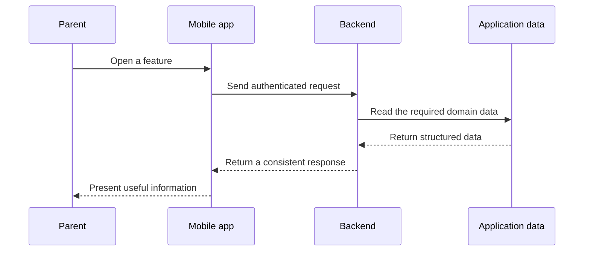

## Why We Built It

Parenting information is easy to find, but useful guidance is often scattered across different places.

A parent may need to read a practical article, understand a child’s daily needs, or check food information. Each answer can live in a different source and use a different structure, leaving the parent to connect everything manually.

**Parentify** was our Bangkit Academy capstone response to that problem: one mobile companion where parenting content and structured food information could be reached through a single product flow.

The goal was not to build another generic information portal. The useful part was reducing the distance between a parent’s question and the information they could act on.

## The Product as One System

Parentify was built across the three Bangkit learning paths, each with a different responsibility:

- **Mobile Development** shaped the Android experience used by the parent.
- **Cloud Computing** exposed the application capabilities through a shared backend and data layer.
- **Machine Learning** worked on the data/model side used by the product’s food-related flow.

Those parts lived in separate repositories, but users should never have to care about those boundaries.



From the user’s point of view, the expected experience was much simpler:

```text
open Parentify
→ authenticate
→ choose the information needed
→ receive a useful response
```

## My Responsibility

My primary responsibility was on the **Cloud Computing and backend integration** side.

I translated product requirements into backend capabilities that the Android client could consume consistently. The service covered authentication, parenting articles, food records, and food-classification data, with MySQL holding the application data behind those flows.

The cloud/backend work also became the shared contract between teams. Mobile Development needed stable responses to build against, while data and model work needed a clear path into the application flow.

That made the job broader than hosting routes. The backend had to make independently developed components behave like one product.

## How the Backend Fit the Product

The general request path looked like this:



For food information, the backend joined the food record with its related classification data before returning it to the client. That kept the relationship inside the backend instead of forcing the Android app to reconstruct domain data on its own.

Conceptually, the backend responsibilities were separated like this:

```text
authentication
→ control application access

articles
→ expose parenting content

food data
→ expose food details and classifications

application API
→ provide one stable integration boundary for the mobile client
```

## Working Across Repositories

The project was intentionally split by learning path rather than kept in one monolithic codebase. That made integration discipline important: each team could progress independently, but the product only worked when the contracts between them agreed.

The project repositories are available under the **Parentify** GitHub organization:

- [Cloud Computing repository](https://github.com/Parentify/Parentify-Cloud-Computing)
- [Mobile Development repository](https://github.com/Parentify/Parentify-Mobile-Development)
- [Machine Learning repository](https://github.com/Parentify/Parentify-Machine-Learning)

For my part, most implementation responsibility was in the Cloud Computing repository, with additional contribution around the project’s data/model work. I do not present the Android implementation as my own work.

## What the Project Taught Me

Parentify was one of my first projects where the engineering problem was genuinely cross-functional.

A mobile screen, API response, database schema, and model artifact can all be correct in isolation and still fail as a product when their assumptions do not line up. The useful lesson was learning to think in **contracts and boundaries**, not only individual components.

It pushed me to think about ownership, integration order, hand-offs, and how backend decisions affect people working in completely different parts of the stack.

That systems perspective ended up being more valuable than any single service used during the capstone.
