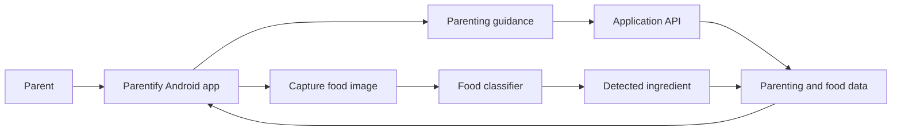
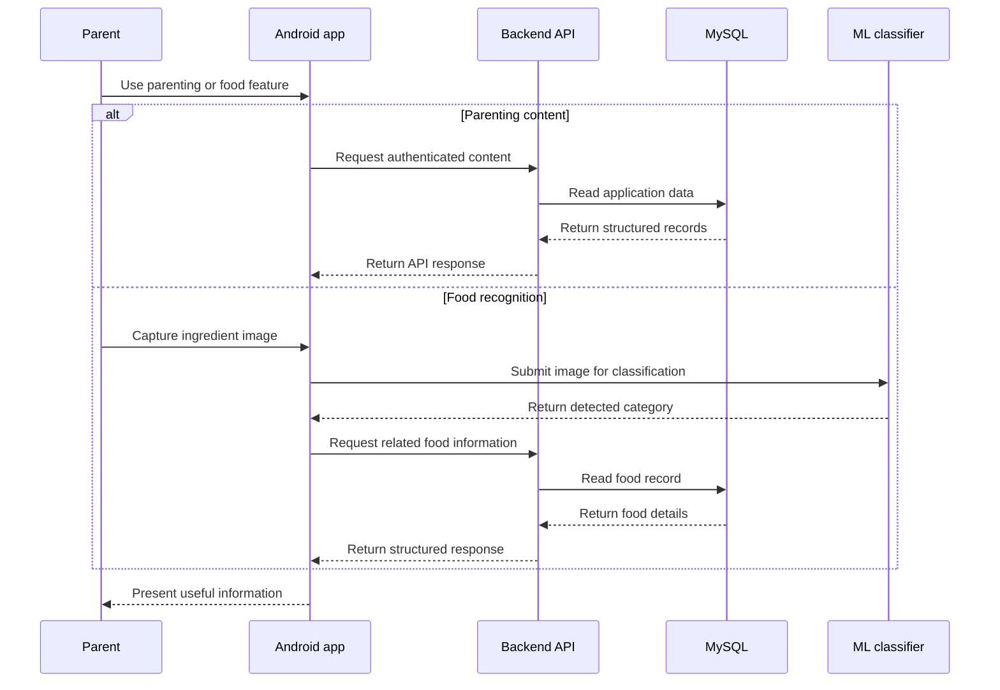

## The Problem

Parenting information is easy to find, but it is often split across unrelated sources.

A parent may look for childcare guidance in one place and then use another tool to identify or understand a food ingredient. **Parentify** was our Bangkit Academy capstone attempt to bring those flows into one mobile product.

The app combined curated parenting content with camera-based food recognition. The engineering challenge was less about either feature in isolation and more about making the Android, backend, data, and machine-learning parts agree on the same product flow.

## Product Approach

Parentify had two main journeys.

The **parenting guidance** flow let users authenticate, browse parenting articles, and open detailed content.

The **food recognition** flow let users capture an ingredient image, classify it through the machine-learning path, and then retrieve the related food information from the application data.



The user should not have to care that those features came from different Bangkit learning paths. The integration work existed to make them feel like one application.

## Team Boundaries

The project was split across the three Bangkit tracks:

- **Mobile Development** owned the Android client and user-facing flows.
- **Cloud Computing** owned the backend API, authentication path, application data, and integration contract.
- **Machine Learning** built the image-classification workflow for food ingredients.

The Android app coordinated the experience. Network-backed features called the backend, while the camera flow connected captured images to the classifier and then resolved the detected category into product data.



## Mobile Experience

The Android application was written in **Kotlin** and used Android architecture components to keep UI state, navigation, networking, local persistence, and camera behavior separated.

**ViewModel** and **LiveData** handled UI state, **Navigation Component** handled screen transitions, and **Hilt** provided dependency injection. **Retrofit** and **OkHttp** connected the app to remote services, while **Room** supported local persistence. **CameraX** powered the food capture flow, and **Firebase Authentication** was included for identity-related functionality.

That structure supported authentication, parenting content, favorites, camera capture, food detection results, and supporting settings/detail screens without putting the whole product flow into screen code.

## Food Recognition

The Machine Learning track trained a TensorFlow/Keras convolutional neural network to classify **36 food-ingredient categories**.

Training used 150×150 RGB images with a softmax output over the supported classes. The recorded experiment ran for 20 epochs and reached approximately **93.7% validation accuracy at its best observed epoch**.

I treat that number as a training result, not a production guarantee. Notebook validation and real camera input are different conditions.

The exported artifacts included both Keras `.h5` and **TensorFlow Lite** formats for mobile-oriented inference.

```text
camera image
→ resize / prepare input
→ CNN inference
→ one of 36 ingredient classes
→ resolve related food information
→ present result to the user
```

## Backend and Data Layer

My primary responsibility was the **Cloud Computing** side, especially the backend and integration contract used by the Android app.

The Node.js service used **Express** for APIs around authentication, parenting articles, and food information. **MySQL** stored the structured application data.

Authentication used **JSON Web Tokens**, password hashing with **bcrypt**, and request validation with **Joi**. The backend kept database relationships behind an application-facing contract so the Android client could work with stable domain responses instead of database structure.

Conceptually, the service covered four areas:

```text
authentication
→ identify users and control access

parenting articles
→ provide guidance content

food information
→ map detected ingredients to records

API contract
→ keep mobile, data, and backend assumptions aligned
```

That contract mattered because each team could progress independently. Integration only worked when naming, payloads, and data relationships matched across all three tracks.

## Cloud and Delivery

The backend was prepared for **Google Cloud** on a Linux environment with Node.js and MySQL.

Deployment documentation covered application dependencies, database access, service credentials, and an update/deployment script. The repository also included Postman documentation for testing the API contract during integration.

For this capstone, the cloud work was where authentication, persistent data, API behavior, and cross-team integration met.

## Technology Across the Product

| Area | Technology | Role in Parentify |
| --- | --- | --- |
| Android | Kotlin, Android SDK, ViewModel, LiveData, Navigation Component | User-facing application and screen/state flow |
| Mobile architecture | Hilt, Room, View/Data Binding | Dependency management, local persistence, and UI integration |
| Networking | Retrofit, OkHttp | Communication between the Android client and remote services |
| Device capability | CameraX | Camera capture for food recognition |
| Authentication | Firebase Auth, JWT, bcrypt | Identity and protected access across the product stack |
| Backend | Node.js, Express, Joi | Application APIs, validation, and integration logic |
| Data | MySQL | Persistent user, article, food, and related records |
| Machine learning | TensorFlow, Keras, CNN | Training the 36-class ingredient classifier |
| Mobile inference artifact | TensorFlow Lite | Portable model format for application-oriented inference |
| Cloud | Google Cloud, Linux | Runtime environment for backend and data services |
| API collaboration | Postman | Backend testing and API contract documentation |

## My Responsibility

My direct implementation work was primarily in **Cloud Computing**: backend behavior, application data, authentication, and the API surface consumed by the mobile team.

I also worked at the integration boundary between the cloud, mobile, and machine-learning deliverables. I describe all three parts here because they are necessary to understand the product, not because I implemented every layer myself.

The main lesson was simple. A mobile screen, API endpoint, database table, and model can each work correctly on their own while the product still fails if their assumptions do not match. Parentify made contracts and ownership boundaries just as important as the code inside each repository.

## Repositories

Parentify is split across the original Bangkit repositories:

- [Parentify: Cloud Computing](https://github.com/Parentify/Parentify-Cloud-Computing): backend API, application data, cloud setup, and integration work.
- [Parentify: Mobile Development](https://github.com/Parentify/Parentify-Mobile-Development): Kotlin Android application, parenting content, authentication, favorites, and camera/detection flows.
- [Parentify: Machine Learning](https://github.com/Parentify/Parentify-Machine-Learning): dataset workflow, CNN training notebook, and exported model artifacts.

The repositories are also collected under the [Parentify GitHub organization](https://github.com/orgs/Parentify/repositories).
