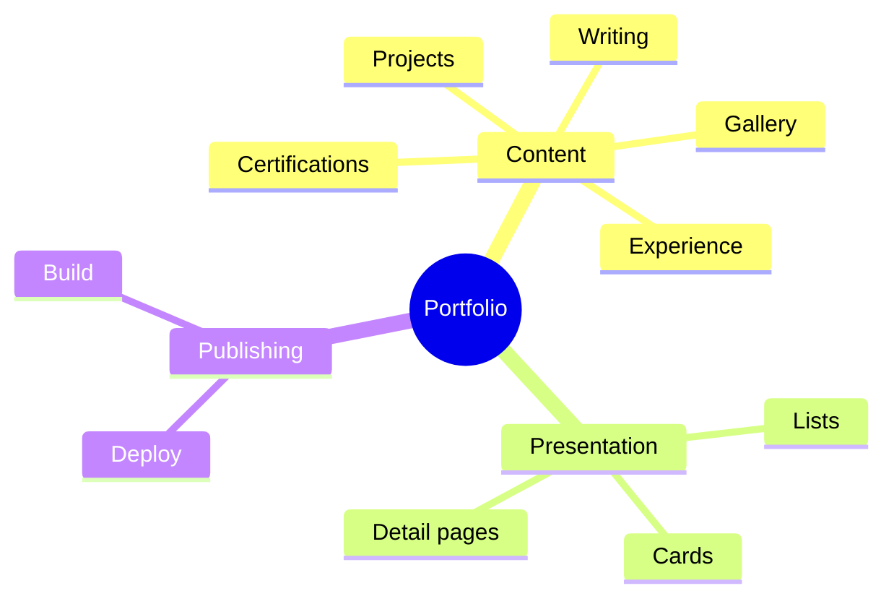
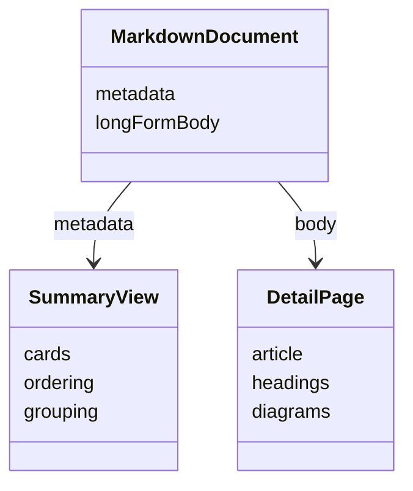
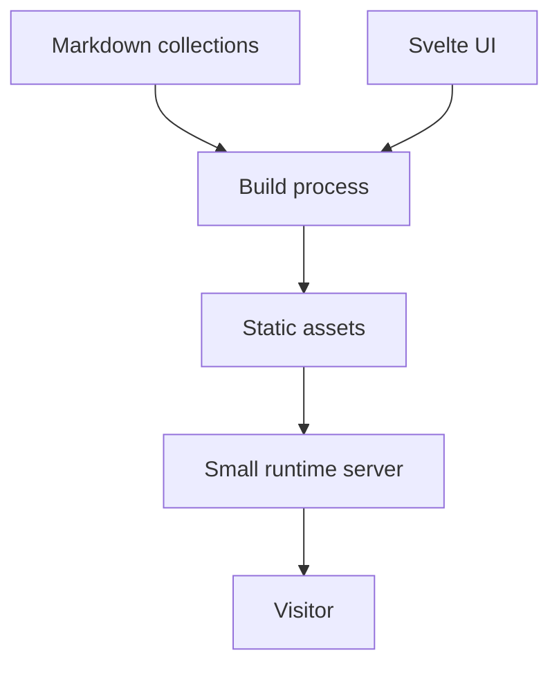

## The Story

A portfolio usually starts simple.

You create a few project cards, hardcode some experience, add a gallery, and ship it.

Then real life happens.

A new project is added.

A job changes.

A certificate arrives.

A project grows enough that one paragraph is no longer enough.

At that point, the portfolio starts behaving like a small publishing system — except the codebase was never designed that way.

This project was rebuilt around that realization.

## The Core Idea

The website is designed so content and presentation are separate.

The UI should not know which projects exist.

It should only know how to render a project.

The content system decides what exists.



That sounds simple, but it changes how the whole site is maintained.

## What Editing the Portfolio Should Feel Like

Adding a project should feel like writing an article.

Not like modifying application state.

The intended workflow is:

```text
create Markdown
→ add metadata
→ write the story
→ attach media
→ build
→ publish
```

No project-specific component should be required.

That same model applies to:

- projects;
- blog posts;
- experience;
- education;
- certifications;
- gallery items;
- profile copy.

## Why Markdown Became the Center of the System

Markdown fits this kind of site unusually well.

It is readable without tooling.

It works naturally with Git.

It can carry both structured metadata and long-form writing.

It can include code, diagrams, lists, links, and images.

Most importantly, it keeps the source of truth close to the content itself.



The same file can power both a summary card and a full article.

## The General Content Algorithm

The site follows a simple pattern:

1. Discover content files.
2. Parse their metadata.
3. Parse their Markdown body.
4. Sort or group them where needed.
5. Render summary views from metadata.
6. Render detail views from the long-form body.

```text
files
→ parse
→ normalize
→ sort
→ render
```

The important thing is that the list of content is derived from the repository.

There should not be a second hardcoded list somewhere in the UI.

## General System Design



The build process turns content and UI into a static frontend.

A small production server then serves that result.

This keeps the runtime simple while still allowing the authoring experience to stay rich.

## Why Project Detail Pages Matter

A project is not only a screenshot and a stack list.

A good project page should explain:

- what problem existed;
- what the product tries to solve;
- how the system thinks about that problem;
- what tradeoffs shaped the design;
- what was learned while building it.

That is why project details are treated more like articles than product cards.

Mermaid is useful here because some ideas are easier to understand as relationships and flows than as paragraphs.

## Why the Homepage Stays Dynamic

The homepage should reflect the current portfolio automatically.

When a new project is added, recent projects can change without editing the homepage component.

When experience changes, the site can derive the latest items from content order.

The concept is:

```text
content changes
→ views update
```

not:

```text
content changes
→ update content
→ update homepage
→ update project list
→ update navigation
```

That removes duplication.

## Product Tradeoffs

**Markdown simplicity vs CMS convenience.** Markdown is excellent for a technical author, but less friendly for non-technical editors.

**Repository ownership vs instant editing.** Git gives history and reviewability, but content updates still go through a build and deployment.

**Flexible long-form content vs rigid schemas.** Markdown bodies are flexible, but too much freedom can make consistency harder if there are no editorial conventions.

## Implementation Notes

The current site uses Svelte for presentation, Markdown for content, Mermaid for diagrams, and a small Rust server for production delivery.

## Stack

Svelte, Vite, Markdown, Mermaid, Rust, Axum, and GitHub Actions.
