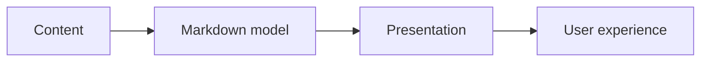
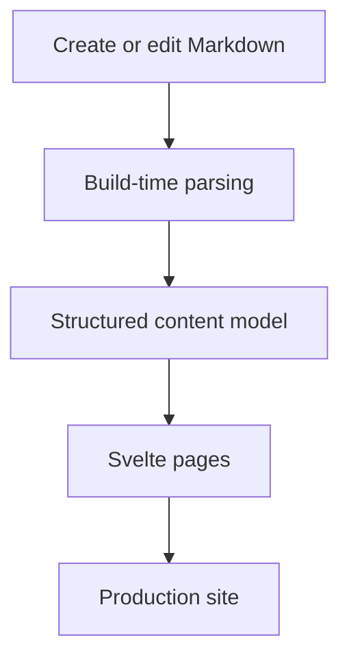
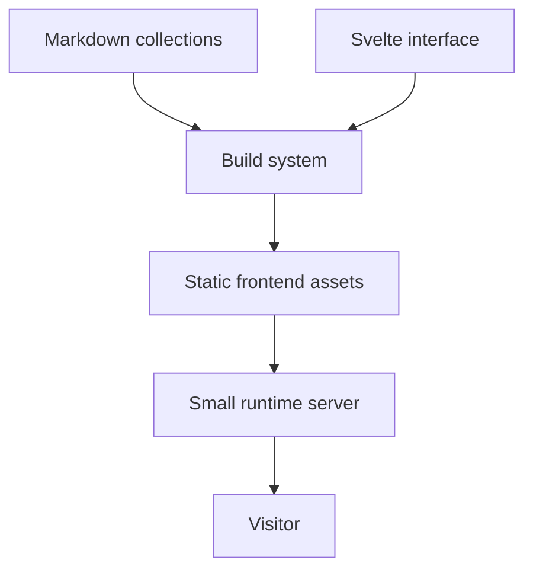

## What It Is

This portfolio is a personal publishing system for professional work.

The main design goal is to keep content independent from presentation.

Projects, work experience, writing, certifications, gallery items, and profile information are all maintained as repository content rather than embedded into page components.

## Problem It Solves

Portfolio sites often become difficult to maintain because every content update requires editing application code.

That creates unnecessary friction:

- adding a project means changing components;
- changing experience means touching layout code;
- ordering sections becomes hardcoded;
- content structure becomes coupled to UI structure.

This project tries to make portfolio maintenance behave more like editing a publication.

## Core Concept



The content model is the source of truth.

The UI reads from it.

## General Content Flow



Adding a project should mostly mean adding one Markdown file.

## General Page Model

Each content item has two parts:

```text
metadata
+ long-form body
```

Metadata controls things such as title, date, image, category, and ordering.

The Markdown body contains the human-readable content.

That separation allows pages to stay flexible without growing large TypeScript data objects.

## General System Design



The browser experience is fully content-driven, while deployment remains simple.

## Why Markdown

Markdown provides a useful middle ground:

- readable by humans;
- version-controlled;
- easy to diff;
- flexible enough for long-form writing;
- supports diagrams through Mermaid;
- does not require a CMS.

## Important Product Decisions

### Content must not depend on page code

The home page, project list, and detail pages should derive from content collections.

### Long-form project pages should behave like articles

A project detail page should be able to evolve freely without needing a new component every time a new section is added.

### Assets should remain repository-owned

Images, certificates, and gallery media live beside the project and are referenced through stable paths.

## Tradeoffs

- **Markdown simplicity vs CMS convenience**;
- **repository ownership vs non-technical editing**;
- **static content model vs highly dynamic authoring tools**.

## Implementation Notes

The current site uses Svelte for presentation, Markdown for content, Mermaid for diagrams, and a small Rust server for production delivery.

## Stack

Svelte, Vite, Markdown, Mermaid, Rust, Axum, and GitHub Actions.
