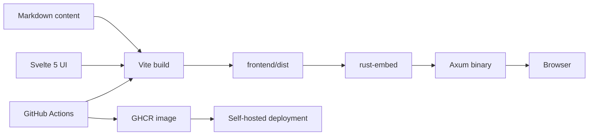
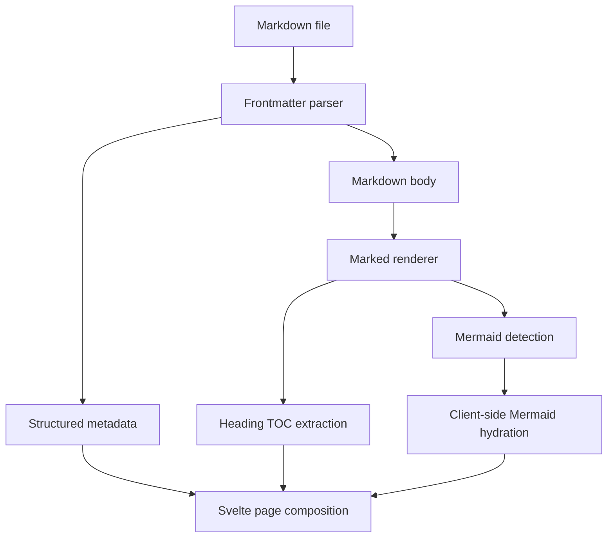
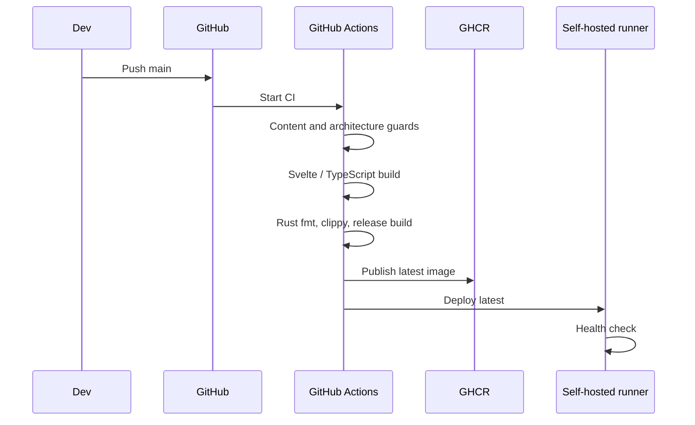

## Overview

This portfolio is intentionally built as a **content system first** and a website second.

Projects, blog posts, profile data, experience, education, skills, certifications, gallery entries, navigation, and page copy live in repository-owned Markdown. Svelte loads that content at build time, while a small Rust/Axum server embeds the generated frontend into a single production binary.

The architecture makes normal content updates mostly a Markdown edit rather than a component change.

## Architecture

The production runtime has no Node server. Vite produces static assets, Rust embeds them at compile time, and Axum serves the embedded files with SPA fallback behavior.

## Content Model

Each content domain lives in its own Markdown collection:

- profile and site copy;
- professional experience;
- education;
- skills;
- projects;
- blog posts;
- certifications;
- gallery items;
- navigation and layout metadata.

Frontmatter stores structured metadata. The Markdown body stores long-form content. That keeps the project detail page free to evolve like an article without expanding a TypeScript object schema every time a new section is needed.

## Project and Article Rendering

Project detail and blog content share the same Markdown rendering approach.

Headings automatically feed the table of contents. Mermaid code blocks render into diagrams, while normal Markdown handles prose, lists, code, links, tables, and images.

## Media Strategy

Static images and certificates live under `frontend/public`. Content files refer to stable public paths rather than importing binary assets into Svelte components.

Certification assets use slug-safe filenames so browser URL encoding does not conflict with the Rust embedded-asset lookup.

## Runtime Server

The Rust server is intentionally small:

- `rust-embed` embeds the built frontend;
- `mime_guess` selects response content types;
- hashed assets receive long-lived immutable cache headers;
- `index.html` remains non-cacheable;
- unknown frontend routes fall back to the embedded SPA entrypoint;
- Axum and Tower HTTP provide the runtime and tracing layer.

This keeps deployment independent from a Node process while preserving a straightforward Svelte development environment.

## CI and Deployment

The deployment workflow validates content, frontend diagnostics, frontend build, Rust formatting and linting, the embedded release binary, and the container before production recreation.

## Engineering Decisions

### Markdown is the source of truth

Content lists are derived from files rather than duplicated inside Svelte components. Home sections use the current collections instead of hardcoded project names.

### One small runtime binary

Rust embeds the static frontend so production needs one application process and does not depend on Node.

### Rich content without a CMS

Markdown, frontmatter, Mermaid, and repository assets cover the content needs while keeping history reviewable in Git.

### UI remains reusable

Svelte owns presentation components such as project heroes, media, timeline entries, Markdown articles, and navigation. Content-specific facts stay outside those components.

## Stack

Svelte 5, Vite, TypeScript, Tailwind CSS, daisyUI, Marked, Mermaid, Rust, Axum, rust-embed, Docker, GHCR, and GitHub Actions.

## Status

The portfolio is actively being migrated from legacy content into the current Markdown-driven architecture. The Svelte/Rust stack is now the production source of truth and the project detail pages are maintained as long-form technical case studies.
