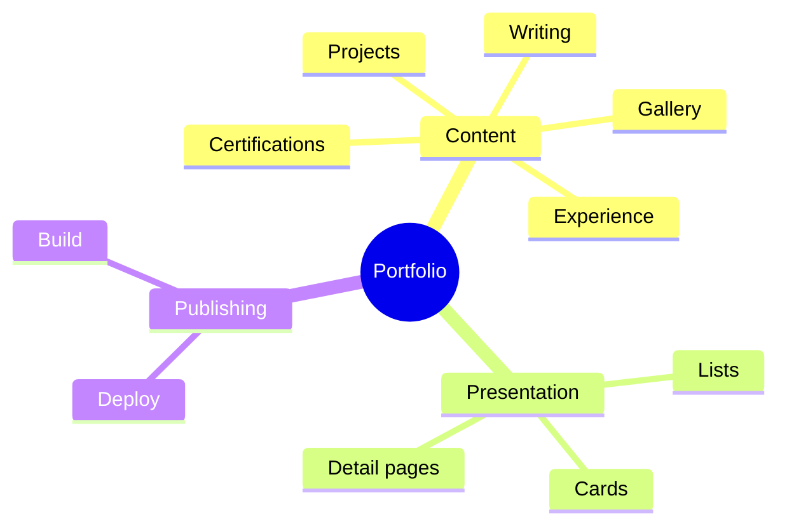
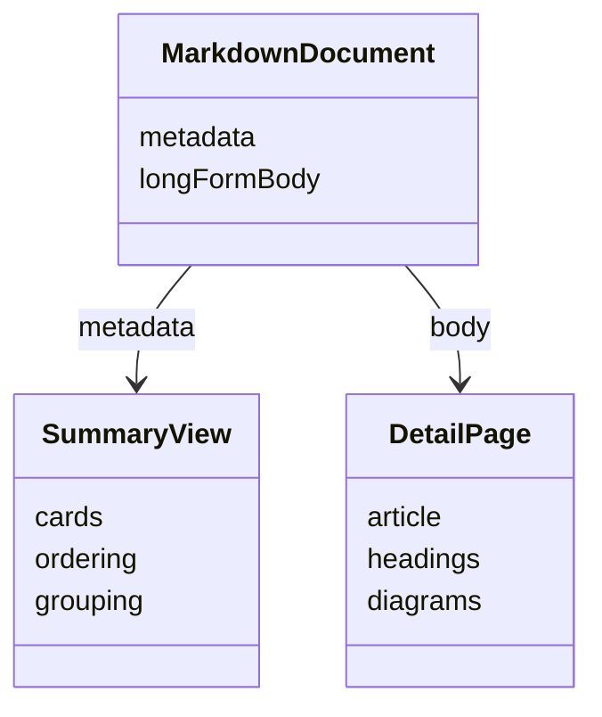
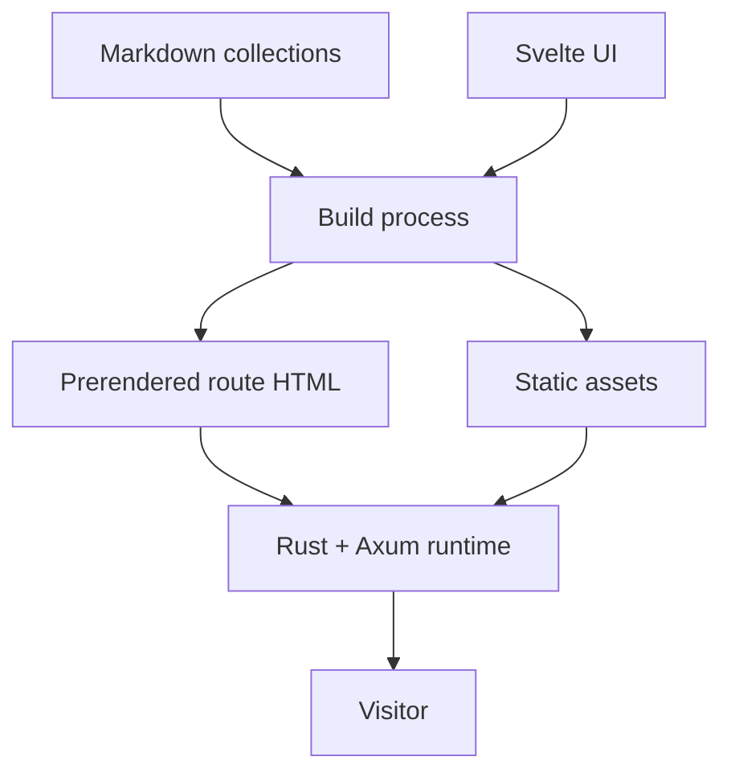

## Why I Rebuilt It

The first version of a portfolio is easy to hardcode. A few project cards, an experience section, and a gallery can live directly in UI components without causing much trouble.

That stops working once the content keeps changing. New projects arrive, job history grows, certifications need updates, and some projects deserve a full technical story instead of one short card.

At that point, the site is already acting like a publishing system. I rebuilt this portfolio around that reality.

## The Core Idea

Content and presentation are separate.

The UI should know how to render a project, article, experience entry, or certification. It should not need a hardcoded list of which ones exist.



The repository content decides what exists. The application turns that content into pages and summary views.

## Editing Should Feel Like Publishing

Adding a project should mostly involve writing the project.

```text
create Markdown
→ add metadata
→ write the story
→ attach media
→ build
→ publish
```

The same pattern is used for projects, blog posts, experience, education, certifications, gallery items, and profile copy.

A new entry should not require a new project-specific component or another hardcoded array in the UI.

## Why Markdown Fits

Markdown works well here because it supports both structured metadata and long-form writing while staying readable in Git.

One file can provide card metadata for a listing page and the body for a full detail page.



It also gives project pages enough room for diagrams, links, code, and implementation notes without forcing those details into the component layer.

## Content Flow

The build follows a predictable sequence:

1. Discover content files.
2. Parse metadata and body content.
3. Normalize the records.
4. Sort or group them where needed.
5. Build summary views from metadata.
6. Build detail views from the Markdown body.

```text
files
→ parse
→ normalize
→ sort
→ render
```

The important part is that there is one source of truth. The project list, homepage selection, and project detail route all derive from the same content collection.

## System Design



Public routes are prerendered during the build so crawlers and browsers receive useful HTML immediately. Svelte then hydrates that markup for client-side interaction.

A small Rust and Axum server embeds the generated route documents and assets for production delivery.

## Why Project Detail Pages Are Long Form

A screenshot and stack list usually do not explain why a project exists or how its design changed.

The detail pages have room for the problem, product model, system boundaries, tradeoffs, and lessons from implementation. Mermaid is useful when a relationship or flow is clearer as a diagram than as another paragraph.

That makes a project page closer to an engineering note than a marketing card.

## Keeping Summary Views in Sync

Homepage and listing content are derived from the same collections.

```text
content changes
→ derived views update
```

There is no separate workflow where I update the project content and then remember to patch another hardcoded homepage list.

That removes a class of small maintenance bugs that becomes surprisingly common as a portfolio grows.

## Tradeoffs

**Markdown vs CMS editing.** Markdown is comfortable for a technical author and works well with Git history, but it is less approachable for non-technical editors.

**Repository ownership vs instant publishing.** Content changes are reviewable and versioned, but they still go through a build and deployment.

**Flexible long-form content vs consistency.** Markdown gives each project room to tell a different story, so editorial guardrails are needed to keep the overall site coherent.

## Implementation Notes

The current site uses Svelte 5 and Vite for the frontend, Markdown for content, Mermaid for diagrams, build-time prerendering for public routes, and Rust with Axum for production delivery. GitHub Actions runs the validation, build, and deployment pipelines.

## Stack

Svelte 5, Vite, TypeScript, Markdown, Mermaid, Rust, Axum, and GitHub Actions.
