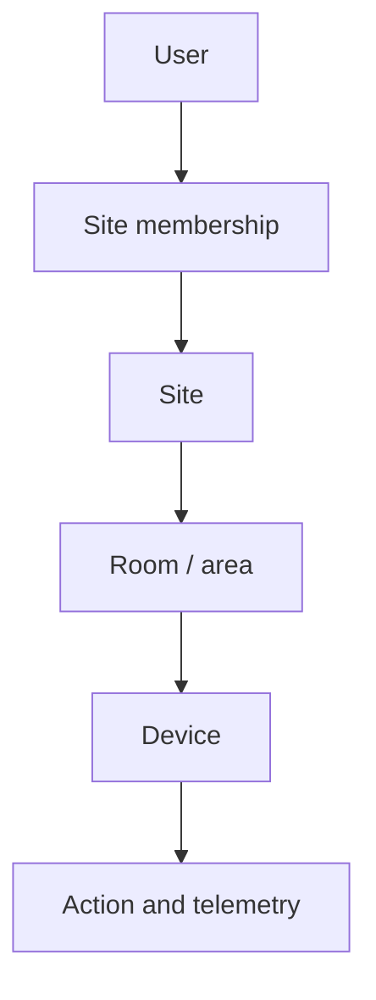
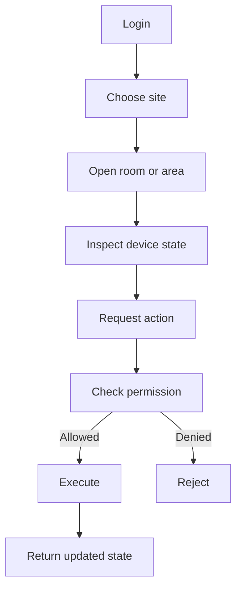
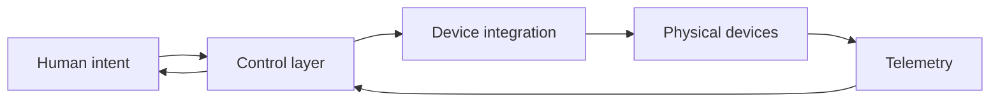

## The Story

IoT systems often look clean in a technical diagram and confusing in real life.

A device has an ID. A broker has a topic. A controller has an address. A database has another identifier.

But the person using the system does not think like that.

They think:

> “Turn off the lights in Meeting Room A.”

or:

> “Give this employee access to devices in the Jakarta office.”

That difference is where **Sensio IoT** begins.

The product is designed around the physical world first, not around protocol identifiers.

## The Core Idea

The main concept is **site-oriented control**.

A site represents a real place: an office, school, home, store, factory, or other physical environment.

Users become members of sites.

Devices belong to spaces inside sites.

Permissions are evaluated in that context.



This gives the system a model that matches how people naturally describe the real world.

## The User Experience

Imagine a building operator opening the application.

They should not see a wall of device IDs.

They should see the spaces they are responsible for.

They choose a site, enter a room, inspect current device state, and perform an action.



The technical details stay underneath the interaction.

## The General Control Algorithm

Every device action can be reduced to a sequence of questions.

```text
Who is asking?
Where does this action belong?
Is this person a member of that site?
Are they allowed to control this target?
Is the device available?
Execute the action.
Observe the resulting state.
```

Conceptually:

```text
identity
→ scope
→ permission
→ availability
→ action
→ state
```

This algorithm is more important than the protocol used to talk to the device.

## Why Space Matters More Than Device IDs

A flat device list works when there are ten devices.

It becomes painful when there are hundreds.

Humans need grouping, context, and ownership.

The physical hierarchy gives the system a natural way to answer questions like:

- Which devices belong to this office?
- Which room is this sensor in?
- Who is allowed to control these lights?
- Which telemetry belongs to this site?
- Which automation should apply here?

That structure becomes the backbone for more advanced features later.

## General System Design



**Human intent** is expressed in product terms: rooms, devices, scenes, and actions.

**Control layer** applies identity, scope, and permission.

**Device integration** translates those product-level actions into whatever protocol the hardware understands.

**Telemetry** closes the loop by showing what actually happened.

## Why On-Prem Is Part of the Concept

For physical infrastructure, local availability matters.

If a smart-space system controls lights, environmental systems, or meeting rooms, users may still expect it to work even when the internet is unreliable.

That makes local deployment useful for:

- lower latency;
- predictable availability;
- privacy;
- local operational control.

The product is therefore not only about IoT features. It is also about where control should live.

## Product Tradeoffs

**Local control vs cloud convenience.** On-prem systems give operators more control, but require more responsibility for deployment and maintenance.

**Simple hierarchy vs enterprise complexity.** A clean site/room/device model is easy to understand, but very large organizations may need more levels.

**Immediate control vs stronger checks.** Every permission check adds a little work, but skipping them creates the wrong trust model.

## Implementation Notes

The current rewrite uses a single Rust application, PostgreSQL state, server-rendered UI, secure session handling, and MQTT-oriented device integration.

## Stack

Rust, Axum, Askama, SQLx, PostgreSQL, MQTT, Docker, and OpenTelemetry.
