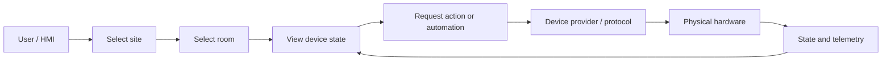
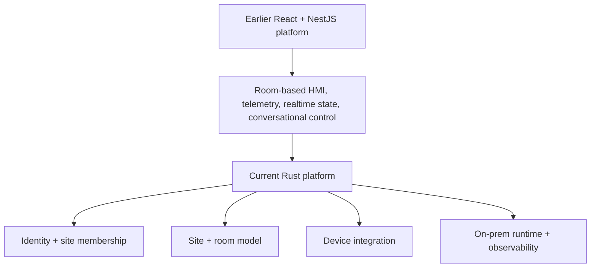
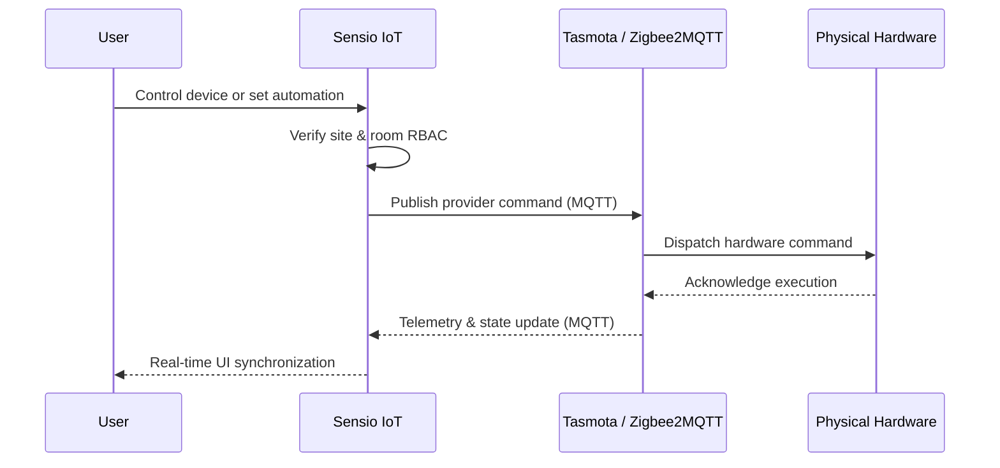

## The Problem

People managing a room do not think in broker topics, hardware addresses, or database identifiers.

They think in physical language: *the lights in this meeting room, the sensor in that office, the devices this operator is allowed to control.*

**Sensio IoT** is built around translating those real-world boundaries into software boundaries.

The product has evolved through more than one implementation, but the underlying idea has stayed consistent: organize control around **sites and rooms**, keep device protocols behind an integration layer, and make local hardware state understandable from a human-facing interface.

## Product Approach

A user first enters the physical scope they are responsible for, then works with the devices and automation inside that scope.



That hierarchy matters more than any particular protocol. The same product-level action can eventually be translated to different providers without making the user learn how each device communicates.

## How the Platform Evolved

Sensio IoT has gone through two main production architectures.

The initial implementation used a fullstack React HMI with a NestJS backend. It centered the UI around physical rooms, synchronized device state through REST, WebSockets, and SSE, stored high-frequency sensor telemetry in PostgreSQL and TimescaleDB, and integrated a room-scoped LangGraph assistant capable of evaluating context and dispatching device automation routines.

The newer implementation is a high-performance Rust rewrite designed for edge efficiency. Axum serves both HTTP APIs and server-rendered Askama templates, SQLx manages PostgreSQL connection pooling and transactional persistence, and the entire domain—identity, site memberships, rooms, device state, and local configuration—is unified into a single lightweight binary.



I treat those as iterations of the same product rather than pretending they were one unchanged architecture. The rewrite built directly on the lessons of the earlier stack.

## Identity and Physical Scope

The platform makes physical scope an integral part of authorization.

Users do not receive one global role that automatically applies everywhere. Site membership is the role boundary, and room access is evaluated through that site relationship. Permission to operate one office never grants access to another site.

Authentication is designed for an on-premises control surface: provisioned users sign in, short-lived access tokens pair with rotating refresh tokens, and browser sessions keep security credentials isolated from client-side scripts.

The result is a strict conceptual chain:

```text
identity
→ site membership
→ room scope
→ device action
```

## Device Integration: Tasmota and Zigbee Ecosystems

The device communication layer is separated cleanly from the site and room domain model.

The platform manages two primary hardware integration pipelines:

1. **Tasmota-Flashed Smart Devices & Power Monitoring**:
   Smart plugs, energy meters, relays, and power strips running open-source **Tasmota** firmware communicate over dedicated MQTT channels. The ingestion pipeline listens to `tele/%topic%/SENSOR` broadcasts to parse real-time power metrics (active power in Watts, line voltage, current, and accumulated energy consumption), tracks relay state changes via `stat/%topic%/POWER`, and issues low-latency switching commands via `cmnd/%topic%/Power` without external cloud dependencies.
2. **Zigbee2MQTT Environmental & Presence Sensors**:
   Coordinates Zigbee coordinators and edge routers to ingest environmental telemetry (ambient temperature, humidity, illuminance) and occupant presence (PIR motion detectors, magnetic door/window sensors).

In the Rust implementation, these integrations are structured into dedicated mapping, adapter, repository, listener, service, and HTTP boundaries. Incoming messages are normalized into room-scoped domain state, while outgoing commands are translated into provider-specific payloads.



This decoupled boundary absorbs protocol-specific quirks, MQTT broker disconnects, and network retries instead of leaking them into the user interface or database schema.

## On-Prem as Part of the Product

For a smart-space system, deployment location directly impacts reliability and latency.

Lighting, room controls, telemetry, and local automation cannot depend on distant cloud round-trips. Sensio IoT treats local on-premises deployment as a core architectural requirement.

The Rust service is packaged as a multi-architecture Docker container (supporting both AMD64 and ARM64) and runs on edge hardware including NVIDIA Jetson and Linux single-board computers. OpenTelemetry distributed tracing, Prometheus metrics for ingestion latency and broker throughput, and container health checks ensure rock-solid uptime next to the physical equipment it manages.

## My Contribution

My work on Sensio IoT spans backend systems engineering, fullstack interfaces, device integrations, and production operations:

- **Fullstack & Backend Engineering**: Built both the initial React + NestJS fullstack platform and the high-performance Rust (Axum + SQLx) rewrite, implementing relational schemas, connection pooling, and real-time state synchronization.
- **Physical RBAC Authorization**: Designed site- and room-scoped access control with secure JWT/refresh token rotation, preventing unauthorized command dispatch across multi-tenant physical spaces.
- **Hardware & Protocol Integration**: Engineered asynchronous MQTT message consumers, Tasmota telemetry parsers, and Zigbee2MQTT adapters that handle real-time power monitoring, sensor ingestion, device discovery, and low-latency actuation.
- **Conversational AI & Automation**: Developed room-scoped LangGraph assistant workflows to parse contextual commands and trigger device state changes within verified safety constraints.
- **Production Edge Deployment & Observability**: Packaged containerized multi-architecture images (AMD64 / ARM64), deployed services to on-premise edge hardware (Jetson / Linux servers), tracked agile deliverables in Jira, and established OpenTelemetry/Prometheus observability for production reliability.

## What I Took From It

The recurring lesson in Sensio IoT is that the hardest part of connected-device software is not sending a command to a broker.

The harder question is how to keep **identity, physical scope, device state, protocol translation, and local operations** consistent while the system evolves. Once those boundaries are clear, individual device integrations become much easier to reason about.

## Product Links

- Sensio IoT: [iot.sensio.id](https://iot.sensio.id)
- Sensio Platform: [sensio.id](https://sensio.id)
