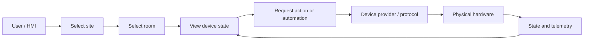
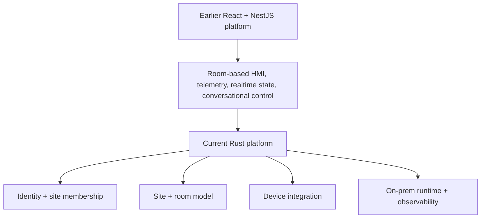
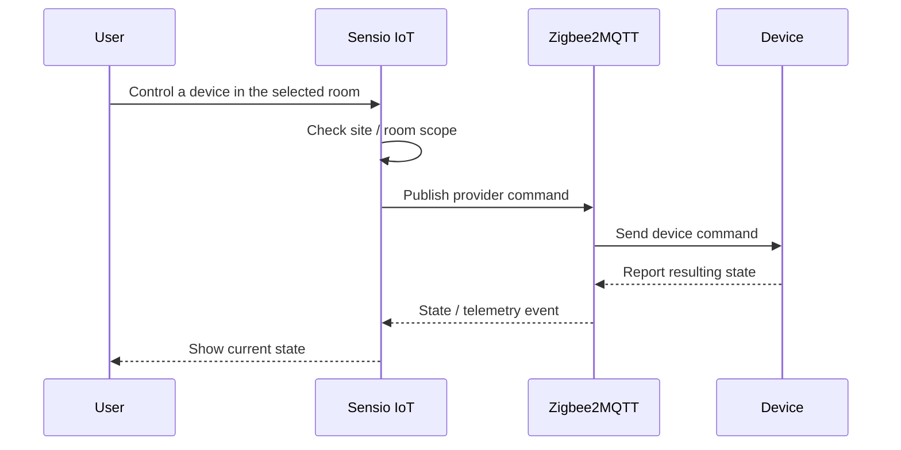

## The Problem

People managing a room do not think in broker topics, hardware addresses, or database identifiers.

They think in physical language: *the lights in this meeting room, the sensor in that office, the devices this operator is allowed to control.*

**Sensio IoT** is built around translating those real-world boundaries into software boundaries.

The product has evolved through more than one implementation, but the underlying idea has stayed consistent: organize control around **sites and rooms**, keep device protocols behind an integration layer, and make local hardware state understandable from a human-facing interface.

## Product Approach

A user first enters the physical scope they are responsible for, then works with the devices and automation inside that scope.



That hierarchy matters more than any particular protocol. The same product-level action can eventually be translated to different providers without making the user learn how each device communicates.

## How the Platform Evolved

Sensio IoT has gone through two main application shapes.

The earlier implementation used a React HMI with a NestJS backend. It centered the UI around rooms, synchronized device state through REST, Socket.IO, and SSE, stored telemetry in PostgreSQL/TimescaleDB, and experimented with a room-scoped LangGraph assistant that could read context and dispatch device commands through the backend.

The newer implementation is a Rust rewrite that intentionally reduces the runtime surface. Axum serves both HTTP APIs and server-rendered Askama pages, SQLx owns PostgreSQL persistence, and the application models users, sites, site memberships, rooms, devices, and local runtime configuration in one service.



I treat those as iterations of the same product rather than pretending they were one unchanged architecture.

## Identity and Physical Scope

The current rewrite makes physical scope part of authorization.

Users do not receive one global role that automatically applies everywhere. Site membership is the role boundary, and room access is evaluated through that site relationship. That matches the product model: permission to operate one office should not silently become permission to operate every other site.

Authentication is also designed for an on-prem control surface rather than public self-service signup. Provisioned users sign in, short-lived access tokens are paired with rotating refresh tokens, and browser sessions keep token material out of normal client-side JavaScript.

The result is a simple conceptual chain:

```text
identity
→ site membership
→ room scope
→ device action
```

## Device Integration

The device side is deliberately separated from the site and room model.

In the current Rust implementation, Zigbee2MQTT support has its own mapping, adapter, repository, listener, service, and HTTP boundary. Discovery and state messages are ingested from MQTT topics, normalized into application state, and commands are translated back into provider-specific payloads when a user controls a device.



The same boundary also gives the platform somewhere to absorb protocol-specific details instead of leaking them throughout the UI and domain model.

## On-Prem as Part of the Product

For a smart-space system, deployment location affects the user experience.

Lighting, room controls, telemetry, and local automation are awkward if every interaction depends on a distant service being reachable. Sensio IoT therefore treats local deployment as part of the architecture, not just an installation detail.

The Rust rewrite is packaged as a CI-built container and has been worked through both AMD64 and ARM64 deployment paths, including Jetson-based runtime work. Observability and browser-level verification are part of that operational loop because the software ultimately has to work next to the hardware it controls.

## My Contribution

My work on Sensio IoT has followed the platform across those iterations.

It includes the backend and device boundary of the earlier room-oriented system, telemetry and realtime-control flows, experiments with room-scoped conversational control, and the current Rust rewrite where the physical domain, authentication boundary, Zigbee2MQTT integration, runtime packaging, and on-prem deployment are being made more explicit.

Rather than presenting the rewrite as a completely separate project, I see it as the same product being simplified around lessons from the earlier architecture.

## What I Took From It

The recurring lesson in Sensio IoT is that the hardest part of connected-device software is not sending a command to a broker.

The harder question is how to keep **identity, physical scope, device state, protocol translation, and local operations** consistent while the system evolves. Once those boundaries are clear, individual device integrations become much easier to reason about.

## Product Links

- Sensio IoT: [iot.sensio.id](https://iot.sensio.id)
- Sensio Platform: [sensio.id](https://sensio.id)

