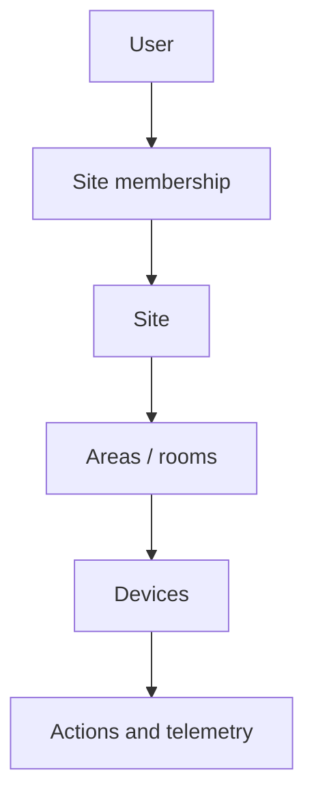
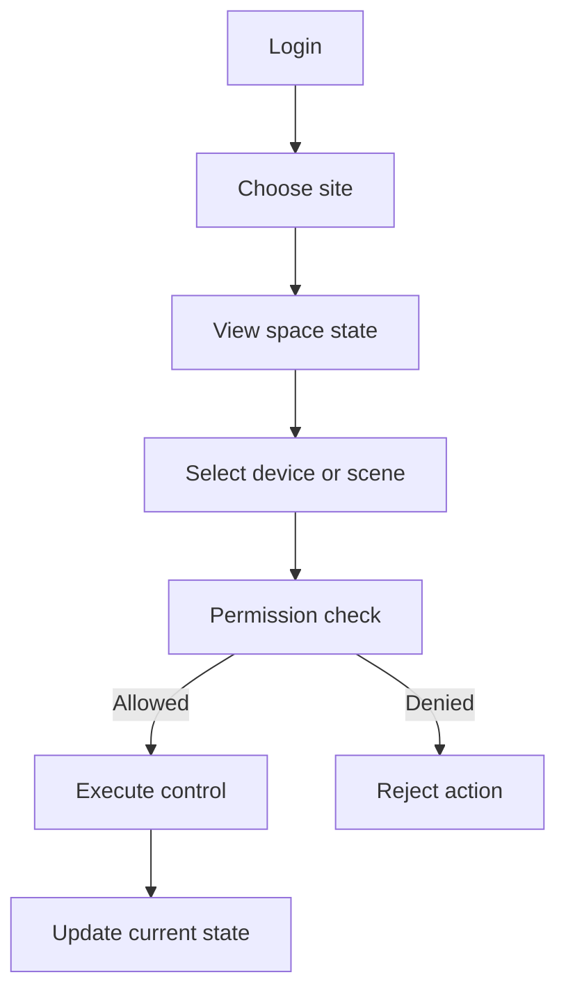
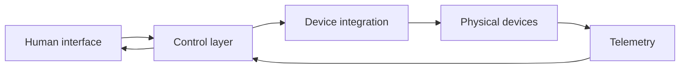

## What It Is

**Sensio IoT** is a smart-space platform.

The central idea is to model physical places first, then connect users, permissions, devices, and automation to those places.

Instead of treating IoT as a giant flat device list, the product starts from a more human model:

```text
person
→ site
→ room or area
→ device
→ action
```

## Problem It Solves

Connected-device systems often become difficult to manage because hardware is organized around technical identifiers instead of real-world context.

Users think in terms of:

- home;
- office;
- classroom;
- store;
- factory;
- room;
- equipment.

The platform exists to map device control back to those real-world spaces.

## Who It Is For

The concept fits environments where physical access and device access need to stay aligned:

- offices;
- schools;
- smart homes;
- retail spaces;
- factories;
- meeting rooms.

## Core Concept

A **site** is the main trust and organization boundary.



A device action should make sense only inside the site and permission context that owns it.

## General User Flow



## General Control Algorithm

A physical action should pass through a simple conceptual decision chain:

1. Who is requesting the action?
2. Which site does the action belong to?
3. Does the user belong to that site?
4. Does the user have permission for the target?
5. Is the device reachable?
6. Execute the action.
7. Record or return the resulting state.

```text
identity
→ scope
→ permission
→ availability
→ action
→ state
```

## General System Design



### Human interface

Shows spaces, devices, and current state in a human-readable structure.

### Control layer

Owns permissions, orchestration, and action intent.

### Device integration

Translates product-level actions into device-level communication.

## Why On-Prem Matters

For physical infrastructure, local control can be important.

The on-prem model can improve:

- local availability;
- latency;
- privacy;
- operational independence;
- control over deployment.

That makes the platform suitable for environments where device control should not depend entirely on a remote cloud service.

## Important Product Decisions

### Space is more important than device ID

Users should navigate the physical world, not protocol identifiers.

### Permission follows location context

Access to devices should derive from site membership and role.

### Control and telemetry belong together

A system should not only send commands; it should also show the resulting state.

## Tradeoffs

- **local control vs centralized cloud convenience**;
- **simple space model vs complex enterprise hierarchy**;
- **fast device actions vs stronger authorization checks**.

## Implementation Notes

The current rewrite uses a single Rust application, PostgreSQL state, server-rendered UI, secure session handling, and MQTT-oriented device integration.

## Stack

Rust, Axum, Askama, SQLx, PostgreSQL, MQTT, Docker, and OpenTelemetry.
