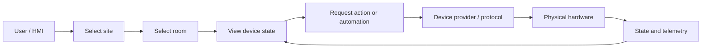
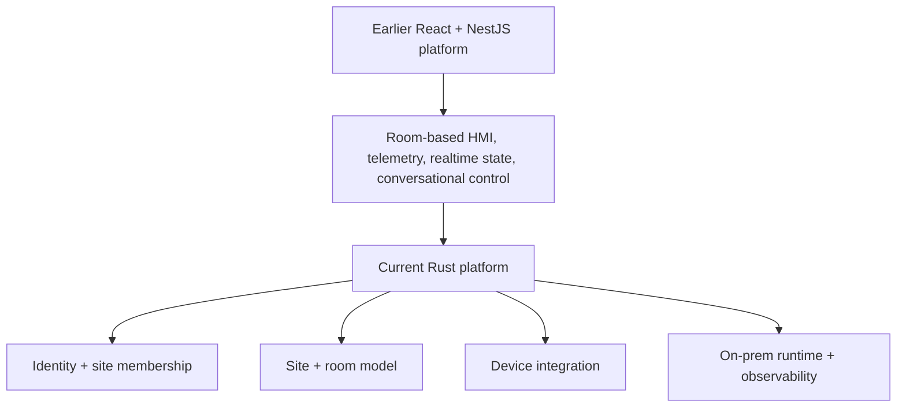
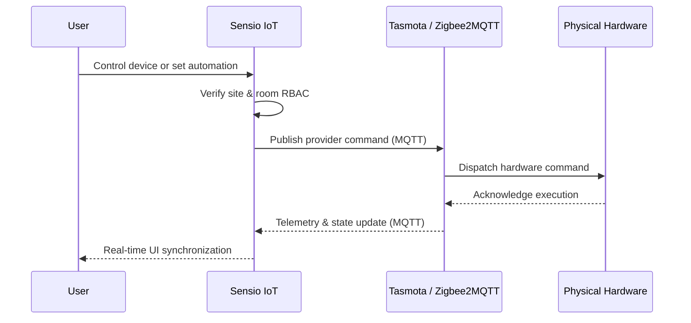

## Rooms, not protocols

People managing a room do not think in broker topics, hardware addresses, or database identifiers.

They think in physical language: *the lights in this meeting room, the sensor in that office, the devices this operator is allowed to control.*

**Sensio IoT** is built around translating those real-world boundaries into software boundaries.

The product has evolved through more than one implementation, but the underlying idea has stayed consistent: organize control around **sites and rooms**, keep device protocols behind an integration layer, and make local hardware state understandable from a human-facing interface.

## Client delivery is part of the architecture

Sensio IoT is not operated as one shared SaaS instance for every customer. It is delivered into client-owned environments and runs on-premises alongside the spaces and hardware it controls.

That changes the engineering boundary. Deployment, configuration, observability, hardware connectivity, and upgrades have to work inside each client environment rather than assuming one centrally managed cloud runtime.

I treat that client delivery model as part of the product itself. The application has to remain understandable and operable after it leaves a development machine, including on edge hardware where local network conditions and device integrations are part of normal production behavior.

## Organizing control around spaces

A user first enters the physical scope they are responsible for, then works with the devices and automation inside that scope.



That hierarchy matters more than any particular protocol. The same product-level action can eventually be translated to different providers without making the user learn how each device communicates.

## How the platform evolved

Sensio IoT has gone through two main production architectures.

The initial implementation used a fullstack React HMI with a NestJS backend. The UI was organized around physical rooms, while REST, WebSockets, and SSE kept device state synchronized.

High-frequency telemetry lived in PostgreSQL and TimescaleDB. A room-scoped LangGraph assistant evaluated context and could dispatch device automation routines.

The newer implementation is a Rust rewrite aimed at reducing runtime overhead on edge hardware. Axum serves HTTP APIs and Askama templates, SQLx manages PostgreSQL connection pooling and transactions, and the same service owns identity, site memberships, rooms, device state, and local configuration.



I treat those as iterations of the same product rather than pretending they were one unchanged architecture. The rewrite built directly on the lessons of the earlier stack.

## Edge constraints shape the architecture

The rewrite is not only a language change. The application runs beside the hardware it controls, on machines where runtime overhead, local service dependencies, broker connectivity, and deployment architecture are product constraints.

Moving more responsibility into the Rust service reduces the number of boundaries the edge runtime has to coordinate while keeping identity, room state, device integration, and local configuration in one operational unit. Packaging the same service for AMD64 and ARM64 keeps that runtime model usable across larger Linux hosts and smaller edge devices.

That is the tradeoff behind the newer architecture: accept a more systems-oriented implementation in exchange for a smaller edge-oriented runtime and fewer moving pieces at the deployment boundary.

## Identity follows physical scope

The platform makes physical scope an integral part of authorization.

Users do not receive one global role that automatically applies everywhere. Site membership is the role boundary, and room access is evaluated through that site relationship. Permission to operate one office never grants access to another site.

Authentication is designed for an on-premises control surface: provisioned users sign in, short-lived access tokens pair with rotating refresh tokens, and browser sessions keep security credentials isolated from client-side scripts.

The result is a strict conceptual chain:

```text
identity
→ site membership
→ room scope
→ device action
```

## Tasmota and Zigbee behind one room model

The device communication layer is separated from the site and room domain model.

The platform manages two primary hardware integration pipelines:

1. **Tasmota-flashed smart devices and power monitoring**: smart plugs, energy meters, relays, and power strips running Tasmota publish telemetry and state through MQTT. The ingestion path reads power metrics and relay state. Commands go back through provider-specific topics without depending on an external cloud service.
2. **Zigbee2MQTT environmental and presence sensors**: Zigbee coordinators feed temperature, humidity, illuminance, motion, and door/window state into the same room-oriented model.

In the Rust implementation, those integrations sit behind mapping, adapter, repository, listener, service, and HTTP boundaries. Incoming messages are normalized into room-scoped state; outgoing actions are translated back into provider-specific payloads.



That boundary is where broker reconnects, protocol quirks, and message retries belong. Keeping them there prevents the UI and room model from having to understand every hardware-specific detail.

## On-prem is part of the product

For a smart-space system, deployment location affects both latency and reliability.

Lighting, room controls, telemetry, and local automation should keep working without depending on a distant cloud round-trip. Sensio IoT therefore treats on-premises deployment as part of the product rather than an afterthought.

The Rust service is packaged as a multi-architecture Docker image for AMD64 and ARM64. It runs on Linux edge hardware, including NVIDIA Jetson devices and single-board computers.

OpenTelemetry, Prometheus metrics, structured logs, and container health checks help trace what happened when a broker, device, or local service stops behaving as expected.

## Diagnosing failures across software and hardware boundaries

A connected-device failure can surface in several places at once: the user-facing state, the application service, the MQTT broker, a provider adapter, or the physical device itself. Treating every symptom as an HTTP problem would hide the boundary that actually failed.

I use OpenTelemetry, Prometheus, structured logs, health checks, and the device telemetry path together to narrow those failures across the edge runtime. Broker reconnects and message retries stay inside the integration boundary, while room-scoped application state remains separate from provider-specific transport behavior.

This does not turn observability into a substitute for network tooling. It does make production diagnosis explicit: first identify whether the failure is application state, authorization, broker connectivity, protocol translation, or hardware state, then follow the evidence at that boundary.

## My work across both generations

My work has covered both generations of the product.

In the earlier React + NestJS version, I worked on backend and fullstack pieces around room state, telemetry, real-time updates, and the LangGraph control flow.

In the Rust rewrite, I moved more of that responsibility into a smaller edge-oriented service built with Axum and SQLx.

A large part of the backend work is authorization. Site membership and room scope have to be checked before a command reaches a physical device, so I built the access-control path around those boundaries instead of treating permissions as a UI concern.

I also work on the hardware-facing side: MQTT consumers, Tasmota telemetry and relay state, Zigbee2MQTT adapters, device discovery, and command dispatch.

Those integrations are translated into one room/device model that the rest of the product can use without knowing the underlying protocol details.

The same ownership extends into deployment. I package the service for AMD64 and ARM64, run it on local edge hardware, and use OpenTelemetry, Prometheus, and logs to investigate issues that only show up when software is sitting next to real devices and imperfect networks.

## The boundary that mattered most

The recurring lesson in Sensio IoT is that the hardest part of connected-device software is not sending a command to a broker.

The harder question is how to keep **identity, physical scope, device state, protocol translation, and local operations** consistent while the system evolves. Once those boundaries are clear, individual device integrations become much easier to reason about.

## Links

- Sensio IoT: [iot.sensio.id](https://iot.sensio.id)
- Sensio Platform: [sensio.id](https://sensio.id)
