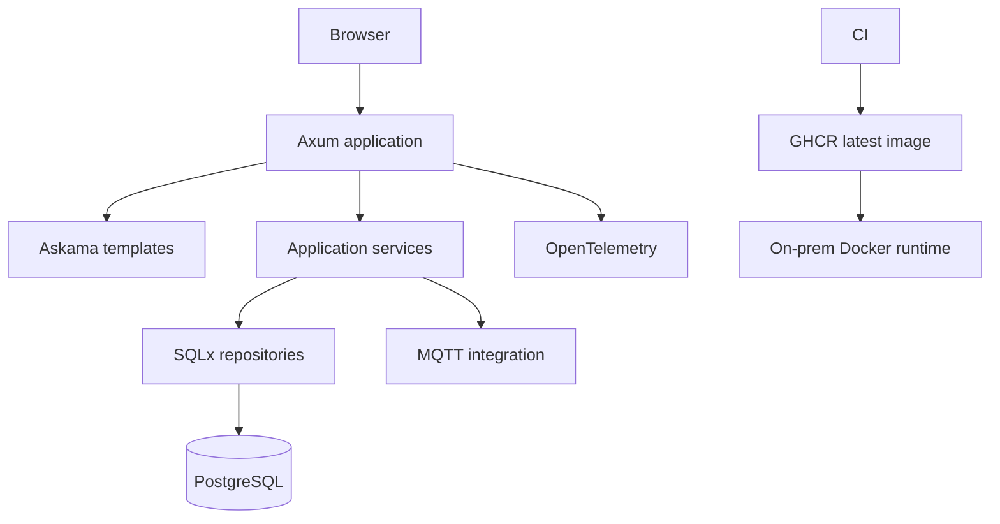
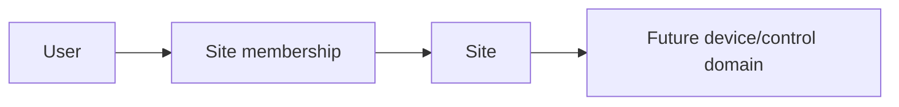

## Overview

**Sensio IoT** is being rebuilt as a compact Rust application for on-prem smart-space management.

The current generation intentionally moves away from a split frontend/backend runtime. Axum serves the HTTP application, Askama renders HTML, SQLx owns PostgreSQL access and migrations, and the same binary serves the interface and backend routes.

The current domain slice focuses on users, sites, site memberships, authentication, and the platform foundation required before expanding device control.

## Why the Rewrite

The earlier Sensio direction covered a wide set of device and automation features across multiple services. The new implementation starts from a smaller, stricter core:

- one server runtime;
- explicit **Site** boundaries rather than generic organization state;
- server-rendered HTML;
- administrator-controlled account provisioning;
- production-only container delivery;
- strong authentication and session primitives before broader device capability.

The result is easier to reason about as an on-prem system where identity, tenancy, runtime configuration, and deployment behavior matter as much as the UI.

## Architecture

Frontend and backend are intentionally one application. There is no React, Vite, or Node production runtime.

## Application Structure

The UI is organized like a small server-rendered design system:

- layouts define the page shell;
- reusable components own controls such as buttons, cards, badges, and inputs;
- blocks compose larger UI sections;
- route-specific templates assemble those primitives.

The CSS follows the same boundaries so server-rendered markup does not become one large page-specific stylesheet.

## Identity and Session Security

The authentication foundation is designed for a private on-prem dashboard rather than public self-service signup.

Provisioned users authenticate through the login surface. The session system uses:

- Argon2id password hashes;
- short-lived Ed25519 JWT access tokens;
- opaque refresh tokens stored only as SHA-256 hashes;
- refresh-token rotation;
- family revocation on reuse;
- HttpOnly browser sessions;
- published JWKS for token verification.

This puts session integrity in place before exposing broader control over physical devices.

## Site Domain

The domain uses **sites** for physical locations such as homes, schools, offices, stores, and factories.

A site membership is the explicit relationship that will scope access to future device and automation capabilities. The model avoids treating all connected hardware as one global device collection.

## Runtime Configuration

Local environment variables are bootstrap-only. At startup the application loads runtime configuration through Sensio Env for the `sensio / sensio-iot-new` project.

The application still owns its PostgreSQL schema and SQLx migration journal. Applied migration history is treated as immutable; schema evolution happens through new forward migrations rather than rewriting old ones.

## Delivery Model

Application images are built and published by CI. Runtime hosts pull `ghcr.io/farismnrr/sensio-iot-new:latest` and recreate the service.

That rule keeps the deployed artifact aligned with the validated CI output and avoids local image drift on the on-prem machine.

## Stack

Rust, Axum, Askama, SQLx, PostgreSQL, Argon2, Ed25519/JWT, MQTT via rumqttc, Docker, GHCR, and OpenTelemetry-compatible telemetry.

## Status

The current rewrite has the platform, authentication, users, sites, site memberships, server-rendered UI, runtime configuration, database migration, and production delivery foundations in place. Device-control capability is intentionally being layered on top of that core rather than presented here as already complete.
