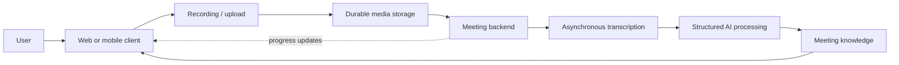
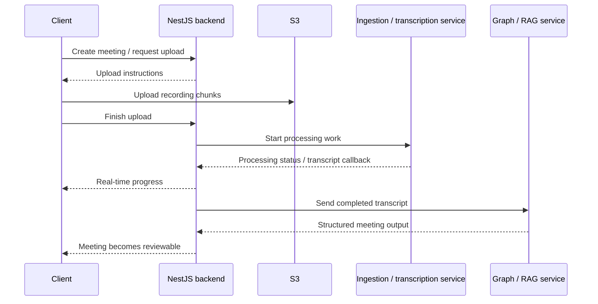

## Protect the recording before asking AI to interpret it

A meeting recording is useful evidence, but it is rarely useful by itself.

The questions people come back with are usually smaller and more practical: *what was decided, who needs to follow up, what problem was raised, and where in the conversation did that come from?*

**Sensio Notes** is built around that gap. It treats the recording and transcript as the source material, then turns them into meeting information that can be reviewed and reused without replaying the entire conversation.

There is another problem underneath that product idea: the recording has to survive long sessions, mobile operating-system constraints, and unreliable networks before any AI processing becomes useful.

That makes the product a combination of two different concerns:

```text
preserve the meeting reliably
then
interpret it carefully
```

## The meeting lifecycle

From the user's point of view, the flow stays simple: record or upload a meeting, wait while it is processed, then review the transcript and the structures derived from it.



The important boundary is that capture, transcription, and interpretation are separate stages. A summary should not be treated as the original evidence, and a failed processing step should not make the recording itself disappear.

## Capture before interpretation

The client supports both browser/PWA and native-mobile recording because those environments fail in different ways.

On the web, recording uses browser media APIs and a wake-lock strategy so long sessions are less likely to be interrupted by background throttling.

On native mobile, Capacitor bridges to a native audio-recorder path. That lets recording continue under mobile constraints that a normal browser tab cannot handle as reliably.

After recording, the client does not rely on one large request. Audio is divided into small chunks and queued through the upload flow so a long file can move into object storage more safely over an unstable connection.

That design keeps the first promise of the product deliberately boring: **do not lose the meeting**.

## Processing after the media is durable

Once media is durable, the backend becomes an orchestration layer for work that continues beyond one request.

The NestJS backend owns the application-side meeting lifecycle and authentication, coordinates presigned S3 multipart uploads, and tracks asynchronous processing state. It receives callbacks from services maintained elsewhere in the product team, persists application state in PostgreSQL, and sends live progress updates through WebSocket channels.

Within the NestJS areas I maintain, application behavior is organized through class-based modules, controllers, and services with dependency injection.

That structure separates responsibilities and composes dependencies without turning one large handler or service into the whole application.



PostgreSQL stores durable product data with relational schemas, indexed queries, and migration versioning. Redis handles background job queues and pub/sub events.

The client and backend are kept as separate repositories so recording UX and client performance can change without coupling that work to persistence and service coordination.

## Failure handling is part of the product flow

The difficult cases are the boundaries where the browser is backgrounded, a mobile recorder behaves differently from the web recorder, a network disappears during upload, or a background processing step finishes later than the request that started it.

The system keeps durable media, upload progress, processing state, and generated output as separate concerns.

Chunked and resume-friendly uploads reduce how much work a weak connection can invalidate. Asynchronous processing state lets the client reconnect to a meeting after the original request has ended.

Within the product team, I investigate application-side failures with OpenTelemetry and structured logs so we can follow work across the processing path.

The operational question is which stage of the meeting lifecycle stopped progressing and what durable state was already preserved. That view is more useful than diagnosing each service in isolation.

## Turning transcripts into meeting knowledge

Sensio Notes goes beyond producing raw text.

Completed transcripts are passed to structured Graph/RAG services maintained by other members of the product team.

Those services produce summaries, action items, decisions, discussion structure, and PPP-style progress/issues/plans context. The application backend owns the integration state around those outputs and makes them reviewable in the product.

The useful distinction is:

```text
recording = evidence
transcript = searchable representation of that evidence
AI output = interpretation built on top of it
```

Keeping those layers conceptually separate makes it easier for the product to expose useful automation without pretending generated text is more authoritative than the meeting itself. Extracted insights can be linked back to transcript timestamps so users can verify decisions against what was said.

## Ownership inside a cross-functional team

Sensio Notes is a team product, and my role carries substantial ownership of the application flow within that team.

I own application-side work around the backend, recording and upload lifecycle, asynchronous state, integration boundaries, and web/mobile behavior.

The ingestion pipeline and Graph/RAG capabilities are separate service boundaries maintained by other team members. My contribution is to integrate them reliably while keeping their internal implementation attributed to the people who own those services.

The same division applies outside the backend. I work with infrastructure and security engineers on server operations, deployment, access, and production constraints.

UI/UX designers own the product's visual and interaction direction. Within that collaboration, I translate those designs into production React and Capacitor behavior and connect them to the application state underneath.

That engineering work covers recording and upload progress, asynchronous processing, loading and failure feedback, interrupted-work recovery, and differences between browser and native-mobile behavior.

I do not present this as independent UI/UX ownership. It is implementation work done as part of a cross-functional product team.

That division of responsibility is important to how I describe the project: substantial ownership of an area does not mean presenting a production system as a one-person stack.

## What I worked on

Within that team, most of my work sits at the points where a long-running meeting flow can fail.

On the backend, I built and maintained the application-side meeting lifecycle in NestJS: data models, upload coordination, background processing state, callbacks, and the APIs used by the web and mobile clients.

For large recordings, I worked on chunked S3 uploads and resume-friendly flows so a weak connection would not force someone to start from zero.

I integrated the ingestion and Graph/RAG service boundaries into that lifecycle, including the state transitions around when processing starts, when callbacks arrive, when structured outputs are ready, and how those results become available to users.

On the client side, I connected the React and Capacitor recording paths to the same backend state machine.

That meant dealing with wake locks, native recording behavior, upload progress, and the awkward cases where the app is backgrounded or the network disappears halfway through a meeting.

Production work is shared across the team as well. My part includes Docker packaging, OpenTelemetry and structured-log based diagnosis across the processing path, and Jira-tracked implementation work tied to the product issues we are solving.

## The boundary that mattered most

Sensio Notes made one design rule especially clear: **capture reliability and AI quality are different problems**.

A clever summary cannot recover a recording that was never preserved, and a perfectly stored recording is still inconvenient if useful decisions remain buried inside an hour of audio. The system has to protect the evidence first and add interpretation second.

## Links

- Sensio Notes: [notes.sensio.id](https://notes.sensio.id)
- Sensio Platform: [sensio.id](https://sensio.id)
