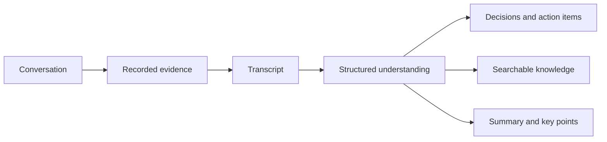
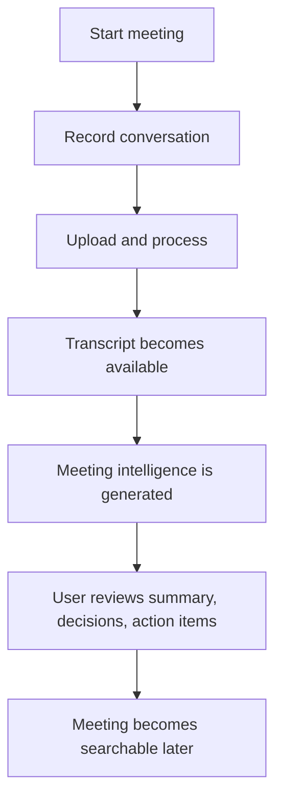
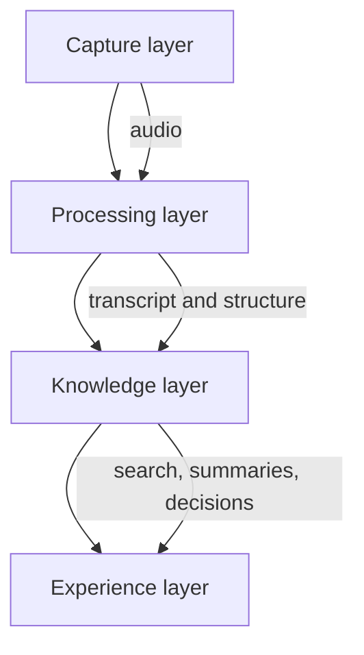

## What It Is

**Sensio Notes** is a meeting intelligence product.

Its job is not just to record audio or generate a summary. The core idea is to turn a messy human conversation into a structured body of knowledge that can be searched, reviewed, and acted on later.

A meeting starts as unstructured speech. Sensio Notes gradually converts that into:

- transcript
- discussion structure
- decisions
- action items
- key points
- searchable meeting knowledge

## Problem It Solves

Meetings generate a lot of information, but humans are bad at preserving all of it.

Typical problems are:

- people forget decisions;
- action items are not assigned clearly;
- context gets lost after a few days;
- recordings are too long to review manually;
- summaries can be inaccurate or disconnected from the source.

The product exists to reduce the gap between **what was said** and **what the organization remembers**.

## Who It Is For

The concept is useful for teams that depend on recurring conversations:

- project teams;
- operational teams;
- engineering teams;
- internal meetings;
- client discussions;
- planning and review sessions.

The main user need is simple: **“I should not have to reconstruct the meeting from memory.”**

## Core Concept

The system treats a meeting as a transformation pipeline.



The important concept is that generated outputs should remain connected to the original meeting evidence.

That means AI is not treated as a free-form writer. It acts more like a processing layer over a durable meeting record.

## General User Flow



The product should feel simple to the user even though the internal processing is asynchronous.

## General Processing Algorithm

At a high level, the system behaves like this:

1. Capture the meeting reliably.
2. Preserve the source media.
3. Convert speech into text.
4. Break the transcript into useful context units.
5. Extract structure from the conversation.
6. Generate summaries, decisions, and action items.
7. Keep generated outputs linked to source context.
8. Store everything as reusable meeting knowledge.

Conceptually:

```text
meeting
→ evidence
→ transcript
→ context
→ structured interpretation
→ reusable knowledge
```

## General System Design

The system has four conceptual layers.



### Capture layer

Responsible for making sure a meeting is not lost.

### Processing layer

Turns raw audio into transcript and structured outputs.

### Knowledge layer

Stores the durable meeting representation.

### Experience layer

Lets users review, search, and act on the resulting knowledge.

## Important Product Decisions

### Reliability comes before intelligence

A perfect summary is useless if the original recording was lost.

### Generated output should be reviewable

The system should help users understand where important conclusions came from.

### Meetings become reusable knowledge

The product is more valuable when old meetings remain useful instead of becoming dead recordings.

## Tradeoffs

The product balances several tensions:

- **speed vs accuracy** — users want quick results, but better interpretation may require more processing;
- **automation vs trust** — AI can save time, but generated decisions should not silently replace human judgment;
- **rich structure vs simplicity** — the system can extract many concepts, but the UI still needs to remain easy to scan.

## Implementation Notes

The current implementation uses a web/native recording client, asynchronous backend processing, durable database and object storage, and AI workflows for structured meeting intelligence.

## Stack

React, Capacitor, NestJS, PostgreSQL, object storage, LangChain/LangGraph, and OpenTelemetry.
