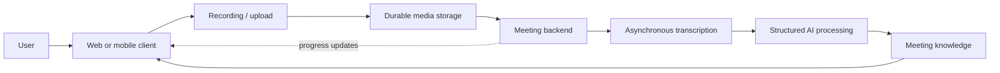
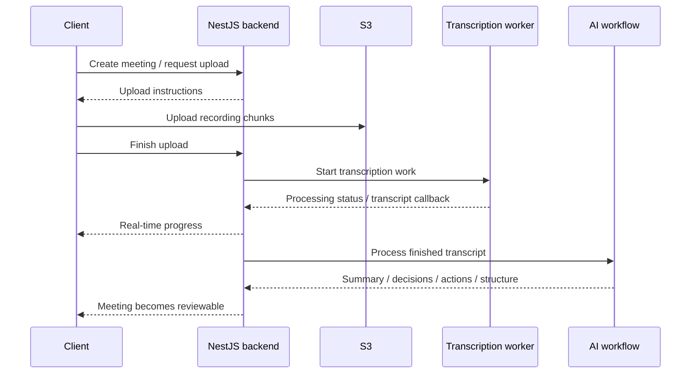

## The Problem

A meeting recording is useful evidence, but it is rarely useful by itself.

The questions people come back with are usually smaller and more practical: *what was decided, who needs to follow up, what problem was raised, and where in the conversation did that come from?*

**Sensio Notes** is built around that gap. It treats the recording and transcript as the source material, then turns them into meeting information that can be reviewed and reused without replaying the entire conversation.

There is another problem underneath that product idea: the recording has to survive long sessions, mobile operating-system constraints, and unreliable networks before any AI processing becomes useful.

That makes the product a combination of two different concerns:

```text
preserve the meeting reliably
then
interpret it carefully
```

## Product Approach

From the user's point of view, the flow stays simple: record or upload a meeting, wait while it is processed, then review the transcript and the structures derived from it.



The important boundary is that capture, transcription, and interpretation are separate stages. A summary should not be treated as the original evidence, and a failed processing step should not make the recording itself disappear.

## Capture Before Interpretation

The client supports both browser/PWA and native-mobile recording because those environments fail in different ways.

On the web path, recording uses the browser media APIs together with a wake-lock strategy so a long meeting is less likely to be interrupted by background throttling. On native mobile, Capacitor bridges to a native audio-recorder path so recording can continue under mobile constraints that a normal browser tab cannot handle as reliably.

After recording, the client does not rely on one large request. Audio is divided into small chunks and queued through the upload flow so a long file can move into object storage more safely over an unstable connection.

That design keeps the first promise of the product deliberately boring: **do not lose the meeting**.

## Processing the Meeting

Once media is durable, the backend becomes an orchestration layer rather than a synchronous request handler.

The NestJS backend owns the complete meeting lifecycle and authentication, coordinates presigned S3 multipart uploads, dispatches and tracks asynchronous transcription tasks, receives processing callbacks, persists application state in PostgreSQL, and sends live progress updates to clients through real-time WebSocket channels.



The application uses PostgreSQL with relational schemas, indexed queries, and migration versioning for durable product data. Redis handles background job queues and pub/sub events. The client and backend are maintained as modular repositories so recording UX and client performance evolve independently from backend persistence and worker coordination.

## From Transcript to Meeting Knowledge

Sensio Notes does not stop at producing raw text.

The completed transcript is processed through structured LangChain/LangGraph workflows to produce higher-level views such as summaries, action items, decisions, discussion structure, and PPP-style progress/issues/plans context.

The useful distinction is:

```text
recording = evidence
transcript = searchable representation of that evidence
AI output = interpretation built on top of it
```

Keeping those layers conceptually separate makes it easier for the product to expose useful automation without pretending generated text is more authoritative than the meeting itself. Every extracted insight links back to source transcript timestamps so users can verify decisions directly against what was said.

## My Contribution

My work on Sensio Notes spans fullstack product engineering, production backend architecture, and AI pipeline orchestration:

- **Backend Architecture & API Engineering**: Designed and shipped the core NestJS backend with structured domain modules, REST APIs, WebSocket gateways, and PostgreSQL data persistence with transactional safety and automated schema migrations.
- **Resilient Media Ingestion**: Engineered chunked S3 audio upload pipelines with checksum verification, presigned URLs, and upload resumption that prevent data loss across spotty client connections.
- **Asynchronous Worker Pipelines**: Orchestrated transcription worker lifecycles with queue backoff, idempotent callback handlers, and live WebSocket broadcasts to maintain transparent progress during multi-minute processing runs.
- **Structured AI & RAG Workflows**: Built LangGraph pipelines that chunk transcripts, query LLMs for grounded summaries and action items, and enforce strict JSON schemas so generated outputs link directly to source evidence.
- **Fullstack Client-Server Integration**: Bridged React and Capacitor mobile recording flows with backend state machines, ensuring consistent wake-lock behavior, offline resilience, and fluid review UX.
- **Production Operations**: Containerized services with Docker, established OpenTelemetry instrumentation and structured logging, and managed production deployments ensuring high availability and zero data loss.

## What I Took From It

Sensio Notes made one design rule especially clear: **capture reliability and AI quality are different problems**.

A clever summary cannot recover a recording that was never preserved, and a perfectly stored recording is still inconvenient if useful decisions remain buried inside an hour of audio. The system has to protect the evidence first and add interpretation second.

## Product Links

- Sensio Notes: [notes.sensio.id](https://notes.sensio.id)
- Sensio Platform: [sensio.id](https://sensio.id)
