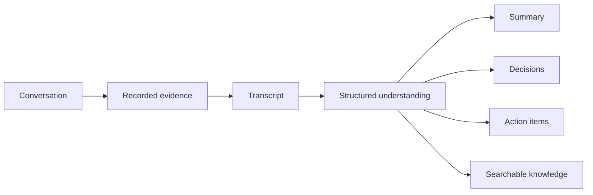
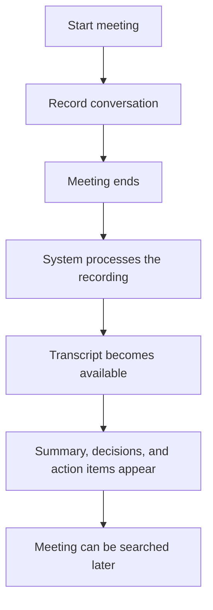
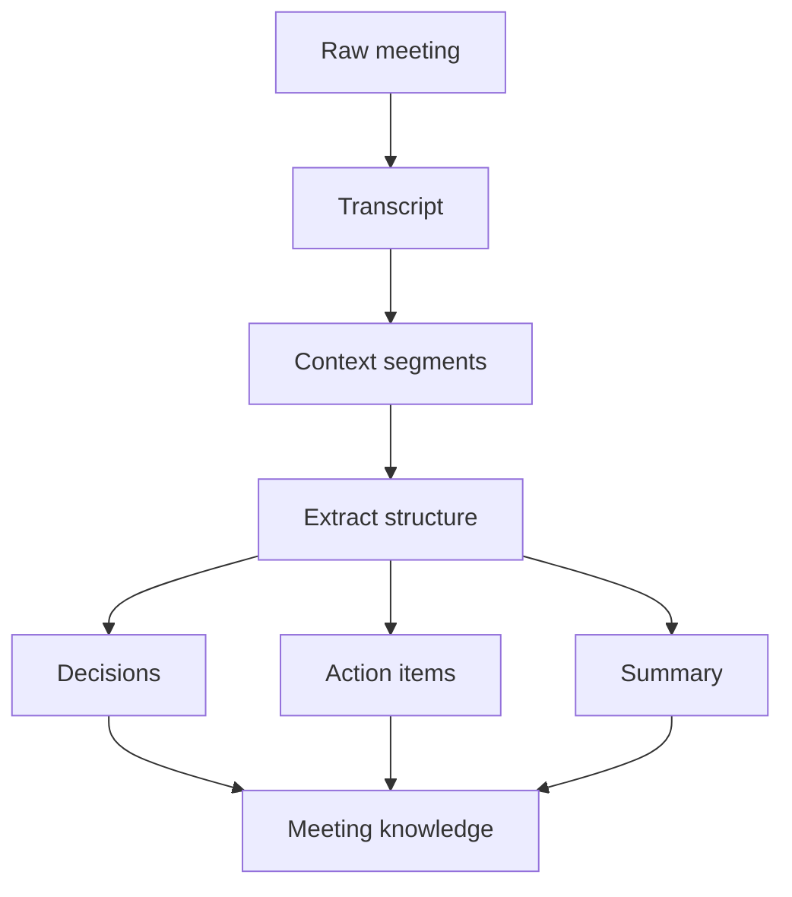
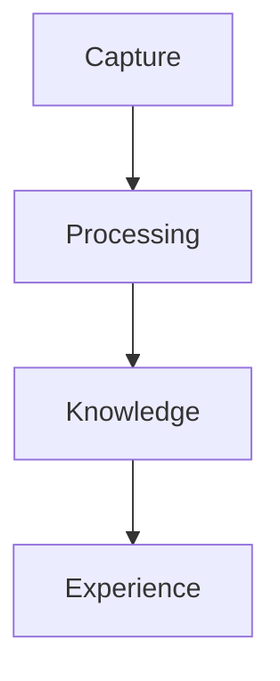

## The Story

A meeting usually feels productive while it is happening.

People talk, decisions are made, responsibilities are mentioned, ideas appear, and everyone leaves with the feeling that the important things were understood.

A few days later, that confidence starts to disappear.

Someone asks, “Who was supposed to handle that?” Another person remembers the decision differently. The recording exists, but nobody wants to listen to an hour of audio just to recover one sentence.

That gap is the reason **Sensio Notes** exists.

The goal is not simply to record a meeting. The goal is to make the meeting remain useful after it ends.

## What the Product Is Really Trying to Do

Sensio Notes treats every meeting as raw information that needs to be turned into something reusable.

A conversation starts messy. People interrupt each other, jump between topics, return to older points, and make decisions without saying the words “this is a decision.”

The product tries to transform that mess into a more durable memory:

- what was discussed;
- what was decided;
- what needs to happen next;
- who is responsible;
- what context matters later;
- where those conclusions came from.

The important part is that the AI does not become the meeting itself. The original conversation remains the source of truth.



## How It Feels to Use

From the user's perspective, the flow should feel boringly simple.

You start a meeting, record it, end it, and wait while the system processes everything in the background.

After that, instead of seeing only a media file, you get a useful representation of the meeting.



The complexity belongs inside the system, not in the user's workflow.

## The Main Problem Behind the Scenes

There are actually two separate problems.

The first is **capture reliability**.

If a meeting lasts an hour and the network drops near the end, the system should not behave as if nothing happened. The product has to assume that devices sleep, connections disappear, browsers throttle background activity, and mobile operating systems behave differently from desktop browsers.

The second is **interpretation reliability**.

An AI can produce a very convincing paragraph that sounds correct while quietly inventing meaning that was never actually present.

So the product has to solve both:

```text
preserve the evidence
then
interpret the evidence carefully
```

That ordering matters.

## General Processing Logic

The processing model is intentionally staged.

1. Preserve the meeting first.
2. Turn speech into text.
3. Break the transcript into useful context.
4. Detect important discussion structure.
5. Extract decisions and actions.
6. Generate higher-level summaries.
7. Keep the outputs connected to the original evidence.
8. Store the result so the meeting remains useful later.



The algorithm is less about “ask an LLM to summarize this” and more about building several smaller transformations that can be reasoned about independently.

## General System Design

The system can be understood as four layers.



**Capture** is responsible for not losing the meeting.

**Processing** turns media into transcript and structured interpretation.

**Knowledge** stores the useful long-term representation.

**Experience** is what the user interacts with: summaries, action items, search, and review.

The layers matter because each one has a different failure mode. A capture failure is not the same kind of problem as a bad summary. Keeping them conceptually separate makes the whole product easier to trust.

## Why This Product Is More Than a Meeting Recorder

The real value appears weeks later.

A normal recorder answers:

> “What happened in this meeting?”

Sensio Notes tries to answer:

> “What did we decide, what should happen next, and what context from past meetings matters now?”

That shift is what turns a recording tool into a knowledge tool.

## Product Tradeoffs

There are a few unavoidable tensions.

**Speed vs accuracy.** Users want results quickly, but better interpretation may require more processing.

**Automation vs trust.** AI can save time, but a user still needs confidence that important outputs came from real evidence.

**Rich output vs clarity.** The system can extract many structures, but too much information can make a meeting harder to understand instead of easier.

The product has to stay useful without becoming noisy.

## Implementation Notes

The current implementation uses a web/native recording client, asynchronous backend processing, durable media storage, structured AI workflows, and real-time progress updates.

## Stack

React, Capacitor, NestJS, PostgreSQL, object storage, LangChain/LangGraph, and OpenTelemetry.
