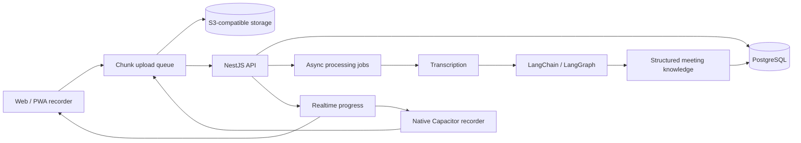
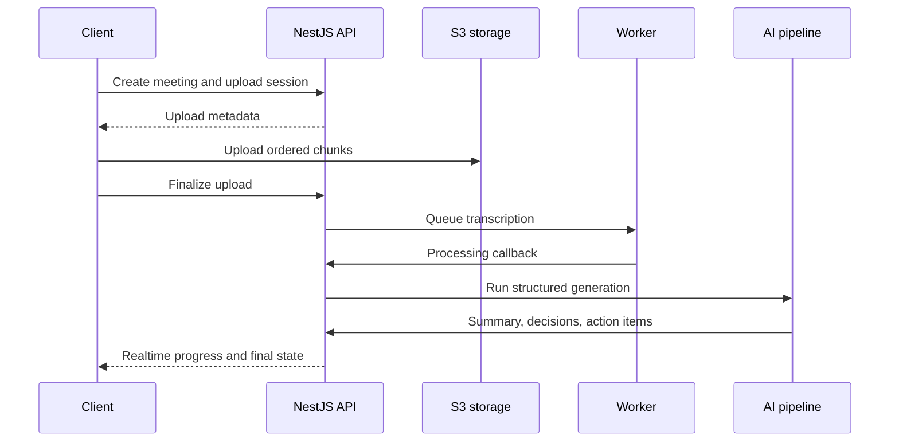

## Overview

**Sensio Notes** is a meeting intelligence platform spanning recording, media ingestion, asynchronous processing, structured AI generation, and searchable meeting knowledge.

I worked across the client, backend orchestration, AI layer, storage flow, and infrastructure. The main engineering challenge was not simply summarizing a transcript. The product had to reliably capture long-running meetings on web and mobile, move large media files over unreliable networks, keep processing state observable, and produce outputs that stay tied to the underlying evidence.

## Problem

Meeting software has two failure-sensitive paths:

1. **capture and upload**, where an interrupted browser, locked phone, or unstable connection can lose valuable audio;
2. **AI processing**, where a fluent model response is not useful if it cannot be traced back to the meeting.

Sensio Notes treats those as one system rather than separate frontend and AI features.

## System Architecture

The frontend and backend are separate products, but the media and processing contracts are designed together. The backend coordinates upload state, meeting lifecycle, authentication, processing, and real-time progress. PostgreSQL remains the durable authority for meeting and processing state while object storage owns media artifacts.

## Cross-Platform Recording

The client uses a unified recording abstraction with two platform-specific implementations.

### Web and PWA

The browser path uses HTML5 `MediaRecorder` and the Screen Wake Lock API so long-running captures are less likely to be throttled when the browser remains active.

### Native mobile

The Capacitor path bypasses normal browser recording limitations and uses a native audio-recorder plugin so recording can continue when the device screen is locked.

After native recording stops, the file is sliced into **256 KB chunks** and fed into the same upload queue used by the web pipeline. That lets native recording reuse the existing backend ingestion contract instead of introducing a second upload architecture.

## Media Processing Flow

The system is designed so interrupted processing can be retried and reconciled without treating transient frontend state as authoritative.

## Meeting Intelligence

Finished transcripts are processed through stateful AI workflows rather than a single prompt. The platform uses LangChain and LangGraph to produce structured outputs such as:

- summaries and key discussion points;
- decisions;
- action items;
- discussion timelines;
- PPP-style progress, issues, and plans;
- searchable meeting knowledge.

The backend also supports retrieval-oriented meeting context so generated answers and insights can remain connected to transcript evidence.

## Reliability Decisions

### Media state is durable

Meeting metadata and processing state live in the database; large audio artifacts live in object storage. Upload and processing state are not inferred from the UI.

### Native and web reuse one ingestion contract

The native client adapts its full recording into chunks instead of forcing the backend to maintain a separate native upload pipeline.

### Processing is asynchronous

Transcription and intelligence work run outside the request lifecycle. The client consumes progress rather than holding long HTTP requests open.

## Platform Boundaries

The frontend is a React 19 application that can ship as PWA and native mobile through Capacitor. The backend is a NestJS 11 orchestration service with Drizzle-backed persistence, S3 coordination, real-time progress, and AI workflows.

Operational behavior is instrumented through OpenTelemetry-compatible tracing and logs so long-running processing can be investigated outside the browser.

## Stack

React 19, Vite, Tailwind CSS, Capacitor, NestJS 11, TypeScript, Drizzle ORM, PostgreSQL, S3-compatible storage, LangChain, LangGraph, WebSockets/SSE-style realtime delivery, OpenTelemetry, and Playwright.

## Status

Sensio Notes is an active product with the recording, upload, transcription, structured intelligence, and cross-platform client foundations implemented.
