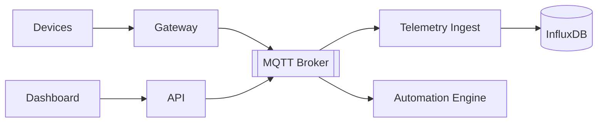
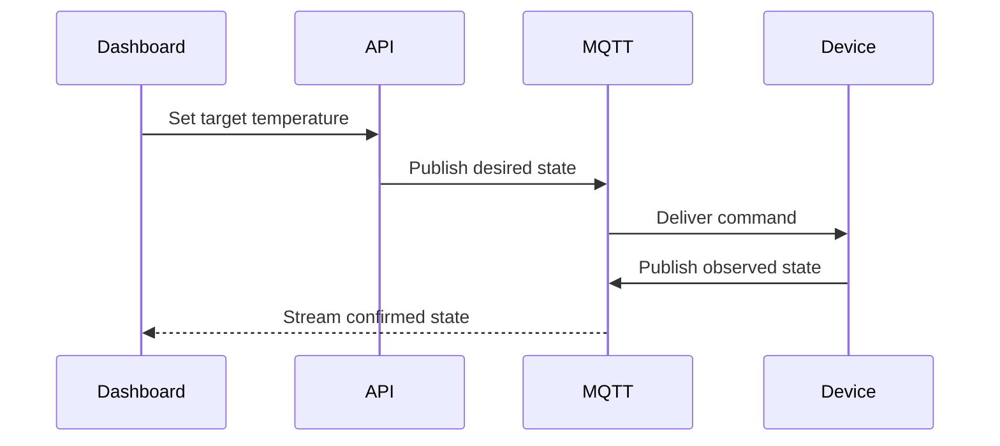

## Project overview

Sensio IoT connects room devices, automation rules, and cloud services behind one operational interface. The emphasis is reliability: devices can be intermittent while the product still needs a coherent view of state.

## Device and cloud boundary

MQTT provides the event transport between gateways and cloud consumers. Device commands and telemetry use explicit topics and versioned payloads.

## Real-time state

The dashboard distinguishes desired state from observed state so a command is not considered complete before the device confirms it.

## Reliability

Telemetry is append-oriented, while commands are idempotent and carry correlation identifiers. Reconnect storms are rate-limited and automation rules are evaluated from durable state.

## Outcome and learnings

Distributed-systems assumptions matter even more when one participant is a small device on an unreliable network.
