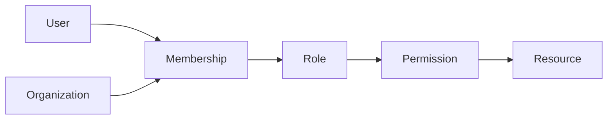

## Project overview

Tenant Core centralizes identity and authorization for products that need strict organization boundaries without duplicating access-control logic in every service.

## Authorization model

Permissions are evaluated from organization membership, role grants, and resource scope.

## Data isolation

Every tenant-owned record carries an organization identifier, and database access helpers require that scope explicitly.

## Auditability

Security-sensitive operations write immutable audit events with actor, tenant, action, resource, and correlation context.

## Outcome and learnings

The most important design choice was making tenant scope impossible to ignore in normal code paths.
